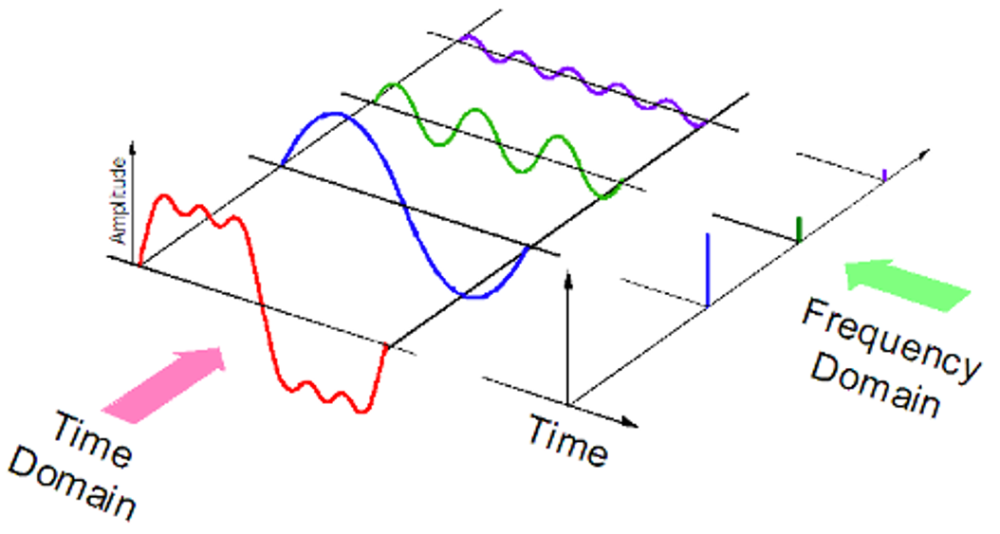
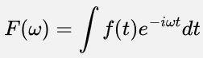
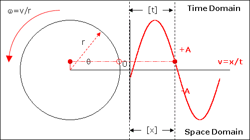

**Main Source:**

- **[The Fourier Series and Fourier Transform Demystified — Up and Atom](https://youtu.be/mgXSevZmjPc)**

If [Fourier series](/digital-signal-processing/fourier-series) is used to sum up wave to approximate a function, **Fourier transform** is a method to separate a complex wave based on its frequency.

Wave functions, such as the Fourier series, is typically associated with time (t). The x-axis represents the time variable, and the function values correspond to the wave's amplitude or other relevant properties at different time instants. We call wave function with time, which represent its behavior over time as **time-domain representation**.

When we add together various wave, the wave function contain multiple frequency components. Fourier transform is a method to extract the individual frequency components within the wave function. It will represent the signal in the **frequency-domain** as a sum of sinusoidal waves with different frequencies.

  
Source: [top](https://kinder-chen.medium.com/denoising-data-with-fast-fourier-transform-a81d9f38cc4c), [bottom](https://knowledge.ni.com/KnowledgeArticleDetails?id=kA03q000000YGJ7CAO&l=en-US)

:::tip

- Time-domain: Provides information about the signal's amplitude and how it changes over time.
- Frequency-domain: Provides information about the signal's frequency content and how the energy is distributed across different frequencies.
 :::

### How does it work

Fourier transform formula for continuous signal is given by below.

- $\omega$ is the frequency with unit of radians per unit time
- $F(\omega)$ is the output of Fourier transform with input frequency $\omega$
- $f(t)$ is the original function of signal in the time domain
- $e^{-i\omega t}$ is a complex exponential term.

The complex exponential term is used to represent wave in terms of sine and cosine waves (by [utilizing Euler's identity](/digital-signal-processing/fourier-series#complex-fourier-series)). In this formula, wave is represented as a vector that has certain magnitude, which correspond to the amplitude of the sinusoidal wave.

  
Source: https://tutorial.math.lamar.edu/Extras/ComplexPrimer/Forms.aspx

Multiplying the original signal $f(t)$ with the exponential term would give us a number that represent the correlation between them, for which we know its contribution to the input wave frequency.

A product represents the contribution of the frequency component at frequency $\omega$ to the original signal $f(t)$. In order to know the contribution of the whole signal function, we can multiply the signal over time. This is where integral comes to play. Essentially, taking the integral for all values of $t$ measures the amount of overlap between the original signal and the oscillating function at frequency $\omega$.

All this produces the $F(\omega)$ function, which is a complex-valued function that will take frequency $\omega$ and shows the amplitude and phase of each frequency component present in $f(t)$.
