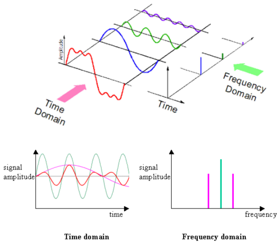

**Main Source:**

- **[The Fourier Series and Fourier Transform Demystified — Up and Atom](https://youtu.be/mgXSevZmjPc)**

If [Fourier series](/digital-signal-processing/fourier-series) is used to sum up wave to approximate a function, **Fourier transform** is a method to separate a complex wave based on its frequency.

Wave functions, such as the Fourier series, is typically associated with time (t). The x-axis represents the time variable, and the function values correspond to the wave's amplitude or other relevant properties at different time instants. We call wave function with time, which represent its behavior over time as **time-domain representation**.

When we add together various wave, the wave function contain multiple frequency components. Fourier transform is a method to extract the individual frequency components within the wave function. It will represent the signal in the **frequency-domain** as a sum of sinusoidal waves with different frequencies.

  
Source: https://kinder-chen.medium.com/denoising-data-with-fast-fourier-transform-a81d9f38cc4c

:::tip

- Time-domain: Provides information about the signal's amplitude and how it changes over time.
- Frequency-domain: Provides information about the signal's frequency content and how the energy is distributed across different frequencies.
  :::

### How does it work

Fourier transform formula for continuous signal is given by below.

- $\omega$ is the frequency with unit of radians per unit time.
- $F(\omega)$ is the output of Fourier transform with input frequency $\omega$.
- $f(t)$ is the original signal in the time domain.
- $e^{-i\omega t}$ is a complex exponential term.

The complex exponential term is used to represent the oscillating property of the wave. In this formula, wave is represented as a vector that has certain magnitude, which correspond to the amplitude of the sinusoidal wave.

In the wave, phase angle represents the phase shift of the wave relative to a reference point. With the vector, this is represented with the $\theta$.

Multiplying the $f(t)$ with the exponential term would make the vector now rotate based on the function.

  
Source: https://tutorial.math.lamar.edu/Extras/ComplexPrimer/Forms.aspx

To be able to separate the function based on each waves' frequency, Fourier transform attempt to isolate the amplitude and the phase. The magic comes from taking the integral of the product of the exponential term and the input signal $f(t)$. The product of them represent the contribution of the frequency component at frequency $\omega$ to the original signal $f(t)$. The idea is, we need to find out how much of the signal at time $t$ is contributed by the frequency component at frequency $\omega$. Do this for all $t$ to know the product for all time domain. This is where integral comes to play. Essentially, taking the integral for all values of $t$ measures the amount of overlap between the original signal and the oscillating function at frequency $\omega$.

Taking the integral produces the $F(\omega)$ function, which is a complex-valued function that will take frequency $\omega$ and shows the amplitude and phase of each frequency component present in $f(t)$.
