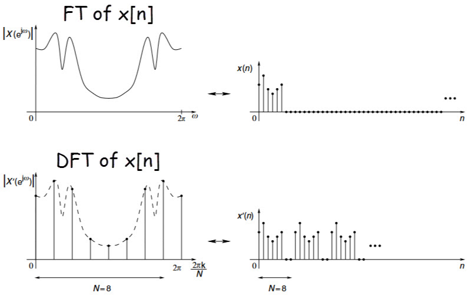
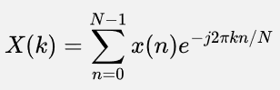

**Main Source : Various source from Google and Youtube**

**Discrete Fourier Transform (DFT)** is the version of the Fourier Transform for discrete periodic signal. DFT is widely used in digital signal processing because computers can only process discrete signals. With DFT, we can Fourier transform digital signal such as audio to filter out signal to remove noises or some specific frequencies.

  
Source : https://www.ee-diary.com/2023/05/what-is-discrete-fourier-transformdft.html#

### How does it works

Here is the formula for DFT :

- $n$ : Sample index
- $N$ : Number of samples
- $k$ : Frequency bin index
- $X(k)$ : The k-th frequency component of the signal
- $x(n)$ : The n-th sample of the input sequence
- $j$ : The imaginary unit
- $e^{-j2 \pi k n / N}$ : The exponential term involving $2\pi k n /N$ to convert frequency from cycles per second to radians per sample

A discrete signal is made from sampling a continous signal. Sampling process involves taking a sequence of equally spaced samples of the continuous signal. The samples is typically called N and the number of samples must be an integer power of 2.

FT and DFT is kinda similar, they differs in how we multiply with the complex exponential term.
In FT, we multiply by $f(t)$ which is the function of signal. While in DFT, we multiply by each of the sample.

After multiplying by each sample, the resulting product is a complex number that represents the contribution of that sample to the k-th frequency component of the signal in the frequency domain. It has a magnitude and a phase angle that depend on the value of the sample $x(n)$ and the frequency bin index k.

### Computation

FT is a continuous-time transform that involves integration over an infinite time interval. Its computation is typically performed using numerical integration techniques. FT can be computationally expensive for large bandwidth or a complex frequency structure.

In computation, DFT multiplication between input signal and exponential term is typically represented in matrix multiplication. With a straight forward algorithm, DFT can be computed in $O(N^2)$ time, where N is the number of samples in the signal.

There is also an improvement for DFT algorithm which is the [Fast Fourier Transform (FFT) algorithm](/digital-signal-processing/fast-fourier-transform).
