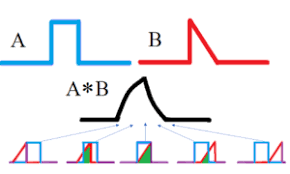
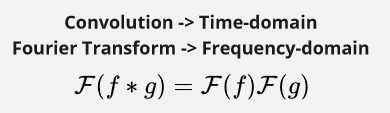

**Main Source : Various source from Google**

**Convolution** is a mathematical operation that is often used in signal processing and other fields to combine two functions in the time-domain to produce a third function that describes their interaction.

Convolution of two signals in the time domain is a way of finding the amount of overlap between the two signals.

  
Source : https://www.statisticshowto.com/convolution-integral-simple-definition/

Convolution of two function $f(t)$ and $g(t)$ is defined as follows :

- $\ast$ is the convolution operator
- $\tau$ is just a placeholder variable

### Convolution Theorem

Convolution and Fourier transform is related, they relates in the following properties :

The theorem tells us that Fourier transform of a convolution between two function is the same as the product of their individual Fourier transforms. This theorem provides a way of relating the time domain and frequency domain representations of signals.

The Fourier transform of a signal is a mathematical representation of the signal in the frequency domain. The frequency domain is a way of looking at a signal that breaks it down into its constituent frequencies.

Multiplying both Fourier transform of the signals together, we are essentially multiplying together the **frequencies** of those two signals. Multiplying frequencies together means we add them up.

And this is the same as convolution of two signals in the time domain which is a way of multiplying the signals together at different time delays (defined based on convolution formula). When you multiply two signals together at different time delays, you are essentially adding together the waves of the two signals at different frequencies.

  
Source : https://www.sharetechnote.com/html/RF_Handbook_TimeDomain_FrequencyDomain.html
