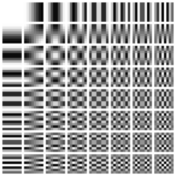
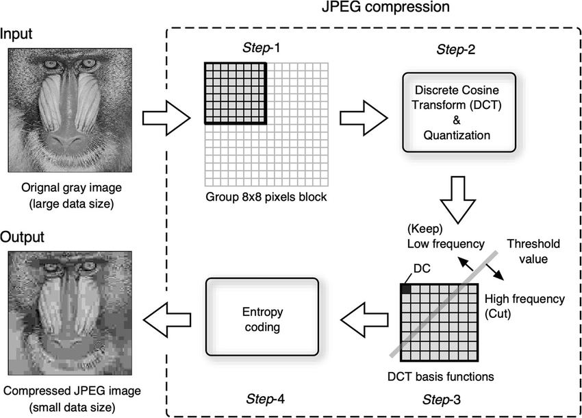

**Main Source : [JPEG DCT Computerphile](https://youtu.be/Q2aEzeMDHMA)**

**Discrete Cosine Transform (DCT)** is kinda similar to [DFT](/digital-signal-processing/discrete-fourier-transform). DFT takes complex-valued data transforming it into complex-valued output and is based on complex exponential function where as DCT transforms real-valued input data into a sequence of real-valued output and is based on the cosine function.

In digital world, image and audio can be represented as signal. The signal is typically in real-valued data, this makes DCT more suitable for digital processing. DCT can be used for image compression, audio processing, etc. A real-valued data can also improve performacne as it will be computed more efficiently.

### The idea

The basic idea of DCT is we try to represent signal from image or audio as the sum of cosine wave with different frequency. With the similar concept as FT, we can discard some of the high-frequency components that are less important to the overall signal.

### Type-II DCT

DCT has many version each with its own set of properties and applications. The Type-II is the JPEG image compression standard. It is well-suited for image compression applications and is also used in other applications, such as video compression and audio compression.

The cosine wave has output varying from -1 to 1, we can represent the output as gray-scale color.

  
Source : https://www.researchgate.net/figure/A-sine-wave-left-with-the-corresponding-2D-representation-a-sine-grating-shown-right_fig5_37986721

If we represent cosine wave output with grayscale color where -1 is black and 1 is white, with many combination of cosine wave frequency and addition, we can make this set of color. This set of color is called the DCT basis function.

  
Source : https://en.wikipedia.org/wiki/Discrete_cosine_transform

The more right and bottom, the frequency of cosine wave is increasing. High frequency will corresponds to frequently color changing. If color changes frequently, we can discard this because it doesn't contribute much to the overall shape or structure of the image.

### DCT Process

With the basis function we can represent any image, to represent the image, we will need to know which cosine wave and which frequency is needed.

In type-II DCT we will process image by breaking it down into small pieces of 8x8 pixels. Each pixel will represent color from 0 to 255, where 255 is white and 0 is black.

Because the color can vary from 0 to 255, we will try to make it vary between 0 to suit with the cosine function. To do this, we will subtract each color by 128, so the color will vary between -128 to 127.

After that, we will apply DCT to the 8x8 pixel. Applying DCT involves summing each of the cosine wave that makes up the basis function and multiply it with the pixel color to know how much it contribute. This is similar idea as Fourier transform when we multiply signal with exponential term.

### DCT Compression

The DCT process will output 64 DCT coefficients that represent the contribution of each cosine wave to the pixel's value. The higher coefficient represents higher frequency and the lower coefficient represents lower frequency.

We can use the coefficient to filter out the data we don't need. For example, we can quantize each coefficient, this mean that we are rounding the coefficients to a smaller set of values.

The DCT coefficients represent the frequency content of an 8x8 block of image pixels, with the lower-frequency coefficients corresponding to the overall shape or structure of the block, and the higher-frequency coefficients corresponding to the fine details. Removing the higher frequency can helps reducing the amount of data that needs to be stored or transmitted.

The last step of DCT is [Huffman Encoding](/digital-media-processing/huffman-encoding). Huffman encoding is a lossless data compression technique that is used to further reduce the number of bits needed to represent the quantized DCT coefficients.

  
Source : https://www.researchgate.net/figure/Algorithm-and-procedure-of-the-JPEG-image-compression-The-original-image-is-compressed_fig1_338524056
