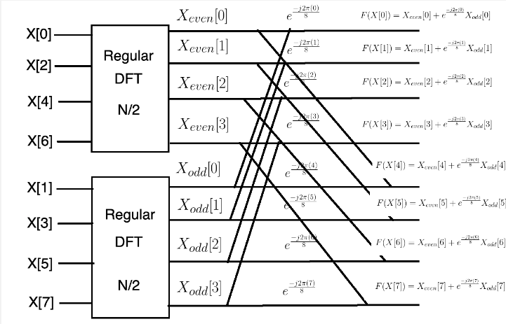

**Main Source : Various source from Google and Youtube**

**Fast Fourier Transform (FFT)** algorithm is a fast and efficient algorithm for computing the Discrete Fourier Transform (DFT) of a sequence of N complex numbers. FFT is able to make improvement from an $O(N^2)$ algorithm to an $O(N \: log (N))$.

### How does it works

There are some version of FFT developed over time, the most common version is the radix-2 which was originally described by Cooley-Tukey in 1965.

#### DFT Properties

DFT has some properties due to the nature of wave.

The symmetry properties states that if the input signal is real and even (symmetric), then the output will also be real and even (symmetric).  
Similarly, if the input signal is real and odd (antisymmetric), then the output will be imaginary and odd (antisymmetric).

On the other hand, the periodicity properties states that the output of DFT will repeat after a certain number of samples.

Using these properties, we can use it to perform a more efficient computation.

### The idea

The basic idea of FFT algorithm is to use divide-and-conquer algorithm strategy. FFT divides problem into smaller subproblems and solve it recursively. This can make computation more efficient because DFT has those properties.

The periodicity means that the output is periodic, this makes us able to decompose it to smaller calculation. If we have period of N, then we can divide it by N. And with the symmetry properties, we only need to calculate the first half of DFT output and the second half can be obtained by symmetry.

For example, if signal has the same output 8 times, we can divide it by 8. For each period, if signal is real-valued, then only the first half of the DFT need to be computed, because the second half of the coefficients can be obtained by symmetry.

  
Source : https://towardsdatascience.com/fast-fourier-transform-937926e591cb

After dividing into sub problems, each computation of the sub problem is the original matrix multiplication.  
So in summary, FFT provides a significant improvement over original DFT by using its properties and the nature of wave.

### FFT Output

A signal can have a various frequency in different time, using FFT we can split all the wave based on their frequency. The x-axis of FFT output shows the frequency bin or the frequency group. The y-axis represent the magnitude of corresponding frequency. Magnitude means how strong or how significant is the contribution of that wave.

For example, if in the x-axis = 100 there is a peak or high magnitude, this means that the wave with frequency 100Hz contribute the most to the original signal.

With the information from the FFT output, we can filter out the signal. For example, we can remove noise or unwanted signals by identifying high magnitudes in the output. If the majority of the output magnitudes range from 0 to 20, but there is one frequency with a magnitude of 100, a simple filter can be used to eliminate the infrequent magnitude.

A high magnitude or peak in the output can be interpreted as a wave that contribute the most or a noise which is unwanted signal. Because of this, a further analysis such as spectral shape, examining the relative magnitudes of different peaks are used to distinguish.

  
Source : https://learn.adafruit.com/fft-fun-with-fourier-transforms/background
