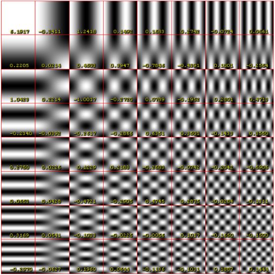

**Main Source:**

- **[JPEG DCT, Discrete Cosine Transform (JPEG Pt2) — Computerphile](https://youtu.be/Q2aEzeMDHMA)**

[DFT](/digital-signal-processing/discrete-fourier-transform) takes signal and waves of sine and cosine on their complex-valued representation, transforming them into another complex-valued representation. On the other hand, **discrete cosine transform (DCT)** takes real-valued input data, transforming them into sequence of real-valued output.

In the complex exponential term of [Fourier transform](/digital-signal-processing/fourier-transform), the sine wave component has imaginary term, which makes the whole representation of wave complex-valued. However, DCT rely only on cosine wave, making it accept and output real-valued data instead.

In the digital world, images and audio can be represented as signals. Digital signals are typically real-valued data because they originate from real-world phenomena. This make DCT suitable for digital signal processing, and is used for image compression, audio processing, etc.

### The Idea

DCT tries to represent digital signal as a sum of cosine wave with different frequencies. By representing them with cosine wave of varying frequency, we effectively separate the signal like FT. The separation of frequency makes it useful for tasks that analyze frequency content of the signal.

### Type-II DCT

DCT has many versions, each with its own set of properties and applications. The Type-II is commonly used and also the [JPG/JPEG](/digital-media-processing/jpg-jpeg) image compression standard. It is well-suited for image compression applications and also used in other media applications, such as video compression and audio compression.

The cosine function's output varies from -1 to 1. We can represent the output as with gray-scale color, and it will alternate from black and white.

  
Source: https://www.researchgate.net/figure/A-sine-wave-left-with-the-corresponding-2D-representation-a-sine-grating-shown-right_fig5_37986721

If we add each cosine wave with different frequency together, we can make a combination of cosine wave, resulting in the below set of color. This set of color is also called the **DCT basis function**.

  
Source: https://en.wikipedia.org/wiki/Discrete_cosine_transform

The more we go to right and bottom, the higher the frequency of the cosine wave will be. A high frequency of cosine wave will correspond to frequent color changing. This will be the basic idea of how DCT is used for compression in the later section.

### DCT Process

The basis function serves as a tool to represent image. The idea is, we can use any number of cosine wave and any combination of them together to construct an image. In other word, the original signal can be expressed as a weighted sum of these basis functions. In order to do this, we will need to know which cosine wave to use and how many of them do we need.

1. The type-II DCT first process the image by breaking it down into small pieces of 8×8 pixels. Each pixel represents color from 0 to 255, where 255 is white and 0 is black.
2. The color vary from 0 to 255, to suit with the output scale of cosine function (whose output is between -1 to 1), we will subtract each color by 128, making the color vary between -128 to 127.
3. After that, DCT is applied on each 8×8 pixels. Applying DCT involves summing each of the cosine wave from the basis function and multiplying it with the pixel color. Multiplying cosine wave with the pixel color will tell us how much each cosine wave on the basis function contributes to the pixel color.

:::note
The idea is similar to Fourier transform, in which we multiply waves of sine and cosine with the original signal, to know how they correlate.
:::

#### DCT Compression

The DCT process outputs 64 DCT coefficients (from a single 8×8 pixels) that represent the contribution of each cosine wave to the pixel's value. A higher coefficient signifies that the particular frequency contribute more compared to one with a lower coefficient.

  
_DCT of 8×8 grayscale image of capital letter A_  
Source: https://en.wikipedia.org/wiki/Discrete_cosine_transform#Example_of_IDCT

As mentioned before, frequent changing color, such as the bottom-most right-most, means a high frequency of cosine wave. On the other hand, as we go to top-left, the color rarely changes, suggesting that it is a lower frequency cosine wave. Seeing the overall image, high frequency wave typically correspond to area where the color of image frequently change, such as an image fine details.

In the image, we see that top-most left-most has the highest number of coefficient, which mean that lower frequency cosine wave contributes the most to the 8×8 pixels.

Together, these coefficients can be thought as the compressed representation of a single 8×8 pixels. To actually reduce the data, we may filter out unnecessary frequencies. For example, the frequency 0.0226 is small enough that we can discard it without affecting the overall image too much, while also reducing its size. We can also remove coefficient in the higher frequencies, because these fine details might not be noticed.

The last step of DCT is [Huffman encoding](/digital-signal-processing/compression#huffman-encoding), which is a lossless data compression technique that is used to further reduce the number of bits needed to represent the DCT coefficients.

  
Source: https://www.researchgate.net/figure/Algorithm-and-procedure-of-the-JPEG-image-compression-The-original-image-is-compressed_fig1_338524056

:::tip
Find out more about [JPG compression](/digital-media-processing/jpg-jpeg)
:::
