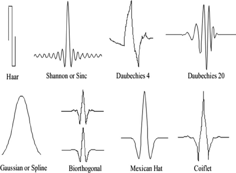
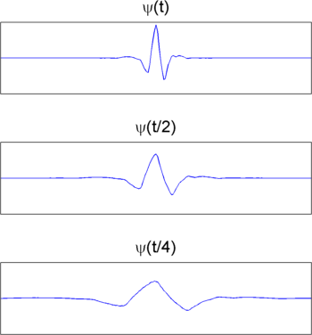
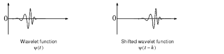

**Main Source :**

- [MATLAB : Understanding Wavelets, Part 1: What Are Wavelets](https://youtu.be/QX1-xGVFqmw)

Fourier transform represent signal in sinusoidal function, sometimes this is not suitable for some signal that has abrupt changes. For example, a sine wave is periodic meaning that the wave will have the same value at some intervals. If a signal changes abruptly, we will need another sine wave that represents another frequency. But adding another sine wave will also change the other side of the wave.

**Wavelets** is a short periodic function meaning that the function doesn't oscillates forever unlike sinusoidal function. Because it doesn't oscillates forever, Wavelets is localized meaning that the same function can have various shape. Wavelets can adapt their shape and size to match different regions of a signal, capturing localized information at different scales.

The purpose of Wavelets is like Fourier transforms, it is used to analyze and separate signals into different frequency components. Unlike Fourier transforms that decompose a signal into a series of sinusoidal components of different frequencies, Wavelets decompose signal into specific time or frequency region of the signal and is able to localized it.

  
Source : https://medium.com/@andrewtan_36013/electrocardiograms-qrs-detection-using-wavelet-analysis-a1070505efee

These are some example of common and general purpose wavelets function (called basis function).

### Wavelets Operations

Using basis wavelets function, we can construct any signal shape. We can do this by doing transformation into these basis function such as scaling or shifting.

#### Scaling

  
Source : https://www.mathworks.com/help/wavelet/gs/continuous-wavelet-transform-and-scale-based-analysis.html

#### Shifting

  
Source : https://inst.eecs.berkeley.edu/~ee225b/sp14/lectures/wavelets-g&w.pdf

The wavelets basis function are multiplied by the original signal to obtain wavelet coefficients, the similar concept as Tourier transform which is the contribution of each wavelets to the signal.

And using the wavelets coefficient we can do further analysis such as filtering noise, compression, etc by removing or discarding specific portion of signal based on the coefficient.
