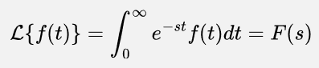

**Main Source:**

- **Various source from Google and YouTube**

**Laplace transform** is a mathematical operation that converts a time-domain function $f(t)$ into a complex frequency-domain representation $F(s)$.

Laplace transform can be thought as the generalized [Fourier transform](/digital-signal-processing/fourier-transform). Laplace transform extends the concept of the Fourier transform by allowing the analysis of a broader class of functions, including those functions that are not necessarily periodic or defined over an infinite time interval.

Fourier transform uses a complex exponential term to capture sinusoidal waves. This complex variable has only an imaginary part, representing the frequency component of the signal. On the other hand, the Laplace Transform involves both a real and an imaginary part in its complex variable.

The real part helps to represent exponential growth and exponential decay in the signal. These are characteristics of signal whose amplitude increases or decreases exponentially over time.

The Laplace transform is defined as the following:

Where:

- $s = \sigma + j \omega$
- $\sigma$: the real part of $s$
- $j \omega$: the imaginary part of $s$, where $j$ is the imaginary unit $j^2 = −1$ and $\omega$ is the angular frequency.

The concept of Laplace transform is same as Fourier transform. The complex term is multiplied by the original signal to capture the contribution of each frequency components.

### Visualization

Laplace transform is typically represented in 3D graph, where x-axis represents the real part, y-axis represent the imaginary part, and the z-axis represent the magnitude or phase. If Fourier transform were to be visualized, it would be a flat 2D graph instead.

  
Source: https://www.sharetechnote.com/html/EngMath_LaplaceTransform.html

Some regions may go to infinity, indicating that the corresponding frequency exhibits exponential growth or decay without limit. The presence of holes suggests that the function has discontinuities or exhibits oscillatory behavior.
