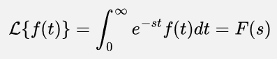

**Main Source : Various source from Google**

**Laplace Transform** is a mathematical operation that converts a function of a real variable (time) $f(t)$ to a function of a complex variable (frequency) $F(s)$.

Laplace transform can be thought as the generalized Fourier transform. Laplace transform extends the concept of the Fourier transform by allowing the analysis of a broader class of functions, including those that are not necessarily periodic or defined over an infinite time interval.

Fourier transform is Laplace transform with the real part of the complex variable (s) set to 0. The additional complexity in the output complex variable (s) which has real that can represents exponential growth or decay behavior, and the imaginary part determines the frequency content of the transformed function.

The Laplace transformed is defined as the following :

Laplace transform has many properties, the properties are useful to simplify the function. Laplace transform are used many fields such as reducing differential equation into an algebraic equation.

#### How does it works

The idea of Laplace transform is same as the Fourier transform, the function of time is multiplied by complex term to capture the frequency component and we will integrate it to combine all of the signal information with respect to time.

### Laplace Transform Visualization

Laplace transform is typically represented in 3D graph, where x-axis represent the real part, y-axis represent the imaginary part, and the z-axis represent the magnitude or phase.

In Fourier transform, because the real part is set to 0, then it will be flat 2D graph instead.

  
Source : https://www.sharetechnote.com/html/EngMath_LaplaceTransform.html

The part of visualization where it goes to infinity generally suggests that the corresponding function exhibits exponential growth or decay.  
The part where it creates a hole is when the function go into discontinuity or oscillatory behavior.
