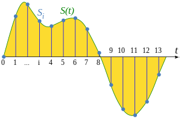
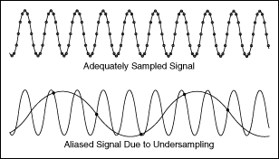
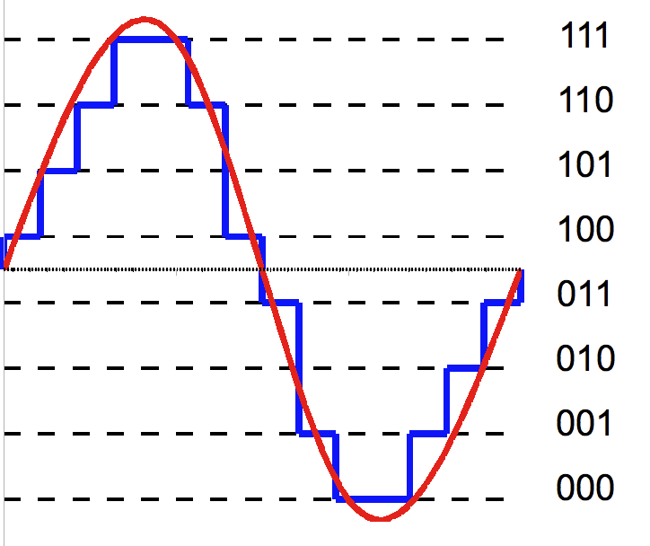
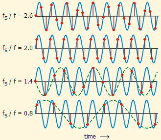
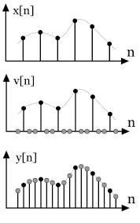

**Main Source :**

- **[0612 TV w/ NERDfirst Sampling, Aliasing & Nyquist Theorem](https://youtu.be/yWqrx08UeUs)**
- **Other sources from Google**

**Sampling** is a technique of taking some representative data from a group of data. In digital signal processing, sampling refers to the process of converting a continuous-time signal into a discrete-time signal.

:::tip
Find out more about sampling specific related to image in [here](/computer-graphics/sampling)
:::

A continuous signal can take on an infinite number of information within the time it's defined. Processing infinite amount of information wouldn't make sense, so instead we will only take some data which should "represent" the original signal.

  
Source : https://en.wikipedia.org/wiki/Sampling_%28signal_processing%29

These sample can now be represented in number easily. To be able to reconstruct that, we will need to connect between each samples.

### Sampling Problem

Sampling signal could introduce several challenges :

- **Noise** : Noise is an unwanted signal that is added to the desired signal during the sampling process. This noise can come from a variety of sources, including the sampling device, the environment, or the signal itself.  
  For example, while you record your sound, you may indirectly recorded traffic, people talking, and appliances sounds.  
    
   Source : https://www.predig.com/whitepaper/reducing-signal-noise-practice

- **Aliasing** : After sampling to a discrete signal, we may want to reconstruct it back to continous signal. However, this could introduce inaccuracy. **Aliasing** occurs when the sampling rate is insufficient making loss of detail and accuracy in the reconstructed signal. In other words, we don't have enough information to reconstruct it back.  
    
   Source : https://www.physik.uzh.ch/local/teaching/SPI301/LV-2015-Help/lvanlsconcepts.chm/Aliasing.html

- **[Quantization](/digital-signal-processing/quantization)** : Quantization is a way of simplifying a set of values by putting them into groups. It works by dividing the range of possible values into smaller intervals and assigning each value to the closest interval. This process helps to reduce the complexity of the data, but it also introduces some inaccuracy because the original values are approximated.

  For example in the image below, we divided this continous signal into 8 groups of binary bits.
    
   Source : https://www.differencebetween.com/difference-between-uniform-and-nonuniform-quantization/

### Nyquist Theorem

#### Sampling Rate

**Sampling Rate** also referred to as the sampling frequency is the number of samples taken per unit of time during the process of analog-to-digital conversion. It is typically measured in samples per second and is denoted in hertz (Hz). A higher sampling rate means more samples are taken per unit of time, resulting in a more detailed and accurate representation of the original analog signal.

For example in audio applications, the commonly used sampling rates are 44.1 kHz, this means every second, we will take 44.100 representation of the sound wave.

#### Nyquist-Shannon Sampling Theorem

Also known as **Nyquist Rate**, is a fundamental principle in digital signal processing to accurately reconstruct a continuous analog signal from its discrete samples. The theorem states that sampling rate should be greater than or equal to twice the bandwidth of the signal.

Mathematically written as : $\text{Sampling rate} \ge 2B$, where $B$ is the highest frequency in the signal.  
Nyquist rate is used to avoid aliasing and accurately represent signal.

  
Source : http://195.134.76.37/applets/AppletNyquist/Appl_Nyquist2.html

#### Nyquist Frequency

Nyquist frequency, also known as folding ferquency, represents the maximum frequency that can be accurately represented in a discrete digital signal without introducing aliasing.  
It is written as : $f_{\text{Nyquist}} = \frac{\text{Sampling rate}}{2}$

We can think Nyquist rate as the minimum and Nyquist frequency as the maximum sampling rate to avoid aliasing and to make sure we don't take too much sample.

For example, Audio CDs: Audio CDs have a sampling rate of 44.1 kHz. This means that the Nyquist frequency is 22.05 kHz. This is enough to represent the human hearing range, which is up to 20 kHz.

### Upsampling & Downsampling

Upsampling and downsampling are signal processing operations that involve changing the sampling rate of a discrete signal.

Upsampling increases the sampling rate of a signal by inserting additional samples between existing samples. A common method is to take an average of neighbour or technique like linear interpolation.

Downsampling reduces the sampling rate of a signal by removing samples from the original signal. It applies a low-pass filter, known as an anti-aliasing filter, to remove high-frequency components above the new Nyquist frequency.

  
Source : https://www.divilabs.com/2014/07/upsampling-interpolation-of-discrete.html
