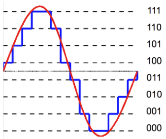

**Main Source : [Quantization - (Akash Murthy - Digital Audio Fundamentals)](https://youtu.be/1KBLguIXL30)**

**Quantization** is a way of simplifying a set of values by putting them into groups. It works by dividing the range of possible values into smaller intervals and assigning each value to the closest interval. This process helps to reduce the complexity of the data, but it also introduces some inaccuracy because the original values are approximated.

For example in the image below, we divided this continous signal into 8 groups of binary bits representation.

Source : https://www.differencebetween.com/difference-between-uniform-and-nonuniform-quantization/

The power of two of the bits used is called **bit depth**. Bit depth determines the resolution or precision of the quantized representation.

There is also **quantization level**, which represents the number of possible output or representation and mathematically written as : Number of quantization levels = $2^{(\text{bit depth})}$

The difference between the actual analog input value and the nearest quantization level is called **Quantization Error** or **Quantization Noise**.

### Uniform & Non-uniform Quantization

**Uniform quantization** is a quantization technique where the intervals between the quantization levels are evenly spaced. In other words, the range of all possible values is divided into equal intervals.

**Non-uniform quantization** is a quantization technique where the intervals between quantization levels are not evenly spaced. Instead, the intervals are non-uniformly spaced to allocate more quantization levels in regions of higher signal importance or sensitivity, and fewer quantization levels in regions of lower importance.

  
Source : https://analogquantized.wordpress.com/tag/non-uniform-quantization/
