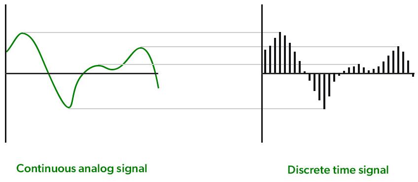
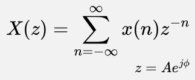
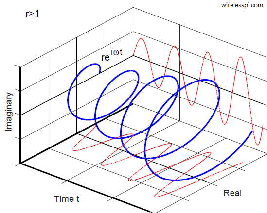

**Main Source : Various source from Google**

**Z-Transform** is the discrete version of [Laplace transform](/digital-signal-processing/laplace-transform). The discrete input of signal makes Z-transform usable in the digital world.

  
Source : https://www.geeksforgeeks.org/what-is-z-transform/

Z-transform is defined as follows :

- $x(n)$ : the n-th term of the sample
- z : complex variable
- A : magnitude of z
- j : imaginary unit
- $\phi$ : angle or phase in radian

Because Z-transform is discrete, $\sum$ is used instead of continous sum integral. Typically we don't sum all the way from negative infninity up to positive infinity, because it's not always possible to compute as the discrete signal may not be defined for all n values.

Instead, we truncate the sum. it won't affect the accuracy of the Z-transform as long as the number of terms is sufficiently large.

### How does it works

Z-transform is just the discrete version of Laplace transform, the way of how it works is similar as the [Discrete Fourier Transform](/digital-signal-processing/discrete-fourier-transform) to [Fourier Transform](/digital-signal-processing/fourier-transform). Multiplying each discrete sample by the complex variable would capture the phase and magnitude.

Z-transform is just the discrete version of Laplace transform, the way of how it works is similar as the Discrete Fourier Transform toFourier Transform. Multiplying each discrete sample by the complex variable $z^{-n}$, we are essentially converting the sample from the time domain to the frequency domain by shifting the sample to a different frequency. It will be shifted by power of n that vary between samples.

After getting the complex function output, it can be used for a variety of purposes, such as frequency analysis, filter design, system analysis.

#### Visualization

  
Source : https://wirelesspi.com/a-visualization-of-causality-and-stability-in-z-transform/

Same as Laplace transform, x-axis represents real part, y-axis represents imaginary part, and z-axis represents magnitude.
