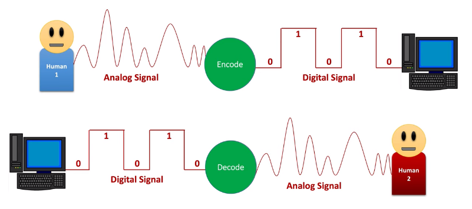
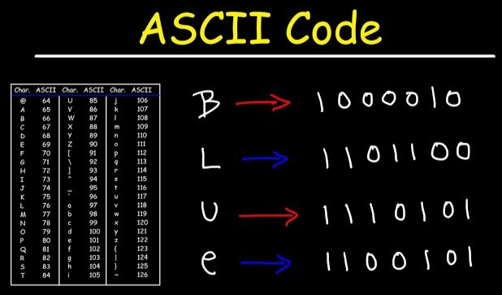

**Main Source :**

- **[Encoding & Decoding - Christopher Kalodikis](https://youtu.be/qSEmEpv5ct8)**
- **Other sources from Google and Youtube**

In digital signal processing, **Coding** refers to the process of representing a signal or data in a specific format or code. Coding is used to convert analog signals or continuous data into a discrete digital representation that can be processed, transmitted, stored, or interpreted by digital systems.

Coding is divided into encoding and decoding,

- **Encoding** : Encoding refers to the process of converting a signal or data into a specific format or code suitable for transmission, storage, or processing.
- **Decoding** : Decoding, on the other hand, is the reverse process of encoding. It involves recovering the original signal or data from its encoded representation.

For example, when we record sound using a microphone, it captures the sound wave as an analog signal. To process and manipulate this signal, it needs to be transformed into a digital form through an encoding process. Once the digital signal has been processed, it can be decoded or transformed back into a continuous analog signal so that we can hear the sound.

  
Source : https://www.sltinfo.com/the-encode-decode-model-of-communication/

The encoding and decoding terms is not limited to digital world.

### Digital Coding

In digital world such as media processing, encoding involves the conversion of media data, such as audio, video, or images. After encoding, the data can be further processed to remove redundancies and to represent the data more efficiently by applying some compression techniques.

Decoding, also known as playback or rendering, is the process of converting an encoded media file back into its original format for playback. For example, in the case of a music player, before playing the music, the player needs to decompress the original music files. After that, the music will output the sound through the speakers.

  
Source : https://youtu.be/qSEmEpv5ct8?t=269

### Unit of Data

In the digital world, a bit is the smallest unit of data that can be stored or transmitted. It can be either a 0 or a 1, which represents two possible states.

Bits are grouped together to form bytes. A byte is a group of 8 bits, and it can represent 256 different values. Bytes are used to store characters, numbers, and other data.

The amount of data transferred is called **Bandwidth**

  
Source : https://semiconductor.samsung.com/support/tools-resources/dictionary/bits-and-bytes-units-of-data/

### Data Representation

#### Information Interchange

To represent character, text, or number, there is a standard used. ASCII, or American Standard Code for Information Interchange, is a character encoding standard for electronic communication ASCII was first published in 1963 by the American Standards Association (now known as ANSI).

ASCII works by assigning a unique 7-bit binary number to each character. This allows for a total of 128 different characters, including letters, numbers, punctuation marks, and control characters.

There is ASCII table, which is a reference table that shows how the 128 characters that are defined based on the standard.  
For example using the ASCII table, character A is 65 and the binary equivalent is 01000001

  
Source : https://youtu.be/H4l42nbYmrU

ASCII has limited uses due to only being able to represent 128 different characters. In the modern world nowadays, ASCII is no longer used, instead we uses other standard called Unicode. Unicode is able to represent 149.186 different characters in the 15.0 version.

#### Image & Color Representation

Image is represented by a grid pixels. Pixel is the smallest unit of information in an image. A pixel typically owns 3 color value which is red, green and blue. Each color is represented as 1 byte or 8 bit (0-255), which means there are 256 different combination for each color. These three colors are combined together to construct an image, making it able to represent 16.777.216 different color in each pixels.

:::tip
Find out more about image and color in [here](/computer-graphics/computer-images-part-1)
:::
