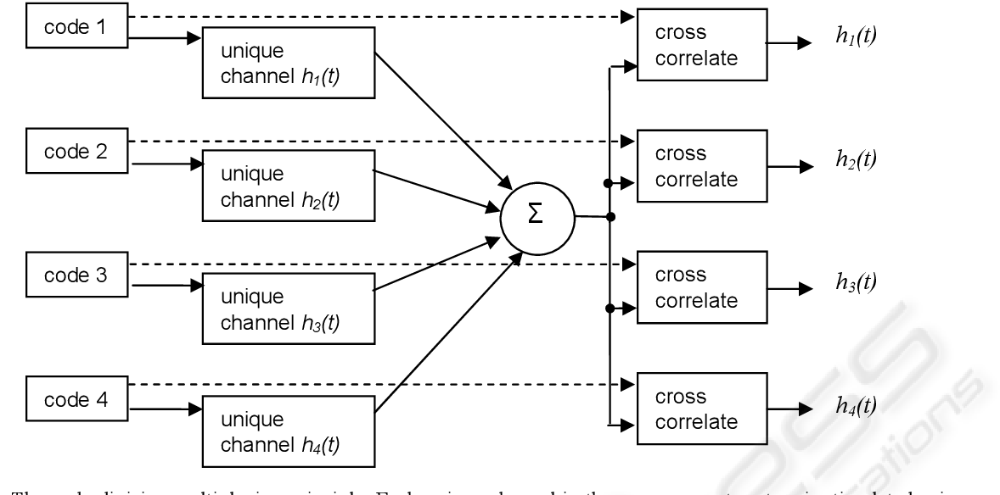

**Main Source :**

- **[Frequency Division Multiplexing - ALL ABOUT ELECTRONICS](https://youtu.be/UwWmDwbsDBs)**
- **[Wikipedia Multiplexing](https://en.wikipedia.org/wiki/Multiplexing)**
- **[Other sources from Google and Youtube]**

**Multiplexing** is a method to combine multiple signals into a single signal for transmission or processing. **Demultiplexing**, refers to the reverse method of multiplexing to extract the original individual signals at the receiving or processing end.

By using multiplexing technique, we can efficiently optimize resources such as bandwidth, time, increase capacity, and reduce costs.

  
Source : https://en.wikipedia.org/wiki/Multiplexing

### Frequency Division Multiplexing (FDM)

FDM is a multiplexing technique used to combine multiple signals onto a single transmission medium by separating each signal based on their frequency. These frequency won't be overlapped with each other to prevent interference between the signals.

FDM are typically used by analog signals such as :

- AM, FM radio
- Analog Television
- Analog Telephone

  
Source : https://electronicspost.com/what-is-multiplexing-frequency-division-multiplexing-fdm-and-time-division-multiplexing-tdm/

### Time Division Multiplexing (TDM)

Multiplexing technique which combine multiple signals onto a single transmission medium by allocating specific time slots to each signal.

There are also Time-Division Multiple Access (TDMA) which allow multiple source or transmitter.

TDM/TDMA is used in :

- Traditional telephone (T1 and E1 carrier)
- Digital Subscriber Line (DSL)
- GSM telephone system (2G networks)

  
Source : https://www.spiceworks.com/tech/networking/articles/what-is-tdm/

### Wavelength Division Multiplexing (WDM)

Multiplexing technique which combine multiple signals onto a single transmission medium by separating each signals by their wavelength. WDM is typically transmitted together through the [optical fiber](/digital-signal-processing/signal-transmission-medium#type-of-transmission-based-on-guidance).

WDM is used in :

- High-speed internet infrastructure
- Cable Television (CATV)
- Submarine Communication Systems

  
Source : https://www.wwt.com/article/how-does-wdm-technology-work

### Code Division Multiplexing (CDM)

Multiplexing technique which combine multiple signals onto a single transmission medium by separating each signals using unique codes identifier to distinguish the signals.

Each signal needs to be encoded using unique codes, the encoded signals are then combined. At the end, the signals are separated and extracted using the corresponding codes. The separated signals are then decoded to recover the original data or information.

Code Division Multiple Access (CDMA) is also a version of CDM which allows multiple sources.

CDM is used in :

- 3G and 4G Networks
- Wireless communication
- Satellite Communication

  
Source : https://www.semanticscholar.org/paper/Wide-Bandwidth%2C-High-Frame-Rate-Electrical-a-Code-McEwan-Holder/551f0f673fa93e8cfa3a9deee0ea2189ff057b12/figure/0
