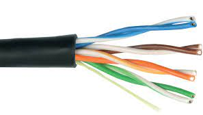
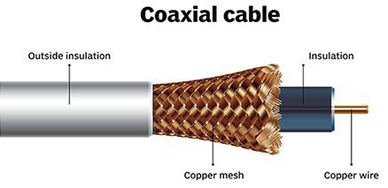
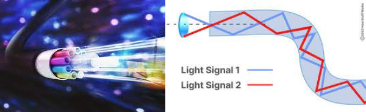
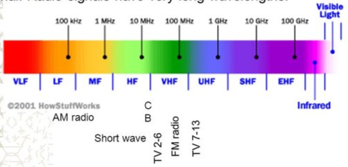
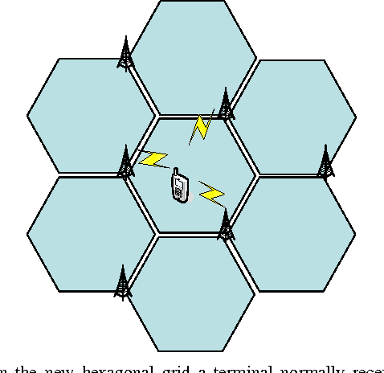
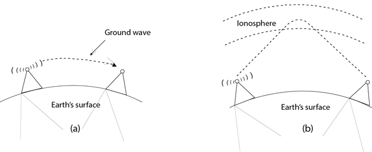

**Main Source:**

- **[Transmission medium — Wikipedia](https://en.wikipedia.org/wiki/Transmission_medium)**

Transmission medium is the pathway that mediate signal propagation.

### Type of Transmission Based on Guidance

Different types of signal transmission media are used depending on the nature of the signals, the distance of transmission, and other factors.

#### Guided Transmission

Guided transmission refers to the transmission of signals through a physical medium, which includes:

- **Twisted Pair**: Consists of pairs of insulated copper wires twisted together. It is commonly used in Ethernet networks and telephone systems.

    
  Source: https://www.ayokonfig.com/2016/11/pengertian-kabel-utp-stp-coaxial-dan.html

- **Coaxial Cable**: Consists of a central conductor, an insulating layer, a metallic shield, and an outer insulating layer. It is used in cable television (CATV) networks and broadband connections.

    
  Source: https://www.techtarget.com/searchnetworking/definition/coaxial-cable-illustrated

- **Optical Fiber**: Uses thin strands of glass or plastic fibers to transmit signals as pulses of light by bouncing it between the fibers. It is widely used for high-speed internet connections, long-distance communication, and data center connectivity.

    
  Source: https://www.nai-group.com/optical-fiber-technology-how-it-works/, https://computer.howstuffworks.com/fiber-optic2.htm

#### Unguided Transmission

Unguided transmission refers to the transmission of signals through wireless or free space channels where there is no physical medium to guide or confine the signals.

Unguided transmission media utilize electromagnetic waves such as radio (e.g., AM/FM radio). In radio communication, the transmitter and receiver must be tuned to the same frequency for successful communication. In other word, both must agree to operate on the same frequency.

  
Source: https://www.quora.com/What-is-the-bandwidth-of-radio-waves

##### Cellular Network

Another example is the unguided communication of mobile devices. These transmissions are guided by cell tower. They are called cell tower due to how they are located within their respective geographical areas or cells that are shaped like hexagon.

Each geographical region is divided into cells. Each cell is served by a base station or cell tower. The hexagon shape provides flexibility over the round earth.

  
Source: https://www.semanticscholar.org/paper/Joint-Transmission-and-Detection-in-Hexagonal-Grid-Ibing-Jungnickel/b5a6a4265438242906d2f913660cb966b23d1b17

Light is then bounced from source tower through the atmosphere or satellite to the next tower until the receiving end.

  
Source: https://www.javatpoint.com/unguided-transmission-media
