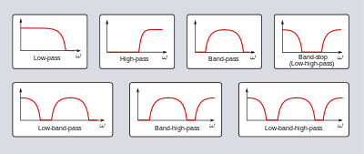

**Main Source : Various source from Google and Youtube**

In digital signal processing, **Filtering** refers to the process of modifying or manipulating a digital signal to remove unwanted components or extract specific information from the signal.

For example, we can remove unwanted component by applying techniques like the [Fourier transform](/digital-signal-processing/fourier-transform) to separate the signal based on each frequency and we can analyze it further.

  
Source : https://towardsdatascience.com/the-fourier-transform-4-putting-the-fft-to-work-38dd84dc814

Applying a filter works by selectively reduce or amplify certain frequency components based on the desired filtering characteristics.

Some common filtering includes :

- Lowpass Filter : Allows low-frequency components of a signal to pass through while reducing higher-frequency components.
- Highpass Filter : Allows high-frequency components of a signal to pass through while or reducing lower-frequency components.
- Bandpass Filter : Filters out both low and high-frequency content, allowing only the frequencies within the desired range to be present in the output signal.
- Bandstop Filter / Notch Filter : Reduces a specific range or band of frequencies while allowing frequencies outside that range to pass through.

  
Source : https://en.wikipedia.org/wiki/Filter_(signal_processing)

:::tip
Find out more about filter related to image in [here](/computer-graphics/signal-processing#image-filters).
:::
