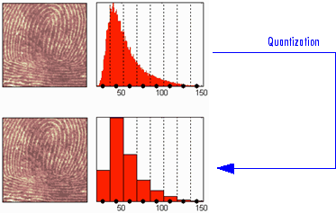

**Main Source : [Compression - CrashCourse Computer Science #21](https://youtu.be/OtDxDvCpPL4)**

**Signal Compression** also known as data compression or source coding, is the process of reducing the size or bit rate required to represent a signal while preserving as much of the original information as possible.

By removing data redundancies, it can lead to benefits such as reduced storage requirements, faster transmission, and improved resource utilization.

There are two main types of compression :

### Lossless Compression

Lossless compression algorithms aim to represent the signal in a compressed format without any loss of information. The original signal can be perfectly reconstructed from the compressed representation. Common example includes :

#### Run-length Encoding (RLE)

RLE is a simple compression algorithm to reduce repeating data without any loss of information. RLE works by replacing consecutive repeated symbols with a count of the repetition. It's effectiveness depends on the characteristics of the data whether it contains alot of repetition or not.

  
Source : https://iq.opengenus.org/run-length-encoding/, https://api.video/what-is/run-length-encoding/

#### Huffman Encoding

Huffman encoding is a technique that assigns some codes to input based on their occurance frequency. The most frequent occuring data will have shorter code, this way we can represent the data in shorter and smaller size.

#### Huffman Process

1. **Huffman Frequency Table** : First, each occurance of data is counted and a frequency table will be created. For example, consider this data `abbaacbbdefffddfff`, the frequency table will be :

   

2. **Huffman Tree Construction** : With the frequency table, we will construct a [binary tree](/data-structures-and-algorithm/binary-tree) where the child-most node is the less frequent data and the top most is the most frequent data. From the bottom child node, we will merge the two of lowest frequency to create the parent node representing their frequency sum. We will keep doing this up to the top most node.

   Constructing the tree includes the use of [min-heap](/data-structures-and-algorithm/heap) by comparing all the parent node frequency with the smallest frequency we are left off in the frequency table.

     
    Source : https://commons.wikimedia.org/wiki/File:Huffman_huff_demo.gif (with speed modification)

   We will then assign 0 for left child and 1 for right child. Each of the leaf node represent the data.

     
    Source : https://commons.wikimedia.org/wiki/File:Huffman_huff_demo.gif (with modification)

   Now the top most node will be the entry point of encoding and decoding process. All the possible bit from reading the binary tree is called **Huffman codes**. During transmission, we can include frequency table or the Huffman codes. So we can either reconstruct the huffman tree or use the decode the data using huffman codes directly.  
   For example, if we have "0001" that means it is "u" character.

   This way we can represent high frequent data in shorter term but we have to sacrifice the less frequent data.

### Lossy Compression

Lossy compression algorithms aim to achieve higher compression ratios by allowing some degree of loss of information. The compressed representation does not perfectly reconstruct the original signal, but it retains the perceptually significant information. Lossy compression is often used where minor losses in quality or accuracy are acceptable.

For example in an image, a color that is similar to the neighbour color can be discarded and changed with the similar one as it won't affect the overall image.

#### Transform Coding

DCT

  
Source : https://www.dspguide.com/ch27/6.htm

#### Wavelet Transform

  
Source : https://www.mathworks.com/help/wavelet/ug/wavelet-compression-for-images.html
