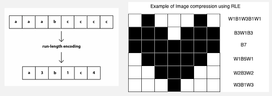
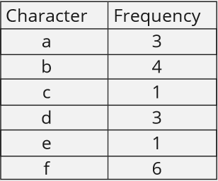
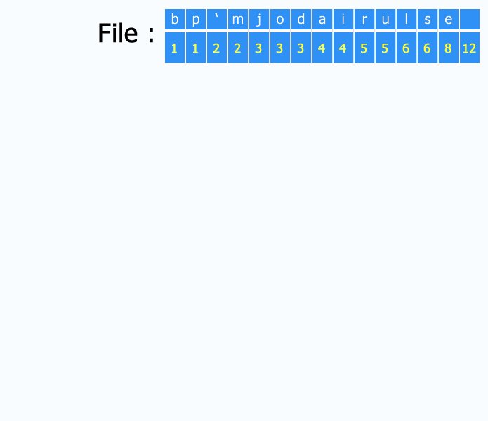
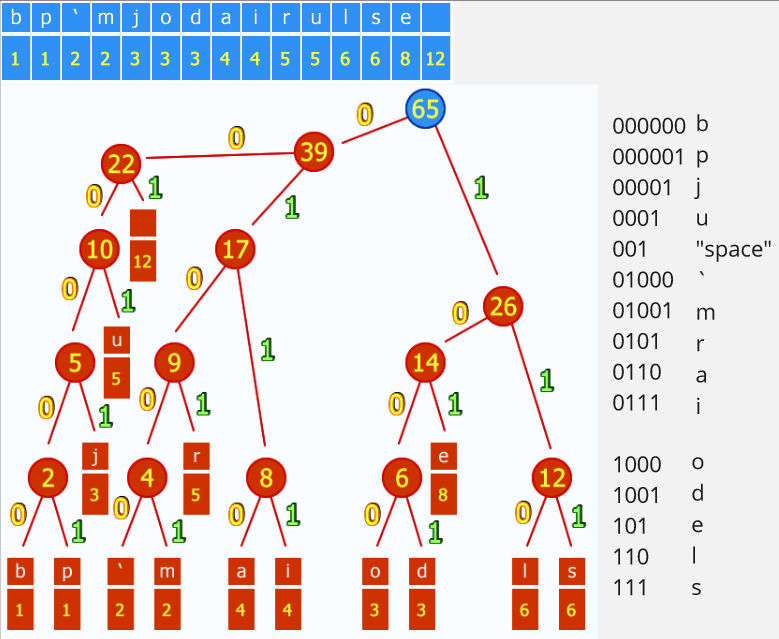

**Main Source:**

- **[Compression: Crash Course Computer Science #21 — CrashCourse](https://youtu.be/OtDxDvCpPL4)**

**Compression** is the process of reducing the size or _bit rate_ required to represent a signal or data while preserving as much of the original information as possible. Removing data redundancies can lead to reduced storage requirements, physical infrastructure cost, faster transmission, and improved resource utilization.

:::info
The amount of data transferred in a unit of time is called **bandwidth** or **bit rate**.
:::

:::note
Compression is considered a form of [encoding](/digital-signal-processing/encoding-and-decoding), which converts a signal or data into a specific format for transmission or storage, and then involves recovering the original signal or data from its encoded representation.
:::

Two main types of compression are lossless and lossy.

### Lossless Compression

Lossless compression algorithms aim to represent the signal in a compressed format without any loss of information. The original signal or data can be perfectly reconstructed from the compressed representation.

#### Run-length Encoding (RLE)

RLE is a simple lossless compression algorithm to reduce repeating data. RLE works by replacing consecutive repeated symbols with just one of the symbol and a number of count of the repetition. Its effectiveness depends on the characteristics of the data, that is whether it contains a lot of repetition or not.

  
Source: https://iq.opengenus.org/run-length-encoding/, https://api.video/what-is/run-length-encoding/

#### Huffman Encoding

Huffman encoding is a technique that maps each symbol (character or data element) of input data to certain code. The code is chosen based on the character occurrence frequency. A frequently encountered symbol will be mapped to a short code, while less frequent symbol is mapped into a longer code. This way we can represent the overall data in shorter and smaller size.

For example, [ASCII](/digital-signal-processing/encoding-and-decoding#information-interchange) is an encoding standard for representing characters. It assigns a fixed 8-bit binary code to each character. If we have 5 characters, we would need 40 bits to represent them. However, Huffman encoding is a **variable-length encoding** method, which means it can assign shorter binary codewords specific characters. It is possible to represent character "a", which may be the 90% of the content using just the binary code "01".

##### Procedure

1. **Huffman Frequency Table**: First, each occurrence of data is counted, and a frequency table will be created. For example, the string "abbaacbbdefffddfff", will have the following frequency table:

   

2. **Huffman Tree Construction**: Using the frequency table, we will construct a [binary tree](/data-structures-and-algorithms/tree#binary-tree), where the child-most node is the less frequent data and the top most is the most frequent data. From the child node, we will merge the two of the lowest frequency to create the parent node that represents their frequency sum. We will keep doing this up to the top most node.

     
   Source: https://commons.wikimedia.org/wiki/File:Huffman_huff_demo.gif (with speed modification)

   We will then assign 0 for left child and 1 for right child.

     
   Source: https://commons.wikimedia.org/wiki/File:Huffman_huff_demo.gif (with modification)

   Now the top most node will be the entry point of encoding and decoding process. All the possible bit from reading the binary tree is called **Huffman codes** (listed on the right side). During the storage or transmission, we will keep the frequency table or the Huffman codes to reconstruct the original version. We can either reconstruct the Huffman tree using the frequency table or use the list of Huffman codes to decode the data.

   For example, if we see the Huffman code "0001", that means it is the "u" character.

### Lossy Compression

Lossy compression algorithms aim to achieve higher compression ratios by allowing some degree of loss of information. The compressed representation does not perfectly reconstruct the original signal, but it retains the perceptually significant information. Lossy compression is often used where minor losses in quality or accuracy are acceptable.

For example, in an image, a color that is similar to the neighbor color can be discarded and changed with the similar one. Instead of having the color (255, 255, 254) with the (255, 255, 255) in RGB together, we may replace one of them with the other. Such replacement is not significant and will result the duplication of color, which can be optimized from other compression method like [run-length encoding](#run-length-encoding-rle) or [Huffman encoding](#huffman-encoding).

Lossy compression techniques are typically designed and optimized for specific types of data, such as images, audio, or video.

#### Transform Coding

Transform coding is a general concept of lossy compression that involves transforming the original data into a different domain or representation. That new representation is then analyzed and processed to achieve desired result. They are algorithm like [discrete cosine transform (DCT)](/digital-signal-processing/discrete-cosine-transform), [discrete Fourier transform (DFT)](/digital-signal-processing/discrete-fourier-transform) and [wavelet transform](/digital-signal-processing/wavelets).

  
Source: https://www.dspguide.com/ch27/6.htm

:::tip
Other lossy compression for [images (JPG/JPEG)](/digital-media-processing/jpg-jpeg), [audio (MP3)](/digital-media-processing/mp3), and [video (MP4)](/digital-media-processing/mp4).
:::
