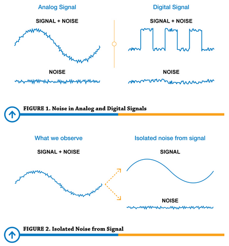
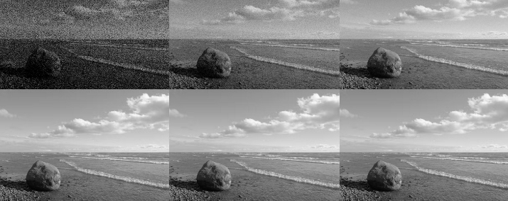
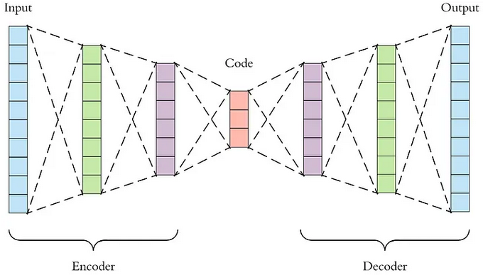

**Main Source : **

**Noise** is any unwanted or interfering signal that is added to the original signal while being processed, transmitted, or captured. This noise can come from a variety of sources, including the sampling device, the environment, or the signal itself.

For example, while you record your sound, you may indirectly recorded traffic, people talking, and appliances sounds.  
   
 Source : https://www.predig.com/whitepaper/reducing-signal-noise-practice

  
 Source : https://www.pixop.com/blog/image-noise-causes

**Denoising**, also known as noise reduction is the process of reducing or removing unwanted noise or interference from a signal. The idea of denoising is to identify the difference of charateristics such as frequency, amplitude, and phase between the legit signal and the unwanted signal.

For example in audio signal, while a relaxing music plays in the background, a sudden jump in amplitude is definitely a noise.

The denoising method depends on the noise characteristics, some common denoising method includes :

- **[Filtering](/digital-signal-processing/filtering)** : For example, applying filter such as lowpass would filter out the high frequency noise.

- **Transform Function** : Transform function such as [DFT](/digital-signal-processing/discrete-fourier-transform), [DCT](/digital-signal-processing/discrete-cosine-transform), or [Wavelets](/digital-signal-processing/wavelets) transform signal in time-domain into frequency domain. We can identify noise by analyzing signal that is separated by their frequency.

- **Statistical Methods** : Statistical methods involve exploiting statistical properties of the signal and noise to estimate and remove the noise. Example of statistical methods are mean filter, median filter, bayesian filter. Mean filter works by taking the average of the neighbour value, this filter may introduce blur or smooth out sharp edges or details in the signal.

### Machine Learning Denoising

Involves the use of machine learning algorithms to remove noise from signals. Machine learning algorithms can learn the characteristics of noise and signal, and use this knowledge to remove the noise without distorting the signal.

The idea of this is the same as general machine learning technique. We will train the models to be able to identify pattern and make prediction. Machine learning technique has advantages due to the adaptability to different noise types and able to recognize complex noise patterns.

Some techniques are :

- **Autoencoders** : Autoencoders are neural networks that are trained to reconstruct a signal from its noisy version. The autoencoder learns to identify the noise in the signal and remove it, leaving the signal intact.
- **Generative Adversarial Networks (GANs)** : GANs are a type of neural network that can be used to generate realistic images. GANs can also be used to remove noise from images by training them to generate images that are similar to the noisy image, but without the noise.

  
Source : https://towardsdatascience.com/applied-deep-learning-part-3-autoencoders-1c083af4d798

:::tip
Find out more about [machine learning](/machine-learning) and [deep learning](/deep-learning)
:::
