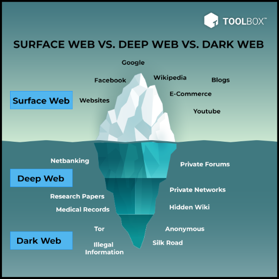
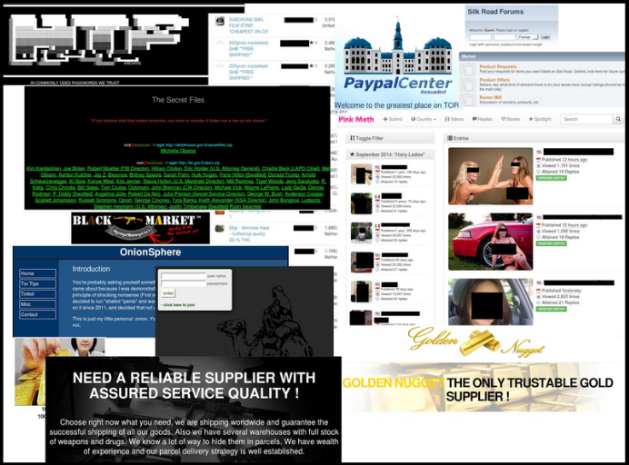

**Main Source :**

- **[Wikipedia Deep Web](https://en.wikipedia.org/wiki/Deep_web)**
- **[Wikipedia Dark Web](https://en.wikipedia.org/wiki/Dark_web)**

The web is often categorized into 3 based on the accessibility and visibility of websites and online content : surface web, deep web, and dark web.

### Surface Web

The surface web refers to any part of the internet that can be accessed through search engines like Google, Bing, or Yahoo. This includes websites and online services that are publicly accessible and can be found using standard web browsers.

### Deep Web VS Dark Web

Deep web and dark web is often used interchangeably, they both related to part of the internet that is not indexed by search engines but differs in the content they offer.

#### Deep Web

The deep web refers to any part of the internet that is not indexed by search engines and is therefore inaccessible through a simple Google search. This includes things like private databases, academic research, government and military networks, and other content that is not intended for public consumption.

#### Dark Web

Dark web on the other hand is a small part of the deep web that is intentionally hidden and requires specific software such as [Tor Browser](/extras/tor-browser) and configurations to access. It contains websites and online services that are intentionally hidden and operate anonymously, often used for illegal activities such as the sale of drugs, weapons, and stolen information.

  
Source : https://www.spiceworks.com/it-security/security-general/articles/dark-web-vs-deep-web/

### History of Dark Web

The dark web originated in the early 2000s as a way for government agencies, particularly the US Navy, to communicate securely and anonymously online. The technology used to create the dark web was called [TOR (The Onion Router)](/extras/tor-browser), which is a free, open-source software that allows users to browse the internet anonymously by encrypting their traffic and routing it through a network of servers around the world.

TOR was later released to the public, and over time, the dark web became a haven for people seeking anonymity online. It quickly became associated with illegal activities, such as drug sales, arms trafficking, and the sale of stolen information like credit card numbers and personal data.

### Inside Dark Web

Dark web has a lot of illegal activities going on inside, some of them are :

- **Cybercriminal Activity** : This includes the distribution of viruses and malware, also variety of hacking tools and services that can be used for malicious purposes. For example, there are services that offer to hack into social media accounts, email accounts, and even bank accounts for a fee.

- **Dark Markets** : The place where people can buy and sell illegal goods and services anonymously. The most infamous of these markets was [Silk Road](<https://en.wikipedia.org/wiki/Silk_Road_(marketplace)>), which was shut down by law enforcement in 2013.

- **Pornography** : There is a significant amount of illegal pornography on the dark web, including child pornography and other forms of exploitation. In addition, this includes extreme pornography, fetish content, and other adult material that may be considered objectionable or offensive. One of the famous site was [Playpen](<https://en.wikipedia.org/wiki/Playpen_(website)>) which was closed in March 2015

- **Terrorism** : Terrorist uses dark web to communicate, recruit members, and spread propaganda. Terrorist groups have been known to use the anonymity provided by the dark web to plan and coordinate attacks, as well as to solicit donations and funding. Some examples of terrorist organizations that have used the dark web include ISIS, al-Qaeda, and neo-Nazi groups.

  
Source : https://securelist.com/law-enforcement-agencies-in-tor-impact-over-the-dark-web/67574/
