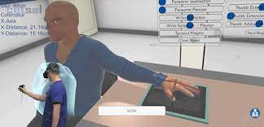
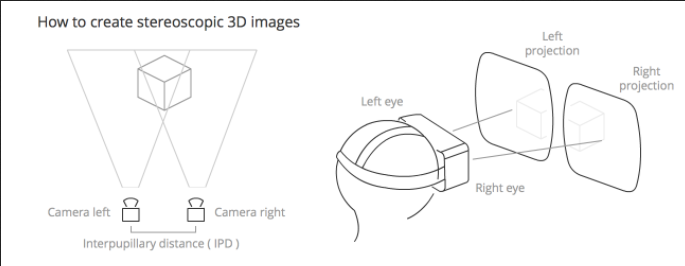
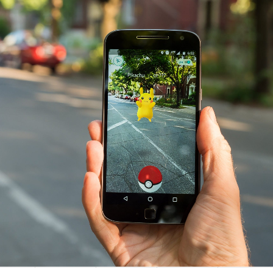
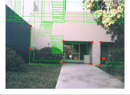

**Main Source :**

- **[How virtual reality tricks your brain - Vox](https://youtu.be/ybyib5pAq7Y)**
- **[ What is Augmented Reality and How Does it Work? | Mashable Explains](https://youtu.be/XX993jgeQ0M)**

### Virtual Reality (VR)

VR is a technology that uses computer simulation to give a sense of virtual world. VR relies on headset or googles as the way we see the simulation. VR uses head tracking sensor to track current direction we are looking into, it will update the virtual world in the same direction as our head. VR also use [spatial audio](/digital-media-processing/audio-effects#spatial-audio) technique to create realistic positional audio source.

  
Source : https://www.auntminnie.com/index.aspx?sec=ser&sub=def&pag=dis&ItemID=127826

#### How VR Works

The idea of VR is to create illusion, the simulation itself is generated with various [computer graphics](/computer-graphics) technique. Head tracking, other sensor and input utilize the use of [sensor](/digital-media-processing/image-acquisition-sensing).

However, these alone aren't enough to simulate real world as the simulation is just 2D. The main idea to create the 3D environment is to create a **stereoscopic images** which is an illusion of depth perception in a two-dimensional image or video.

Stereoscopic images by abusing human brain, the phenomena is called stereopsis. When an object is viewed from different perspectives by each eye, human brain combines these two slightly different images to perceive depth and create a three-dimensional representation of the object.

Together with the computer simulation, the image shown in left eye and right eye of the VR headset are rendered or captured from slightly different perspectives.

  
Source : https://myrepublic.net/au/virtual-reality-101/

### Augmented Reality (AR)

AR is a technology that combines the real world with computer-generated elements, such as images, videos, or 3D models. AR overlays digital information onto the real world, allowing users to see virtual objects or information in real time.

AR is also responsible for social media filters such as adding dog ears or a flower crown to a more complex effects like transforming the user into a specific character or applying virtual makeup.

  
Source : https://unair.ac.id/hukum-dan-kompleksitas-perkembangan-teknologi-augmented-reality/

#### How AR Works

AR relies on device sensor such as GPS, accelerometer, gyroscope, and depth sensors or LiDAR. The device will capture the surrounding real-world environment. It detects and tracks features like surfaces, objects, and markers using camera and sensors.

It will then generates virtual content including 3D models, images, videos, text, or animations. The generated content will be displayed in real time in the user device with the camera feed of the real world.

AR responds to input methods, such as touch, gestures, voice commands, or even eye tracking. As the user moves or the environment changes, the AR system continuously updates the position tracking.

Overall, AR relies alot on sensor and [computer vision](/deep-learning/deep-learning-tasks#computer-vision-cv) technique to track object.

  
Source : https://www.semanticscholar.org/paper/OVERCOMING-AUGMENTED-REALITY-TRACKING-DIFFICULTIES-Clothier-Bailey/ff7b8da5bb11879d1552020609c845919307ab19
