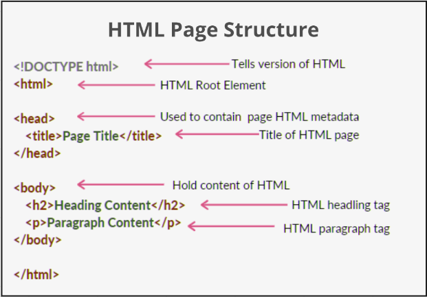
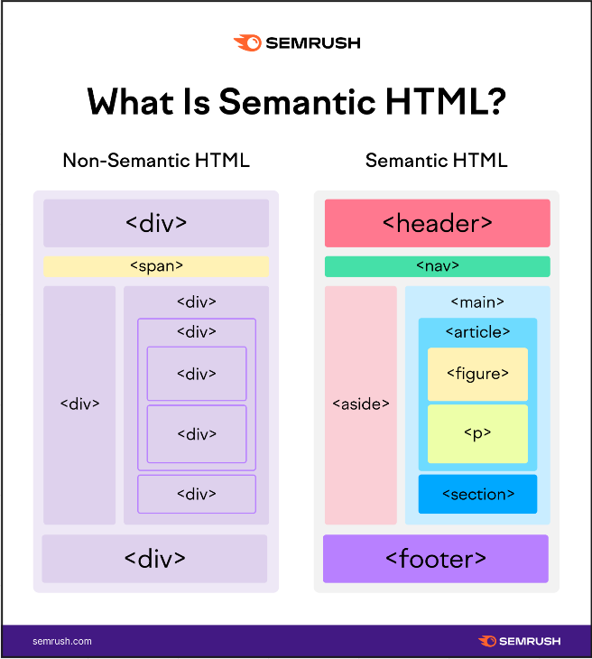

**Main Source : [Wikipedia HTML](https://en.wikipedia.org/wiki/HTML)**

**HTML (Hypertext Markup Language)** is a markup language used to create the structure and content of web pages. It is the basic building block of a webpage, consisting a series of tags or elements, which are used to define the structure and content of a web page.

Find out more about [how HTML works](/frontend-web-development/web-browser#page-rendering)

HTML documents are text files that can be created using any text editor, and have a .html file extension.

HTML provides a wide range of tags that can be used to create various elements on a web page, such as headings, paragraphs, lists, links, images, tables, forms, and more. To use a tag, it must be enclosed in angle brackets `<>` to indicate the beginning of the tag, and also include a closing tag enclosed in angle brackets with a slash `</>` to indicate the end of the tag.

For example creating heading looks like below :

```html
<h1>Heading text here</h1>
```

This is the basic HTML structure that is essential for defining the structure and content of an HTML document :

  
Source : https://www.geeksforgeeks.org/html/

HTML may also contains :

- `<meta>` : This tag is used to provide additional metadata about the document, such as the character encoding, keywords, and description.
- `<link>` : This tag is used to link to external resources, such as stylesheets and scripts.
- `<style>` : This tag is used to define styles for the document, either within the document itself or in an external stylesheet.
- `<script>` : This tag is used to insert scripts into the document, either within the document itself or in an external file.

### Semantic HTML

Semantic HTML is the practice of using HTML markup to convey the meaning and structure of content on a web page. Semantic HTML elements, such as `<header>`, `<nav>`, `<main>`, `<article>`, `<section>`, `<aside>`, and `<footer>`, provide a clear and meaningful structure to web pages.

Using just traditional `div` container would works fine, but using semantic HTML provide a clear and meaningful structure to web pages, which can improve **accessibility**, **search engine optimization (SEO)**, and **user experience**.

  
Source : https://www.semrush.com/blog/semantic-html5-guide/

### XHTML

**XHTML** stands for Extensible HyperText Markup Language, and it is a markup language that is designed to be a stricter, more standardized version of HTML. XHTML is based on XML, which means that it is syntactically stricter than HTML and conforms to the rules of XML syntax such as element nesting, attribute quoting, and other syntax rules.

XHTML was developed as a response to the proliferation of non-standard, poorly formed HTML documents on the web, which made it difficult for web browsers to render pages consistently. By adopting XML syntax and enforcing strict rules for document structure and syntax, XHTML aims to create a more consistent and predictable web browsing experience.

For example in XHTML, any syntax errors will cause the document to fail to parse, and the browser will display an error message. In HTML, the browser will attempt to correct any errors and continue parsing the document, which can lead to unexpected and inconsistent behavior.
