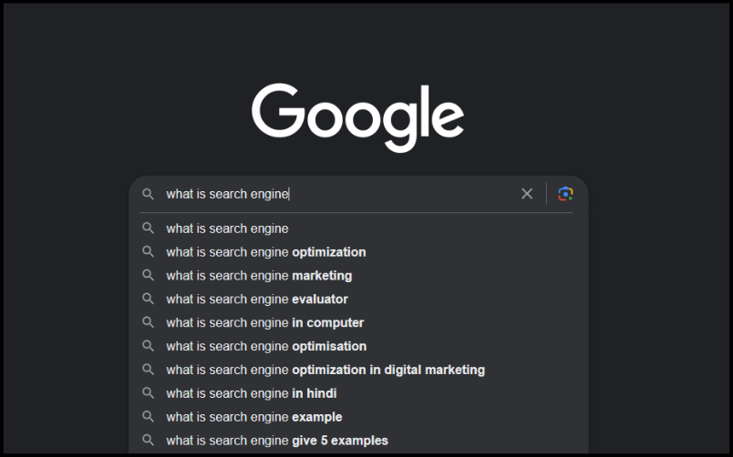

**Main Source : [Wikipedia Search Engine](https://en.wikipedia.org/wiki/Search_engine)**

**Search engine** is a software system that is designed to search for information on the internet. When a user enters a search query, the search engine uses an algorithm to search through its index of web pages and returns a list of relevant results. Search engine can be used to retrieve images, videos, infographics, articles, and other types of files.

These search engines use various techniques to determine the relevance of a web page to a particular search query, including analyzing the page's content, the number and quality of links pointing to the page, and other factors such as the location of the user and their search history. Search engines have become an essential tool for navigating the vast and ever-expanding network of information that is the internet.

### How search engine works

Search engine involves several process :

1. **Crawling** : The first step in the search engine process is crawling. Crawling is the process by which search engines look into web pages. Search engines use automated software known as "spiders" or "bots" to crawl the web and follow links from one page to another. The bots collect information about each page they crawl, such as the page title, meta tags, and content. Some website also have `robots.txt` which is a file containing directives for search spiders, telling it which pages to crawl and which pages not to crawl.

2. **Indexing** : Once the search engine bots have crawled a web page, they then store the information they've collected in a massive database known as an index. The index is a vast collection of all the pages that have been crawled by the search engine.

3. **Ranking** : When a user enters a search query into the search engine, the search engine algorithm analyzes the index to determine which pages are most relevant to the user's search query. The algorithm takes into account hundreds of factors, including keyword usage, page content, links pointing to the page, and many other factors.

4. **Results** : Once the algorithm has analyzed the index and determined which pages are most relevant to the user's search query, the search engine displays a list of results on the search engine results page (SERP). The results are usually displayed in order of relevance, with the most relevant pages at the top of the results page.

5. **Continuous Improvement** : Search engines are constantly refining their algorithms to deliver more relevant results to users. They use machine learning and artificial intelligence techniques to analyze user behavior and improve the relevance of their search results. Search engines also use feedback from users to improve their algorithms and provide better search results.

### PageRank Algorithm

**PageRank** is an algorithm used by the Google search engine to determine the relevance and importance of web pages. This algorithm works by analyzing the number and quality of links pointing to a web page. The basic idea is a webpage's score is increased when it is linked by numerous other webpages compared to a webpage that has fewer incoming links.

The PageRank algorithm assigns a numerical value to each page, known as its PageRank score. The score is calculated using a complex formula that takes into account the number and quality of links pointing to the page, as well as the PageRank scores of the pages linking to it.

  
Source : https://co.delante.co/definitions/pagerank/
