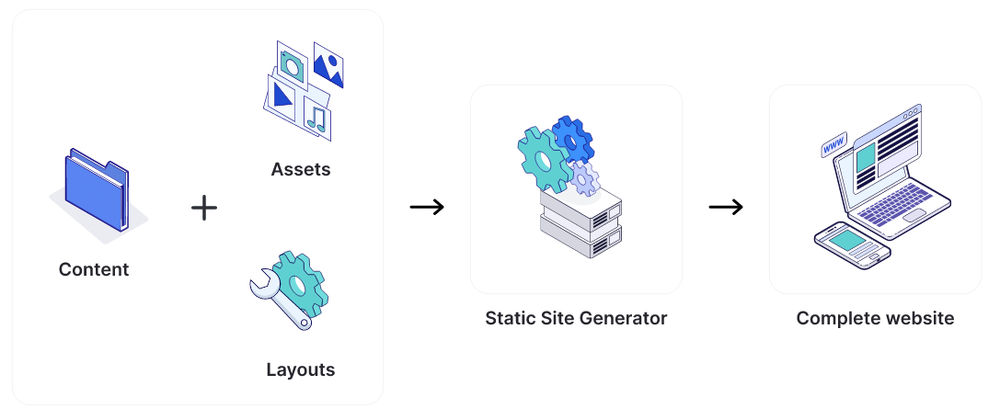

**Main Source :**

- [Wikipedia Static Web Page](https://en.wikipedia.org/wiki/Static_web_page)
- [Wikipedia Dynamic Web Page](https://en.wikipedia.org/wiki/Dynamic_web_page)

A website can be categorized into two based on how website content is generated and served to user.

### Static Website

**Static Website** are made up of pre-built HTML, CSS, and JavaScript files that are served to the user's browser as they are. Browser communicate to server to request such files and will render its content and never communicate with the server again. Static website doesn't need to connect to server to compute what to do next. This mean that the content is fixed and will never change, it will only change because of Javascript interactivity.

  
This site is an example of static site

### Dynamic Website

**Dynamic Website** on the other hand, are websites that generate content on the fly in response to user requests. Dynamic websites are built using server-side programming languages such as PHP, Ruby, Python, or JavaScript, and are typically backed by a database.

When a user requests a page on a dynamic website, the server processes the request, retrieves the necessary data from the database, and generates the HTML code for the page on the fly. This allows dynamic websites to provide more advanced functionality, such as user authentication, content management, and e-commerce capabilities.

Dynamic Website can be further classified into two :

- Client-Side : Client-side is similar to static as it doesn't involves server, but in client-side website aren't pre-built, the content are generated on the fly.
- Server-Side : Server-side relies on server processing the data and generate the HTML before sending it to the user's browser.

  
Source : https://en.wikipedia.org/wiki/Dynamic_web_page

### Static Site Generator

**Static site generators** are engines that is able to generate static HTML, CSS, and JavaScript files from a collection of source files, typically written in a markup language such as Markdown or HTML.

Static site generators are often used for websites that do not require frequent content updates or complex functionality, such as blogs, documentation sites, or portfolios.

#### How does it works?

Docusaurus is one of the popular static site generator used to make documentation website made using React JS and some other tools. Docusaurus is basically a template website that is customable by user, it has pre-made react component and other site functionality. Docusaurus only needs the document from user in markdown template.

The markdown will then be processed and HTML file containing the markdown content will be generated. Docusaurus also provides customization such as theme or other functionality like blog and sidebar. This mean that docusaurus will just change their default site depending on user desire.

  
Source : https://cloudcannon.com/blog/what-is-a-static-site-generator/
