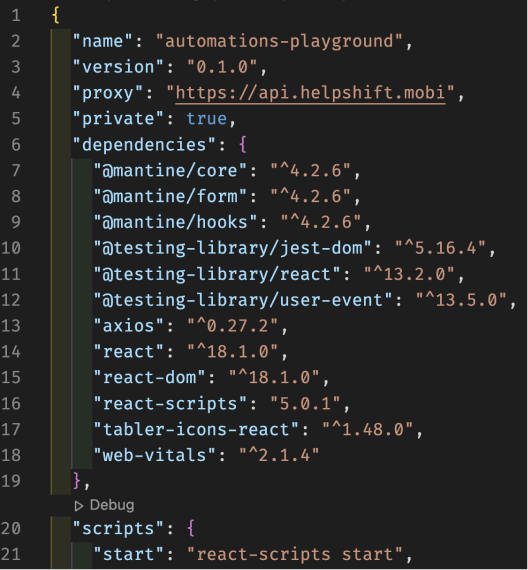

**Main Source : [Wikipedia npm](https://en.wikipedia.org/wiki/Npm)**

**NPM (short for Node Package Manager)** is a [package manager](/software-engineering/package-manager) for the JavaScript programming language also as the default package manager for [Node JS](/web-development/node-js). It is primarily used for managing and sharing packages of reusable code that can be easily integrated into web applications.

NPM provides a command-line interface (CLI) for working with packages and managing dependencies. When you need specific library or packages for your web app, developers can use the npm command to install packages from the NPM registry, which is a public repository of packages that can be easily searched and browsed.

### Dependencies

A dependency is a requirement that one piece of code has on another piece of code to function properly. If a web app uses specific library, the library will be included in the packages.

When a package is installed, NPM automatically resolves and installs any dependencies that are required by that package, which can include other packages, libraries, or tools. This helps to simplify the process of managing dependencies, as developers do not need to manually download and install each individual dependency.

#### package.json

`package.json` is the file used in Node.js projects to define the metadata, dependencies, and scripts for the project. NPM will reads the dependencies property in package.json and downloads and installs the listed modules and all their dependencies.

Here is an example package.json file :

```json
{
  "name": "my-project",
  "version": "1.0.0",
  "description": "My awesome project",
  "main": "index.js",
  "scripts": {
    "start": "node index.js",
    "test": "echo \"Error: no test specified\" && exit 1"
  },
  "dependencies": {
    "express": "^4.17.1",
    "lodash": "^4.17.21"
  }
}
```

#### package-lock.json

While `package.json` is file that contains all the required dependencies and other data, `package-lock.json` specifically used for exact versions of dependencies and their transitive dependencies that should be installed for a project.

  
Source : https://medium.com/helpshift-engineering/package-lock-json-the-complete-guide-2ae40175ebdd
