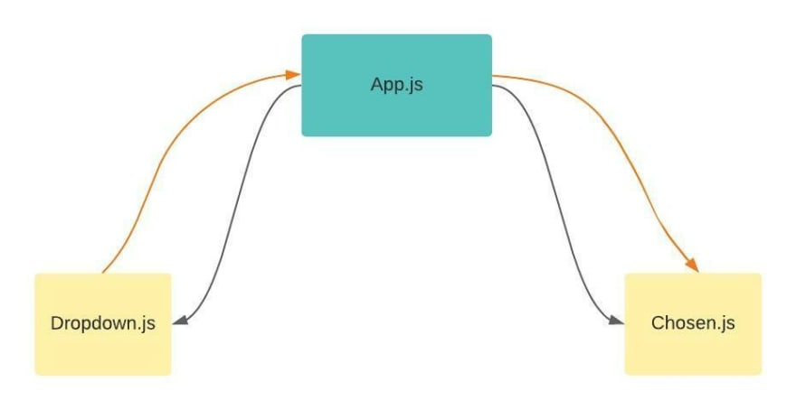

**Main Source : [Wikipedia React (software)](<https://en.wikipedia.org/wiki/React_(software)>)**

**React** is a Javascript front-end library, the idea behind React is to break the UI down into small, reusable components that can be combined to create complex interfaces. Each component can manage its own state and properties, making it easier to reason about and maintain the codebase.

React allows developer to use Javascript with HTML-like code, this is called JSX Extension. This mean developer can use all of the power of JavaScript, including variables, functions, and control structures, to create and manipulate the UI in React.

React uses a declarative syntax to define the UI, which means that developers describe what the UI should look like and React takes care of updating the actual UI as necessary. This is achieved by making a virtual DOM, React generates a virtual representation of the actual DOM. This virtual DOM is a lightweight copy of the actual DOM and is used to keep track of the state of the UI.

  
Source : https://react.dev/

### React State

In React, a state is an object that represents the current state of a component. A state can be anything such as data that a component holds or element that describe the UI.

For example in the image below, when the button is clicked, the text showing a value will be incremented.


  
Source : https://www.geeksforgeeks.org/reactjs-setstate/

### Virtual DOM

After writing HTML and Javascript code in a JSX file, React will render this and creates a virtual DOM tree. Virtual DOM contains information about the type of each element (such as `div` or `button`), its attributes (such as `class` or `style`), and its children (which can be other virtual DOM nodes or plain text).

When the state of a React component changes, React uses diffing algorithm to check which component has changed. This is an efficient way to only make the necessary changes, after this React generates a new virtual DOM tree that represents the updated state of the UI.

  
Source : https://programmingwithmosh.com/react/react-virtual-dom-explained/

### Lifting State Up & React Props

When developing a web app we will try to breaks the UI down into smaller component, often times a child component has some data that other child component needs it. These child component can't communicate directly, a way to solve this is to **lift the state up**. This mean we will store the data to the closest common ancestor of the components that need it.

  
Source : https://dev.to/lauratoddcodes/a-really-simple-intro-to-lifting-state-in-react-1fli

For example, consider the following code :

```jsx
function ClickCountDisplay() {
  return (
    <div>
      <p>The count is: ???</p>
    </div>
  );
}

function ClickCountButton() {
  const [count, setCount] = useState(0);

  function handleClick() {
    setCount(count + 1);
  }

  return (
    <div>
      <button onClick={handleClick}>Click me</button>
    </div>
  );
}
```

In this example, we made a button and a text that should displays the click count. However, the `ClickCountDisplay` doesn't know how many clicks are now, because the click count is stored in the button.

The solution for this is to make a parent that holds the state and pass the required data.

```jsx
function ParentHolder() {
  const [count, setCount] = useState(0);

  function handleClick() {
    setCount(count + 1);
  }

  return (
    <div>
      <ClickCountDisplay count={count} />
      <ClickCountButton onClick={handleClick} />
    </div>
  );
}

function ClickCountDisplay({ count }) {
  return (
    <div>
      <p>The count is: {count}</p>
    </div>
  );
}

function ClickCountButton({ onClick }) {
  return (
    <div>
      <button onClick={onClick}>Click me</button>
    </div>
  );
}
```

`ParentHolder` make it possible for `ClickCountDisplay` to know the data, when we pass in a data through `ClickCountDisplay count={count}` and accept the data by `function ClickCountDisplay({ count })`, this is called props short for properties, which refers to a way of passing data from a parent component to a child component.

### React Use Effect

When a state changes, React only updates the UI. Often times there's something in our web app that we also want to updates everytime a state changes. For example we want to always backup user data in local storage. This is called side effect, any code that is not related to rendering your component, but that needs to be executed as a result of some state or prop changes.

We can achieve this using react `useEffect`, this will allows you to run some code in your functional components after every render.

  
Source : https://www.memberstack.com/blog/uselayouteffect-vs-useeffect
