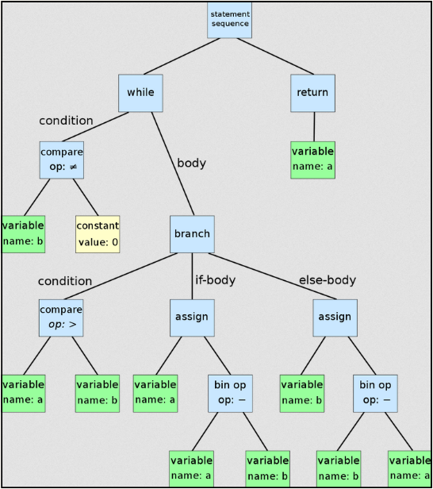
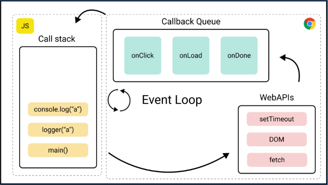
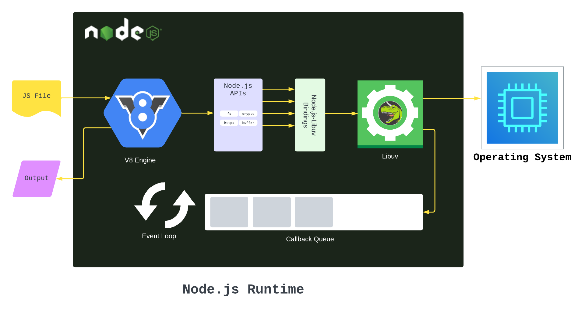
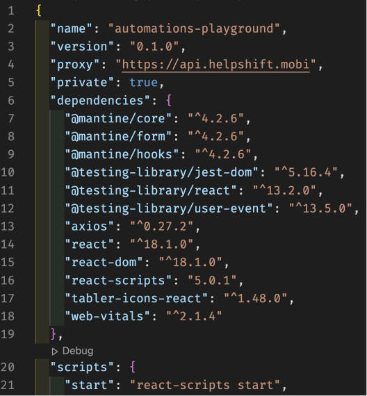
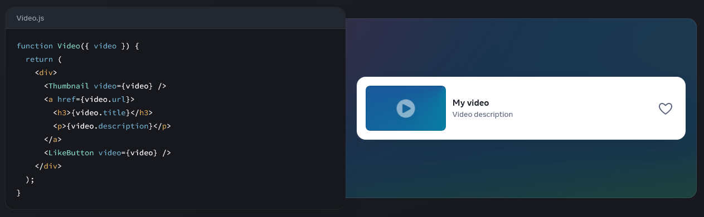
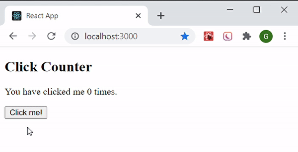
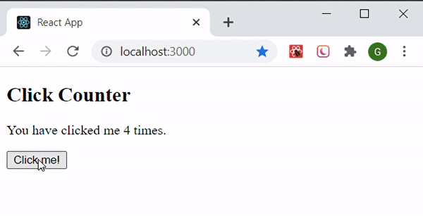
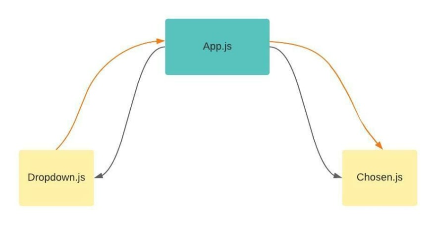
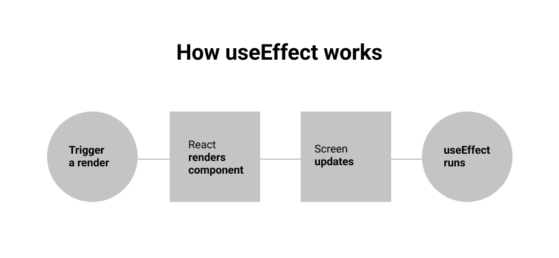

**Main Source :**

- **[JavaScript - Wikipedia](https://en.wikipedia.org/wiki/JavaScript)**
- **[V8 (JavaScript Engine) - Wikipedia](<https://en.wikipedia.org/wiki/V8_(JavaScript_engine)>)**
- **[V8 Hidden Classes by Chameera Dulanga - Medium](https://blog.bitsrc.io/secret-behind-JavaScript-performance-v8-hidden-classes-ba4d0ebfb89d)**
- **[Node JS - Wikipedia](https://en.wikipedia.org/wiki/Node.js)**
- **[npm - Wikipedia](https://en.wikipedia.org/wiki/Npm)**
- **[React (software) - Wikipedia](<https://en.wikipedia.org/wiki/React_(software)>)**

**JavaScript** is a high-level programming language first introduced in 1995, it is mostly used for web development. JavaScript was specifically created to be run in web browsers, which means it can integrate with the browser and access the [DOM (Document Object Model)](/internet-and-web/html-dom) to change or manipulate it such as adding or deleting elements, changing style like color, modify content and etc.

JavaScript is based on ECMAScript (ES) which is a scripting language specification or the standard that defines JavaScript language. JavaScript is now based on the ES6 (ECMAScript 2015) which was released in 2015.

### V8 JavaScript Engine

JavaScript is an interpreted language meaning that it is executed line-by-line at runtime rather than being compiled before execution. JavaScript code is executed by a **JavaScript engine** which is typically included in web browsers.

One of a JavaScript engine is V8 which was developed by Google and is used in Google Chrome. The V8 engine is a just-in-time (JIT) compiler that compiles JavaScript code into machine code at runtime. The engine consists of several components that work together to execute JavaScript code efficiently :

1. **Parsing and Bytecode Generation** : The first step is V8 engine parse JavaScript and turns it into an abstract syntax tree (AST) which is a tree-like data structure that represents the abstract syntactic structure of a program in a programming language. The parser checks the syntax of the code for correctness and creates a tree structure that represents the structure of the code.  
   After it's parsed, bytecode is generated and will be interpreted in the next step.

     
    Source : https://en.wikipedia.org/wiki/Abstract_syntax_tree

2. **Interpreter** : Once AST has been created, V8 engine executes the code using an interpreter called Ignition reading the codes line by line following the control flow.

3. **Profiler & Optimizer** : V8 engine includes a profiler that collects information about how the code is being executed. The information collected by the profiler, the V8 engine uses an optimizing compiler to generate more efficient machine code.

4. **Hidden Class** : Hidden Class is one of the optimization technique to improves the performance of object creation. V8 generates a class based on the structure of the objects we create in our JavaScript code. JavaScript is a dynamic language which means variables, data types, and function calls are evaluated and executed at runtime. This can slow down the process of accessing properties, because the engine need to do type checks. Hidden classes provide certainty for the engine about the types of object properties which can improve efficiency of property accessing and object creation.

5. **Garbage Collector** : V8 engine manages memory allocation and deallocation using a garbage collector. The garbage collector identifies objects that are no longer needed by the code and deallocates the memory they occupy.

6. **Code Generation** : After everything is parsed and optimized, the code is compiled into machine code by the V8 engine's compiler. The machine code is then executed directly by the CPU, which results in faster execution times compared to interpreting the bytecode.

### JavaScript Run-Time Environment

JavaScript relies on run-time environment for managing the execution of JavaScript code. JavaScript runs on a single-threaded environment which means it can only execute one task at a time. JavaScript uses **call stack** which is a data structure that keeps track of the currently executing functions in the JavaScript call hierarchy.

The environment also includes **callback queue** which is a data structure that holds callback functions that are waiting to be executed such as asynchronous events like waiting for user input or making a network call.

Another mechanism to manages the execution is the **event loop**. When the call stack is empty, the event loop checks the callback queue for new events. If there is a callback function waiting in the queue, the event loop retrieves the function and adds it to the call stack for execution. This allows JavaScript to handle asynchronous events without blocking the execution of other code.



#### Node JS

**Node.js** is a JavaScript runtime environment that allows developers to run JavaScript on the server-side.

JavaScript is a client-side language, meaning that it runs in the context of a web browser on the client-side (i.e., the user's computer). However, with Node.js which provide runtime environment, developers can also run JavaScript code on the server-side.

Node.js is able to make JavaScript to run on server because it uses V8 engine which is the same engine used by Google Chrome in the client-side to run JavaScript. Node.js instead uses this engine to run JavaScript on server.

##### Node JS Features

Node.js also provides a collection of modules related to server such as file system I/O, networking (DNS, HTTP, TCP, TLS/SSL, or UDP), binary data (buffers), cryptography functions, data streams, and other core functions.

Node.js uses an event-driven, non-blocking I/O model, single event loop to handle incoming requests. This means that instead of waiting for a request to complete before moving on to the next one, Node.js processes incoming requests in an asynchronous manner. Node.js registers a callback function, meaning another task will be executed once the currently executing task is completed.

  
Source : https://www.freecodecamp.org/news/what-exactly-is-node-guide-for-beginners/

**NPM (short for Node Package Manager)** is a [package manager](/software-engineering/build-and-package-management) for the JavaScript programming language also as the default package manager for [Node JS](/internet-and-web/node-js). It is primarily used for managing and sharing packages of reusable code that can be easily integrated into web applications.

NPM provides a command-line interface (CLI) for working with packages and managing dependencies. When you need specific library or packages for your web app, developers can use the npm command to install packages from the NPM registry, which is a public repository of packages that can be easily searched and browsed.

### Dependencies

A dependency is a requirement that one piece of code has on another piece of code to function properly. If a web app uses specific library, the library will be included in the packages.

When a package is installed, NPM automatically resolves and installs any dependencies that are required by that package, which can include other packages, libraries, or tools. This helps to simplify the process of managing dependencies, as developers do not need to manually download and install each individual dependency.

#### package.json

`package.json` is the file used in Node.js projects to define the metadata, dependencies, and scripts for the project. NPM will reads the dependencies property in package.json and downloads and installs the listed modules and all their dependencies.

Here is an example package.json file :

```json
{
  "name": "my-project",
  "version": "1.0.0",
  "description": "My awesome project",
  "main": "index.js",
  "scripts": {
    "start": "node index.js",
    "test": "echo \"Error: no test specified\" && exit 1"
  },
  "dependencies": {
    "express": "^4.17.1",
    "lodash": "^4.17.21"
  }
}
```

#### package-lock.json

While `package.json` is file that contains all the required dependencies and other data, `package-lock.json` specifically used for exact versions of dependencies and their transitive dependencies that should be installed for a project.

  
Source : https://medium.com/helpshift-engineering/package-lock-json-the-complete-guide-2ae40175ebdd

### HTML + CSS + JavaScript

HTML, CSS, and JavaScript are three different technologies that work together to create modern web applications.

- HTML (Hypertext Markup Language) define the structure and content of a web page. It consists of a series of elements that define the various parts of a web page, such as headings, paragraphs, images, and links.
- CSS (Cascading Style Sheets) is used to style and layout the content created with HTML. It allows developers to control the visual presentation of a web page, including its colors, fonts, spacing, and layout.
- JavaScript is used to add interactivity and dynamic functionality for the behavior of a web application. It allows developers to create interactive elements such as dropdown menus, sliders, and pop-up windows, and to perform actions in response to user input.

    
   Source : https://scrimba.com/articles/html-css-JavaScript/

#### DOM Manipulation

When a web page is loaded in a browser, the browser creates a DOM tree based on the HTML code in the page. The browser parses the HTML code and creates a tree of nodes that represent the elements in the page. This DOM tree can be accessed and manipulated using JavaScript.

This allows developers to manipulate HTML and CSS in a web page. JavaScript will access specific element by searching the DOM tree based on ID, class, selector, and tags.

For example consider the following code that shows how JavaScript access an element based on id selector :

```html
<div id="myDiv">Hello, world!</div>
```

```JavaScript
// Get the element with the ID "myDiv"
var myDiv = document.getElementById("myDiv");

// Change the text content of the element
myDiv.textContent = "Hello, JavaScript!";
```

DOM manipulation with JavaScript can do a lot of things to a web page, including :

- Changing text content of an element using `.textContent`.
- Change attribute of an element using `.setAttribute`, for example changing an img src.
- Adding or removing classes from an element by `.classList.add("anotherClass")` or `.classList.remove("existingClass")`.
- Modify style with `.style` followed by the style element such as `backgroundColor`.
- Creating new elements and adding them to the DOM like below :

  ```JavaScript
  var newParagraph = document.createElement("p");
  newParagraph.textContent = "This is a new paragraph.";
  document.body.appendChild(newParagraph);
  ```

And many other methods and techniques…

### JQuery

TBA

### React JS

**React** is a JavaScript front-end library, the idea behind React is to break the UI down into small, reusable components that can be combined to create complex interfaces. Each component can manage its own state and properties, making it easier to reason about and maintain the codebase.

React allows developer to use JavaScript with HTML-like code, this is called JSX Extension. This mean developer can use all the power of JavaScript, including variables, functions, and control structures, to create and manipulate the UI in React.

React uses a declarative syntax to define the UI, which means that developers describe what the UI should look like and React takes care of updating the actual UI as necessary. This is achieved by making a virtual DOM, React generates a virtual representation of the actual DOM. This virtual DOM is a lightweight copy of the actual DOM and is used to keep track of the state of the UI.

  
Source : https://react.dev/

#### React State

In React, a state is an object that represents the current state of a component. A state can be anything such as data that a component holds or element that describe the UI.

For example in the image below, when the button is clicked, the text showing a value will be incremented.


  
Source : https://www.geeksforgeeks.org/reactjs-setstate/

#### Virtual DOM

After writing HTML and JavaScript code in a JSX file, React will render this and creates a virtual DOM tree. Virtual DOM contains information about the type of each element (such as `div` or `button`), its attributes (such as `class` or `style`), and its children (which can be other virtual DOM nodes or plain text).

When the state of a React component changes, React uses diffing algorithm to check which component has changed. This is an efficient way to only make the necessary changes, after this React generates a new virtual DOM tree that represents the updated state of the UI.

  
Source : https://programmingwithmosh.com/react/react-virtual-dom-explained/

#### Lifting State Up & React Props

When developing a web app we will try to breaks the UI down into smaller component, often times a child component has some data that other child component needs it. These child component can't communicate directly, a way to solve this is to **lift the state up**. This mean we will store the data to the closest common ancestor of the components that need it.

  
Source : https://dev.to/lauratoddcodes/a-really-simple-intro-to-lifting-state-in-react-1fli

For example, consider the following code :

```jsx
function ClickCountDisplay() {
  return (
    <div>
      <p>The count is: ???</p>
    </div>
  );
}

function ClickCountButton() {
  const [count, setCount] = useState(0);

  function handleClick() {
    setCount(count + 1);
  }

  return (
    <div>
      <button onClick={handleClick}>Click me</button>
    </div>
  );
}
```

In this example, we made a button and a text that should displays the click count. However, the `ClickCountDisplay` doesn't know how many clicks are now, because the click count is stored in the button.

The solution for this is to make a parent that holds the state and pass the required data.

```jsx
function ParentHolder() {
  const [count, setCount] = useState(0);

  function handleClick() {
    setCount(count + 1);
  }

  return (
    <div>
      <ClickCountDisplay count={count} />
      <ClickCountButton onClick={handleClick} />
    </div>
  );
}

function ClickCountDisplay({ count }) {
  return (
    <div>
      <p>The count is: {count}</p>
    </div>
  );
}

function ClickCountButton({ onClick }) {
  return (
    <div>
      <button onClick={onClick}>Click me</button>
    </div>
  );
}
```

`ParentHolder` make it possible for `ClickCountDisplay` to know the data, when we pass in a data through `ClickCountDisplay count={count}` and accept the data by `function ClickCountDisplay({ count })`, this is called props short for properties, which refers to a way of passing data from a parent component to a child component.

#### React Use Effect

When a state changes, React only updates the UI. Often times there's something in our web app that we also want to update every time a state changes. For example, we want to always back up user data in local storage. This is called side effect, any code that is not related to rendering your component, but that needs to be executed as a result of some state or prop changes.

We can achieve this using react `useEffect`, this will allow you to run some code in your functional components after every render.

  
Source : https://www.memberstack.com/blog/uselayouteffect-vs-useeffect

### AJAX

TBA
