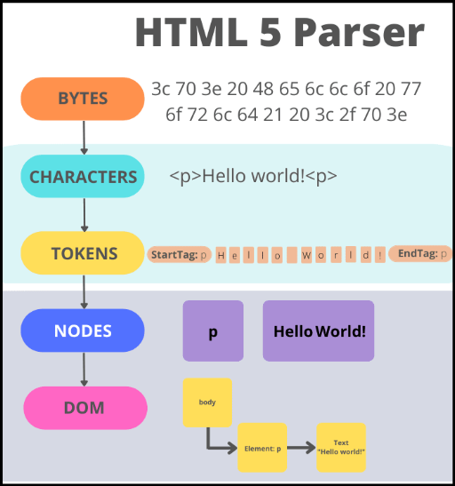
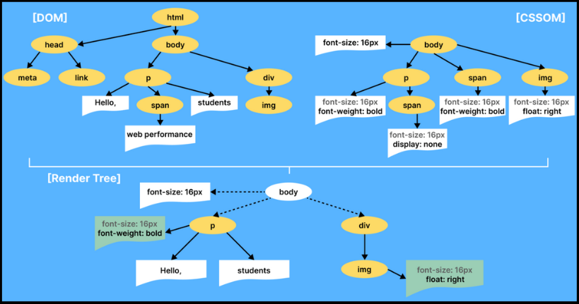
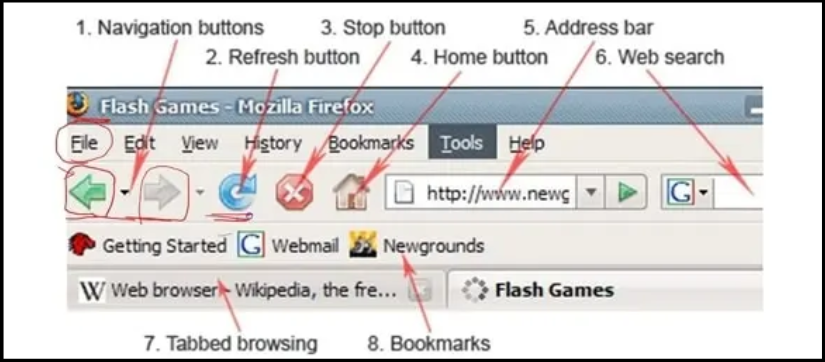

**Main Source :**

- **[Web browser - Wikipedia](https://en.wikipedia.org/wiki/Web_browser)**
- **[How browsers work - JSConf](https://youtu.be/0IsQqJ7pwhw)**

A web browser, is a software application used to access and view websites and other online content on the internet. The main function of a browsers include :

- **Connect to Server** : Browsers connects a server or website first by sending a [web address or URL (Uniform Resource Locator)](/internet-and-web/web-url) entered by user to [DNS](/computer-networking/dns) to find the [IP address](/computer-networking/ip-address) of the web server that hosts the requested web page.
- **Communicate with Server** : After that browser will sends a request to the web server for the specific web page or resource that the user requested, using the [HTTP or HTTPS](/computer-networking/http-https) protocol. The web server responds by sending the requested web page or resource back to the browser.
- **Render Pages** : The received page and resource are then rendered to user, meaning browser will interpret the content of a webpage defined by [HTML, CSS, and JavaScript](/internet-and-web/html-css-javascript) code for the page from the web server and uses a [rendering engine](/internet-and-web/javascript#v8-javascript-engine) to translate that code into a visual representation that can be displayed on the screen.

Browser also act as a [JavaScript runtime environment](/internet-and-web/javascript#javascript-run-time-environment) which is where JavaScript will be executed. Browser provides component such as event loop and able to schedule asynchronous operations, such as making an HTTP request.

### Page Rendering

The rendering process involves 2 steps :

#### DOM Creation

HTML code is parsed to create [DOM (Document Object Model)](/internet-and-web/html-dom), this process is broken down into 3 steps :

- **Tokenization** : The browser breaks the HTML code into tokens, which are small units of the code that represent different elements, attributes, and text content.
- **Lexing** : The browser converts the tokens into a series of nodes, which are the building blocks of the DOM. Each node corresponds to a different element, attribute, or piece of text content in the HTML code.
- **Building the DOM Tree** : The browser uses the nodes to build a hierarchical tree-like structure that represents the structure of the web page. The root node of the tree is the HTML element, and each child node corresponds to a different element or piece of content within the HTML code.

    
  Source : https://dev.to/arikaturika/how-web-browsers-work-parsing-the-html-part-3-with-illustrations-45fi

#### CSS Styling

After creating the HTML DOM, each element is applied by the appropriate style on CSS file :

- **Creation of CSSOM** : The browser breaks the CSS code into tokens which are again small units of the code that represent different elements, properties, and values. Tokens are used to create a [CSS Object Model (CSSOM)](/internet-and-web/css#cssom). Each node in the CSSOM corresponds to a different CSS selector, property, or value.
- **Computing Styles** : The browser matches the CSS selectors in the CSSOM with the HTML elements in the DOM tree to determine which styles should be applied to which elements. The browser then computes the final style for each element based on the matching rules in the CSSOM.
- **Layout and Painting** : Once the final styles for each element have been computed, the browser uses them to perform layout and painting, which involves determining the size, position, calculating the padding, border, and margin properties, and visual appearance of each element such as color and background color on the web page and painting the content onto the screen.

  
  Source : https://www.lambdatest.com/blog/css-object-model/

### Browser Features

Browser also provide useful feature for user such as :

- **History** : Web browsers maintain a history of the web pages that a user has visited. This history allows users to quickly revisit a web page that they've previously viewed, by clicking the back or forward button in the browser. The history also allows users to view a list of their recently visited web pages, which can be helpful for tracking their browsing history.

  :::info
  History can also be manipulated by developer from [Web History API](https://www.w3schools.com/js/js_api_history.asp)
  :::

- **Local Storage** : Local storage is a feature that allows web developers to store data on a user's computer that persists even after the user closes the browser. This data can be used to store user preferences, application state, and other information that needs to be preserved between sessions. To access the local storage, we use [Web Storage API](https://www.w3schools.com/js/js_api_web_storage.asp)
- **Cookies** : Cookies are small text files that are stored on a user's computer by a web server. Web browsers use cookies to store information about a user's preferences and activity on a website. For example, a cookie might store a user's login credentials so that they don't have to enter them every time they visit the website. Cookies can also be used for tracking user activity across multiple websites, which has raised privacy concerns in some cases.

  
Source : https://classnotes.ng/lesson/the-internet-browser/
