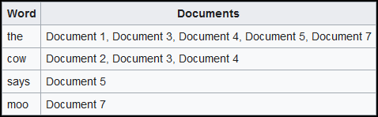
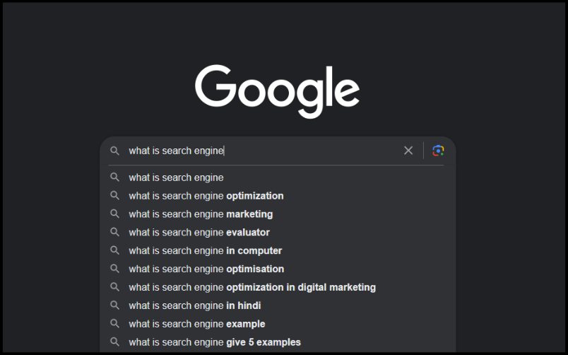

**Main Source :**

- **[Search engine - Wikipedia](https://en.wikipedia.org/wiki/Search_engine)**
- **[Search 101 - Google](https://youtu.be/syKY8CrHkck?si=0cgD0sv7-jgOR2y3)**

**Search engine** is a software system that is designed to search for information on the internet. When a user enters a search query, the search engine uses an algorithm to search through its index (basically a storage of web pages) and returns a list of relevant results. Search engine can be used to retrieve images, videos, infographics, articles, and other types of files.

These search engines have to determine the relevance of a web page to a particular search query, including analyzing the page's content, the number and quality of links pointing to the page; and other factors such as the location of the user and their search history.

### How search engine works

Search engine involves several processes :

1. **Crawling** : The first step in the search engine process is crawling. Crawling is the process by which search engines look into web pages. Search engines use automated software known as "spiders" or "bots" to crawl the web and follow links from one page to another. They start with a list of [URLs](/internet-and-web/web-url) and follow any hyperlinks [recursively](/data-structures-and-algorithms/recursion) that exist within each page. The bots collect information about each page they crawl, such as the page title, meta tags, and content. Some website also have `robots.txt` which is a file containing directives for search spiders, telling it which pages to crawl and which pages not to crawl. The bots will stop the crawling process until it meets certain rules, such as enough number of pages, amount of data indexed, or time spent on that website.

   :::note
   The crawling process may be repeated every period of times based on certain policy (e.g., a fixed time such as every 2 weeks) because of the dynamic nature of internet that changes its content frequently.
   :::

   :::note
   It's worth noting that web crawler is a web visitor just like a human, which mean it can waste the web server's resource if used frequently.
   :::

2. **Indexing** : Once the bots have crawled a web page, they store the information they've collected in a massive database known as an [index](/database-system/database-index). The index is a vast collection of all pages that sometimes work by mapping a word into a list of documents. When the user type a search query, we return the list of documents that contains that query. If the user search for "cow", any documents including webpages, images, videos, or etc. that contains it will be retrieved.

     
   Source : https://en.wikipedia.org/wiki/Search_engine_indexing#Inverted_indices

3. **Ranking** : The index must contain a lot of documents. The search engine ranks them based on their relevance to the user's search query. The algorithm that ranks webpages takes into account hundreds of factors, including keyword usage, page content, links pointing to the page, how popular the website is, and many other factors.

   :::info
   Some malicious website may confuse the web crawler by making a hyperlink that links to the site itself (directly to the same page or making a circular links). This is to make crawler believes that the website is popular, because it is pointed by many hyperlinks. As a result, that website can obtain a high ranking.
   :::

4. **Results** : Once the algorithm has analyzed the index and determined which pages are most relevant to the user's search query, the search engine displays a list of results on the search engine results page (SERP). The results are usually displayed in order of relevance, with the most relevant pages at the top of the results page.

Search engines are constantly refining their algorithms to deliver more relevant results to users. They use machine learning and artificial intelligence techniques to analyze user behavior and improve the relevance of their search results. Search engines also use feedback from users to improve their algorithms and provide better search results. They even provide features like spell correction and supporting international languages to increase ease of search.

### PageRank Algorithm

**PageRank** is an algorithm used by the Google search engine to determine the relevance and importance of web pages.

This algorithm works by analyzing the number of links pointing to a web page. The basic idea is a webpage's score is increased when it is linked by numerous other webpages compared to a webpage that has fewer incoming links. Furthermore, a website's ranking is not solely based on quantity, but also quality. A website does not necessarily have a high ranking just because it is linked to by many other websites, but the ranking of the websites pointing to it is also considered.

The PageRank algorithm assigns a numerical value to each page, known as its PageRank score. The score is calculated using a complex formula that takes into account the number of times it is pointed, how "special" is the link to it, and the PageRank scores of the pages linking to it.

  
Source : https://co.delante.co/definitions/pagerank/

The image above is an illustration of the algorithm that shows `A` being linked the most has the highest rank.

The output of the PageRank algorithm is a probability of someone will end up on a particular page. The algorithm model itself as a random surfer, meaning it doesn't strictly follow hyperlink when assigning score, but sometimes randomly jumping to unrelated page. This behavior accurately model actual browsing behavior of users, who sometimes type in a new URL or use a search engine to navigate to a new page, rather than just clicking on links. The random surf is affected by something called damping factor.

:::tip
See also [search engine on backend development](/backend-development/search-engine).
:::
