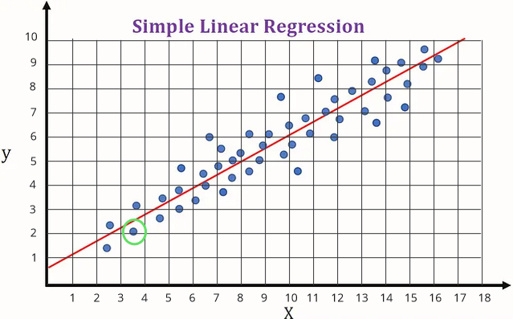
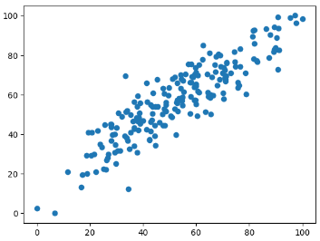
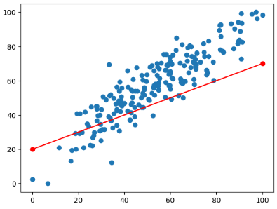
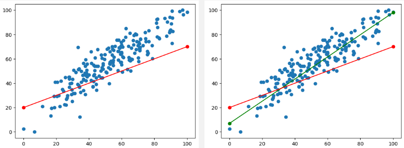
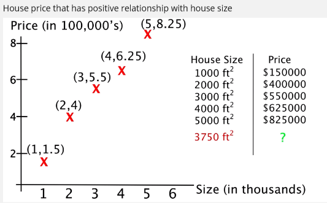
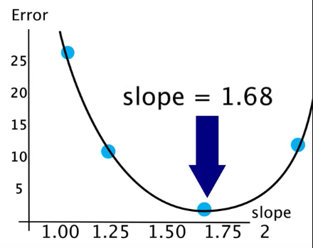

**Main Source :**

- **[Linear Regression, Clearly Explained!!! - StatQuest](https://youtu.be/nk2CQITm_eo?si=spLY7V3w-fqSbVzc)**
- **[The Mathematics of Machine Learning - Zach Star](https://youtu.be/Rt6beTKDtqY?si=2f4Rge2IA_uRCd_1)**

### Linear Regression Idea

**Linear Regression** is a statistical technique used to model and predict between dependent and independent variable. Dependent variable is a variable that we are going to measure or predict while independent variable is the one we thought is going to affect the dependent variable. In other word, we believe that it has impact or influence to variable we are going to measure.

In linear regression, we believe that there is a linear relationship between the dependent and independent variable, this means that as one variable change, the other will also change, the change will be consistent and propotional.

For example, in real scenario, as a house area getting larger, it make sense that the price will be more expensive. In this case, house area and house price has a positive relationship. If we know for sure the relationship between dependent and independent variable, we can predict what will happen next when a variable (typically the independent variable) change.

In linear regression, we predict the outcome of dependent variable by drawing a line. The line should be as fit as possible to the data we know before. This line act as a "standard" that capture the relationship between dependent and independent variable. With this standard, we can predict what is the outcome of dependent variable in some independent variable.

### Example

Before starting, we will need a dataset that consist of known dependent variable with its independent variable.

Consider the image below, after gathering enough data, we plot them all in a graph (denoted as blue point). For example, when the independent variable ($x$) is equal to approximately 3.5, the dependent variable ($y$) is approximately 2.1. After plotting all the data, we will try to construct a line. The line should be as representative as possible.

  
Source : https://saichandra1199.medium.com/linear-regression-1e279814e2bb (with modification)

Using the data, we know that typically a lower $x$ value will also result in lower $y$ value and the higher $x$ will result in higher $y$. By plotting these data and drawing a line, we can predict easier. The line is a mathematical model, meaning that we use mathematical equation or notation to model a real life situation.

A straight line typically modeled by : $y = mx + b$, where $m$ is slope of line, $b$ is y-intercept. The $y$ is the dependent variable we are going to find out and the $x$ is the independent variable.

So if we want to know a $y$ value for a particular $x$ value, we can use the line as a standard to predict the outcomes. Using the line equation, we can just plug in an $x$ value together with the equation of line we construct and we will get the $y$ value.

This will not work if our data has no linear relationship, also the more data we have will result in better prediction as we will be able to capture more relationship about the variable.

---

## More Detailed Explanation

The goal of regression is to construct a line that fit the data as fit as possible to predict the next outcomes. Here is an example of data plotted on a graph.

By just seeing it, indeed there is a positive linear relationship between the x-axis and y-axis value. Next, we will draw a line that act as the standard for the prediction. We could make any line we want like the image below :

But this will probably result in bad prediction, the difference between the actual data (blue points) and the prediction data (anything that lies on the line) is kinda large. The difference between these are called **error**. 

The error is calculated by calculating the difference between actual data and prediction data. These error will be summed up for each points. Error is used to measure how bad or good a regression line is, the more error means the worse line. 

:::note
There are many technique to measure the line error, an example is the Sum of Squared Errors (SSE), where the error is calculated by squaring the difference, the formula is $SSE = \sum(y_i - \hat{y}_i)^2$  
$y_i$ = actual y value data  
$\hat{y}_i$ = predicted y value data
:::

So we would want a line with less error like this :

By the way, when the predicted value is lower than the actual value, its called **Underestimation**. On the opposite, **overestimation** happens when the predicted or estimated value is higher than the actual value.

### Minimizing Error

For simplicity, we will use a simpler data and we will ignore the y-intercept for now, we will just use the slope to make the line.

  
Source : https://youtu.be/Rt6beTKDtqY?si=heJuep-IpaK_V6ki&t=108

The approach of fitting the best line is to try to draw a line with particular slope and calculate the error to see how it performs. We can try this for a several times, the result can be graphed where the x-axis is the particular slope of the line and the y-axis is the error. If we see the graph, the smallest possible error we can get is by drawing a line with slope 1.68.

  
Source : https://youtu.be/Rt6beTKDtqY?si=9_O7XygkvOvZRjiq&t=202

So the point of this is to find the corresponding x value for the minimum y value. Mathematically speaking, we are trying to find the minima of a function. The concept of minima is often used in optimization problems, where the goal is to find the input value(s) that minimize a given function. The commonly used technique to minimize the error in linear regression and other machine learning technique is the **Gradient Descent** algorithm.

### Gradient Descent

Gradient descent is.. formula...

### Linear Regression Implementation

2 dependent variable + 1 independent + gradient descent regression
shows code and explanation...

## Other Regression

There are still many form of linear regression, the example are :

### Multiple Regression

### Polynomial Regression
