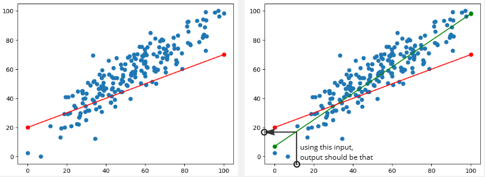

**Main Source :**

- **[The Mathematics of Machine Learning - Zach Star](https://youtu.be/Rt6beTKDtqY?si=2f4Rge2IA_uRCd_1)**
- **[Khan Academy Multivariable Calculus Gradient Descent](https://www.khanacademy.org/math/multivariable-calculus/applications-of-multivariable-derivatives/optimizing-multivariable-functions/a/what-is-gradient-descent)**

### Linear Regression Idea

**Linear Regression** is a statistical technique used to model and predict between dependent and independent variable. Dependent variable is a variable that we are going to measure or predict while independent variable is the one we thought is going to affect the dependent variable. In other word, we believe that it has impact or influence to variable we are going to measure.

In linear regression, we believe that there is a linear relationship between the dependent and independent variable, this means that as one variable change, the other will also change, the change will be consistent and propotional.

For example, in real scenario, as a house area getting larger, it make sense that the price will be more expensive. In this case, house area and house price has a positive relationship. If we know for sure the relationship between dependent and independent variable, we can predict what will happen next when a variable (typically the independent variable) change.

In linear regression, we predict the outcome of dependent variable by drawing a line. The line should be as fit as possible to the data we know before. This line act as a "standard" that capture the relationship between dependent and independent variable. With this standard, we can predict what is the outcome of dependent variable in some independent variable.

### Example

Before starting, we will need a dataset that consist of known dependent variable with its independent variable.

Consider the image below, after gathering enough data, we plot them all in a graph (denoted as blue point). For example, when the independent variable ($x$) is equal to approximately 3.5, the dependent variable ($y$) is approximately 2.1. After plotting all the data, we will try to construct a line. The line should be as representative as possible.

  
Source : https://saichandra1199.medium.com/linear-regression-1e279814e2bb (with modification)

Using the data, we know that typically a lower $x$ value will also result in lower $y$ value and the higher $x$ will result in higher $y$. By plotting these data and drawing a line, we can predict easier. The line is a mathematical model, meaning that we use mathematical equation or notation to model a real life situation.

A straight line typically modeled by : $y = mx + b$, where $m$ is slope of line, $b$ is y-intercept. The $y$ is the dependent variable we are going to find out and the $x$ is the independent variable.

So if we want to know a $y$ value for a particular $x$ value, we can use the line as a standard to predict the outcomes. Using the line equation, we can just plug in an $x$ value together with the equation of line we construct and we will get the $y$ value.

This will not work if our data has no linear relationship, also the more data we have will result in better prediction as we will be able to capture more relationship about the variable.

---

## More Detailed Explanation

The goal of regression is to construct a line that fit the data as fit as possible to predict the next outcomes. Here is an example of data plotted on a graph.

By just seeing it, indeed there is a positive linear relationship between the x-axis and y-axis value. Next, we will draw a line that act as the standard for the prediction. We could make any line we want like the image below :

But this will probably result in bad prediction, the difference between the actual data (blue points) and the prediction data (anything that lies on the line) is kinda large. The difference between these are called **error**.

The error is calculated by calculating the difference between actual data and prediction data. These error will be summed up for each points. Error is used to measure how bad or good a regression line is, the more error means the worse line.

:::note
There are many technique to measure the line error, an example is the Sum of Squared Errors (SSE), where the error is calculated by squaring the difference, the formula is $SSE = \sum(y_i - \hat{y}_i)^2$  
$y_i$ = actual y value data  
$\hat{y}_i$ = predicted y value data  
By the way, a mathematical function that measures the error (like this SSE) is called **cost function**.
Other cost function we can use is the Mean Squared Error (MSE), which has the similar formula to SSE : $\frac{SSE}{n}$ (n is data size)
:::

So we would want a line with less error like this :

By the way, when the predicted value is lower than the actual value, its called **Underestimation**. On the opposite, **overestimation** happens when the predicted or estimated value is higher than the actual value.

### Minimizing Error

For simplicity, we will use a simpler data and we will ignore the y-intercept for now, we will just use the slope to make the line.

  
Source : https://youtu.be/Rt6beTKDtqY?si=heJuep-IpaK_V6ki&t=108

The approach of fitting the best line is to try to draw a line with particular slope and calculate the error to see how it performs. We keep trying this for a several times, the result can be graphed where the x-axis is the particular slope of the line and the y-axis is the error. If we see the graph, the smallest possible error we can get is by drawing a line with a slope of 1.68.

  
Source : https://youtu.be/Rt6beTKDtqY?si=9_O7XygkvOvZRjiq&t=202

This approach sounds good, but how do we know what slope to try next?

The point of this is to find the corresponding x value for the minimum y value. Mathematically speaking, we are trying to find the minima of a function. The concept of minima is often used in optimization problems, where the goal is to find the input value(s) that minimize a given function. The commonly used technique to minimize the error in linear regression and other machine learning technique is the **Gradient Descent** algorithm.

### Gradient Descent

Gradient descent is an iterative algorithm used to find optimal coefficient value such as the slope of the line in linear regression, it aims to minimize the error or the cost function.

The concept of gradient descent comes from calculus, where we find the critical points of a function that may be local minima, local maxima, or a saddle point when the derivatives of the function is equal to zero.

So we will need a function to do that, in this case the function may look like the image above, where we graph the slope in x axis and the corresponding error in the y axis. However, we can't guarantee it will be easy for us to capture the function as formula and to solve the function derivative equal at 0. Instead we will try to approximate the actual solution, gradient descent is such the method. Gradient descent can be thought as the numerical method for finding critical points of a function.

The derivative of a function shows the function behavior at that point, the positive derivative means that the function is increasing. To find the minima, we will go to the opposite direction where the function is decreasing.

  
Source : https://www.khanacademy.org/math/multivariable-calculus/applications-of-multivariable-derivatives/optimizing-multivariable-functions/a/what-is-gradient-descent

To use gradient descent for optimizing slope of a line, we can use the following formula :

Where :

- $\text{m}_{\text{new}}$ : new slope we will try next
- $\text{m}_{\text{current}}$ : current slope
- $k$ : step size or learning rate, used to measure of how far we want to go to the negative direction of function. The learning rate is somewhat important, a smaller rate may slow down computation but a higher rate may make us "go to far" in the minimum direction.
- $\frac{d}{dm} E(m)$ : The derivative of the function $E(m)$, where $E(m)$ itself is the error function we graphed before

After using gradient descent to optimize the slope, we may achieve a better fitting line. However, we can still improve this by also taking account the y-intercept of the line.

#### Gradient Descent in 3D

If we also use y-intercept to draw the line and we want to optimize it aswell, we can do the same gradient descent method. This mean we will need to extend gradient descent method to 3D, because now we have two input which is the slope of the line and the y-intercept.

To extend gradient descent to 3D or higher multi-dimensional function, we will use the concept of gradient, which is the generalization concept of derivative in higher dimension, this mean we will use partial derivative instead. The positive gradient at a point tells us the direction of the steepest accent of the function at a given point. To find the minima, we would do the same, which is to go to the opposite direction of positive gradient or the negative gradient.

  
Source : https://www.analyticsvidhya.com/blog/2017/03/introduction-to-gradient-descent-algorithm-along-its-variants/

The formula now becomes :

  
Where : b is y-intercept

Using gradient descent in 3D, we can know have more than 1 independent variable, we could have 10 variable that affects the dependent variable. For example, a house price may not only depends on area, it may depends on location, how much beds it has, and etc.

## Other Regression

There are various form of regression along with the optimization and the cost function used. An example is :

- **Polynomial Regression** : Polynomial regression is the form of linear regression where the relationship between the variables are not linear, instead it is a form of polynomial function such as curves.

    
   Source : https://www.javatpoint.com/machine-learning-polynomial-regression
