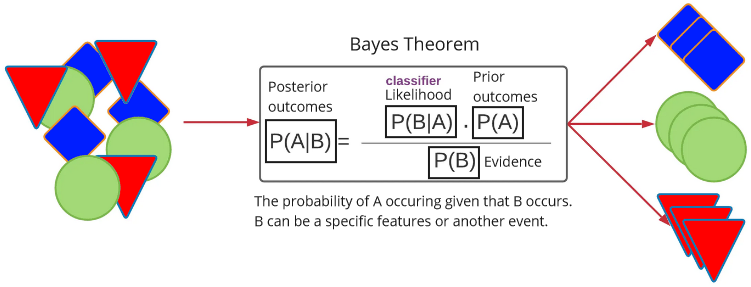
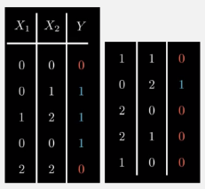
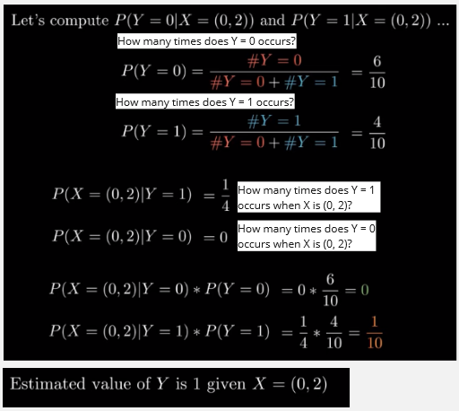
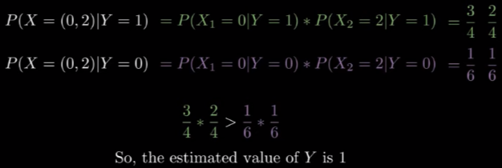

**Main Source : [The Math Behind Bayesian Classifiers Clearly Explained! - Normalized Nerd](https://youtu.be/lFJbZ6LVxN8?si=MpMCC5LA30ytenDB)**

**Naive Bayes** is a machine learning algorithm which is based on the principles of Bayes' theorem in probability theory, it describes the probability of an event based on prior knowledge or information.

Naive Bayes is often used for classification, the category we are classfying into is called dependent variable, and the variable we believe that affect the classification is the independent variable (often called features). Naive bayes uses conditional probability, this mean the probability of an event occuring is given by a specific features. In other word, an event occurs based on specific condition. The algorithm will keep being updated as we gain new information.

When we predict an event in based on prior knowledge, this mean if a feature we observed before causes outcome of a particular event, then in the future, there will be a higher chance for other things that has the similar features to also cause the same particular event.

For example, if we observed that at Saturday night it often rains, then in the future there is a higher chance of it to occurs again. In this case, temperature may be a feature or a variable that affect if it's gonna rain or not.

  
Source : https://mlarchive.com/machine-learning/the-ultimate-guide-to-naive-bayes/

### Bayes Theorem

Probability of a thing classified into some label can be mathematically writen as :  
$P(Y = y | X = (x_1, x_2, ..., x_n))$

Where :

- $Y$ : label, what we are going to classify a thing into
- $y$ : what the label actually is
- $X$ : the features, the variable that affect why a thing is classified into some label
- $x_1,...x_n$ : all the actual features

Let's say we have an event that has 2 features, x1 and x2, the outcome or can be either 0 or 1. We wanted to know in the future what is the outcomes for a specific features.

  
Source : https://youtu.be/lFJbZ6LVxN8?si=g3ks1QA5hPnq91xD&t=304

We can use Bayes theorem here to calculate the outcome, we will need to calculate all the required number first, the evidence, prior outcomes, and the likelihood using the data known before. The calculation for them is simple, the number of outcomes of an event divided by total number event.

  
Source : https://youtu.be/lFJbZ6LVxN8?si=p3aB_jAKZMBnevEn&t=353

This Bayes theorem looks working for a quite simple problem. However, as the problem getting more complex (more data and more features), we may never have an outcomes for particular features, and it's hard to predict if nothing particular happens before.

### Naive Bayes Classifier

In naive bayes classifier, we assume in a naive way that all the features are independent, this mean the outcome of an event doesn't depend or influence each other. This is why we also need to make sure that the features we are studying are actually independent. By assumming they are independent, we multiply them instead.

  
Source : https://youtu.be/lFJbZ6LVxN8?si=St8QN9YRZJvRcjn_&t=516
