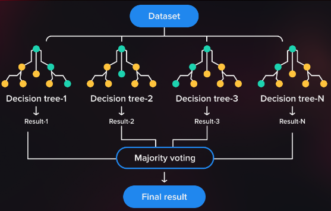
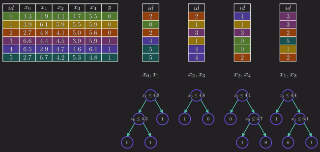

**Main Source :**

- **[Visual Guide to Random Forests - Econoscent](https://youtu.be/cIbj0WuK41w?si=Ck0xYB7UXpLJqE0F)**
- **[Random Forest Algorithm Clearly Explained! - Normalized Nerd](https://youtu.be/v6VJ2RO66Ag?si=blojC7xpDh1oSw4V)**

**Random Forest** is another machine learning technique used for classification and regression tasks. Random forest uses the previous technique, which is [decision trees](/machine-learning/decision-trees), it combines multiple individual of tree to produce a single result of prediction.

Random forest is a form of ensemble learning, which is a concept where we combine multiple machine learning model to create a more powerful and accurate predictive model.

  
Source : https://serokell.io/blog/random-forest-classification

The goal of a [decision tree](/machine-learning/decision-trees#entropy), as discussed in the topic of decision tree entropy and information gain, is to iteratively split the dataset until we can successfully differentiate between different labels or category.

However, even after successfully differentiating the data, decision tree are sensitive to small changes in the training data. Even a slight variation in the data can result in a completely different tree structure, which can make the model unstable. This is because decision tree keep adjusting the question to gain the best information gain and lowest entropy.

Also as the problem gets more complex (more feature), decision tree may lead to **overfitting**, which is when the model fails to generalize well to unseen data. In other words, the tree becomes too specific to the training data.

### Random Forest

#### Aggregating

Random forest solves decision tree problem by having several tree and each tree will handle their own features. This helps to capture different patterns and reduce the chances of all trees making the same mistakes or being overly influenced by a small subset of features. This process is called **aggregating** or **feature selection**.

Aggregating also introduces randomness, the trees become more independent and will offer a wider range of perspectives for each features.

#### Bootstraping

After assigning feature to each tree, the tree will be trained on some sample data. Each tree will be trained on the same data size as the original training data. It may contain duplicate instances and lack some instances from the original data. This process is called **bootstraping** and the samples are called **bootstrap samples**.

  
Source : https://youtu.be/v6VJ2RO66Ag?si=JQ9By3pUHDSXJGq6&t=293

#### Majority Voting

To use random forest to predict a new unknown data, random forest uses the voting concept. This mean the new data with some features will be processed to corresponding tree that handles it. Each tree will decide what label or category does the new data belongs to. All the result will be combined and the most label will be the result of the prediction.

  
Source : https://youtu.be/v6VJ2RO66Ag?si=SeQePcebnrmx20fW&t=346

### Random Forest Regression

The concept of using random forest as regression is the same as random forest for classifying. The difference is we use decision tree regressor instead. At the end of predictions of the individual decision trees, the result are typically averaged or combined to obtain the final regression prediction.

Each decision tree in the Random Forest predicts a continuous numerical value, and the final prediction is calculated as the average or median of the predictions from all the individual trees.
