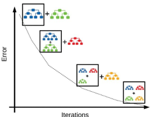
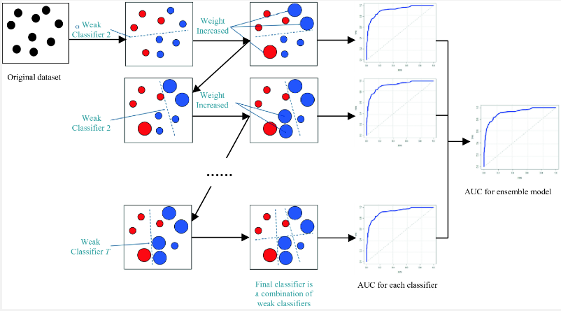

**Main Source:**

- **[Gradient Boosting Algorithm: Concepts, Example — vitalflux.com](https://vitalflux.com/gradient-boosting-algorithm-concepts-example/)**
- **[Visual Guide to Gradient Boosted Trees (xgboost) — Econoscent](https://youtu.be/TyvYZ26alZs?si=0dVrDvNP66xYICb-)**
- **[What is XGBoost? — Simplilearn](https://www.simplilearn.com/what-is-xgboost-algorithm-in-machine-learning-article)**

**Gradient Boosting Machine (GBM)** is a technique that combines simpler and smaller model to produce an accurate prediction better than an individual model. When we combine multiple model to create a more powerful and accurate predictive model, this is called **ensemble learning**, an ensemble is a combination of models.

Weak model individually have limited predictive power, but by combining them, the ensemble can capture a wider range of patterns and relationships in the data.

It is called "gradient boosting" because it uses an iterative process to gradually improve the model's performance. It examines the difference between the predicted and actual values (the residuals) and builds a new model that tries to reduce these residuals. This new model is added to the ensemble, and the process repeats.

Each new weak learner is trained to specifically target the errors or residuals that the ensemble has not yet captured accurately. So, we make sure a mistake we made before are corrected, this is called **sequential correction**.

  
Source: https://vitalflux.com/gradient-boosting-algorithm-concepts-example/

### Gradient Boosting Process

1. **Initialize the ensemble**: Start by initializing the ensemble model with a simple weak learner. A weak learner is a model or algorithm that performs only slightly better than random guessing on a given task. Weak learner is simply a simpler and smaller model, they are characterized by their limited predictive power and simplicity. This could be a decision tree with a small depth or a linear regression model.

2. **Compute initial predictions**: Use the current ensemble model to make predictions on the training data.

3. **Compute residuals**: Calculate the residuals, which are the differences between the predicted and actual values of the target variable. These residuals represent the errors made by the current ensemble model. These residuals are calculated by loss function, which is a measure of how well the models perform at one training. Example are MSE, MAE, and cross entropy.

4. **Fit a weak learner to the residuals**: We will try to minimize error or correct mistake made by previous model by training new weak learner on the residuals. The goal is to find a model that can predict the residuals more accurately than the previous model. We can also use [gradient descent](/machine-learning/linear-regression#gradient-descent) for this.

5. **Update the ensemble**: Add the new weak learner to the ensemble. The weak learner will have a paramater called shrinkage parameter or learning rate. The shrinkage parameter controls the contribution of each weak learner. The parameter also used for deciding the learning rate used in gradient descent.

6. **Update predictions**: Update the predictions of the ensemble by combining the predictions of all the weak learners, including the newly added one.

7. **Iterate**: Repeat steps 3-6 for a specified number of iterations or until a stopping criterion is met. In each iteration, the new weak learner focuses on the residuals left by the previous models, gradually improving the ensemble's predictive performance.

8. **Finalize the ensemble**: Once the desired number of iterations is reached, the final ensemble model is obtained by combining the predictions of all the weak learners in the ensemble.

9. **Prediction**: After training, we can then use the final ensemble model to make predictions on new unseen data.

  
Source: https://datascience.eu/machine-learning/gradient-boosting-what-you-need-to-know/

### XGBoost

**Extreme Gradient Boosting (XGBoost)** is a library that implement of gradient boosting machine that is highly optimized with some extra features (not feature in data). Here are some example:

- **Regularized Learning**: XGBoost includes regularization techniques such as L1 and L2 regularization. In simple term, regularization is a technique to make model prediction simpler by forcing some feature coefficients to be 0. In other word, we exclude some feature consideration for our prediction. The features we are excluding are the one that has low influence toward the overall prediction. This way we can focus on the more important and influential features.

- **Computation Capabilites**: XGBoost supports parallel processing, it optimizes the computation by parallelizing the construction of individual trees and parallelizing the evaluation of split candidates during tree building.

- **Handling Missing Values**: XGBoost has built-in capabilities to handle missing values in the dataset. It automatically learns how to handle missing values in a decision tree by assigning missing values based on available data.
