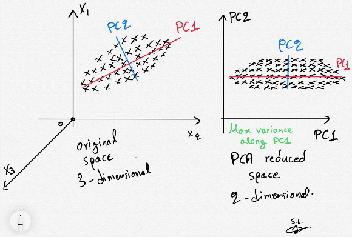
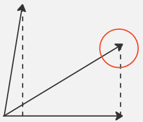
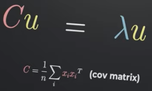

**Main Source :**

- **[Principal Component Analysis (PCA) - Visually Explained](https://youtu.be/FD4DeN81ODY?si=3nPG5l8ELjKh1ek5)**
- **[Wikipedia Principal component analysis](https://en.wikipedia.org/wiki/Principal_component_analysis)**

**Principal Component Analysis (PCA)** is a technique to simplify complex data, it works by reducing dimensionality of data. By reducing dimension, it means that if a data has many features or a data with many variable, PCA allows us to transform this data into a new representation that captures the most important patterns or variations in the data. It is a method that transforms a dataset into a new coordinate system, called the principal components.

For example, this image below shows a 3-dimensional data. For any reason, we want to transform it to a 2-dimensional space. However, if we directly make it in 2-d by removing the third features, we are discarding information. Some data can be misinterpreted because we are seeing it in different perspective.

The key idea of using PCA in here is to project the 3-dimensional data into 2-dimension without losing information, the feature of reduced dimension will still taken by account.

  
Source : https://towardsdatascience.com/pca-clearly-explained-how-when-why-to-use-it-and-feature-importance-a-guide-in-python-7c274582c37e

### Principal Component

In simple term, PCA works by capturing the main variations in a dataset. It looks for patterns or trends that explain the differences between data points. PCA will keep a smaller set of features, called **principal components**, that retain most of the important information. The principal components are ordered by their significance. The first component explains the largest amount of variation in the data, the second component explains the next largest, and so on. By selecting a subset of the components, we can simplify the data while retaining most of its important characteristics.

We then project the original data onto the selected principal components. Each data point's values in the new reduced feature space are determined by their coordinates along the principal components.

We can take account all the feature and map it to 1-dimensional first, this is called the **first principal component**. Increasing the dimension again to 2-d, this is the **second principal component**.

### Optimization

The point of PCA is to project a data while also preserving info. PCA uses the orthogonal projection in mathematics, it is basically mapping a point or a vector to a lower dimensional space.

To make it simple, lets take an example in 2-d. A projection can range from 0 to 1, where 0 means the point we are projecting is perpendicular with the line below. Where 1 means we fully project it to the line.

In PCA, because we want to capture all the information, we should make the projection result as high as possible. If all the data is considered as a vector, we want the vector projection to be 1 as the constraint.

Not only a single data, we want all data to also have a high projection. This becomes an optimization problem, the goal is to maximize the variance of the projected data along each features or the principal component.

#### Eigenvalues

Solving a constrained optimization problem involve using the lagrange multiplier. After going into the mathematical problem, it produced a matrix called **covariance matrix**. In simple term, covariance matrix summarizes the relationships between the different variables in the dataset. Specifically, it quantifies how the variables vary together.

Solving the problem further, it produced an eigenvectors and eigenvalues equation, where the matrix in the equation is the covariance matrix. The eigenvalues represent the amount of variance captured by each corresponding eigenvector (principal component) in the dataset.

  
Source : https://youtu.be/FD4DeN81ODY?si=wwoMIXF5Wwy6-0x4&t=192

After obtaining the eigenvalue equation with the covariance matrix in PCA, the next step is to solve this equation to find the eigenvalues. The solution is the highest variation or the highest previously projection result in the covariance matrix.

Once the eigenvalues are determined, they can be used to order which data should be higher than other. The measure of how high is data than order is called **power**. The power are based on the magnitude of the eigenvalues.

### Second Component

After projecting the data for the first time, called as first principal component, we can also achieve the second component by doing the similar things as before. Both the first and second principal component is taken from the eigenvector with the highest and second highest eigenvalues.

PCA takes account all feature in high dimension and transform it into 2D where the axes of PCA (the component) shows how high a data is compared to other. Each data point is typically mapped onto the line and also sorted. Overall, PCA provides way to visualize high dimensional data by also considering all the feature.

  
Source : https://medium.com/@raghavan99o/principal-component-analysis-pca-explained-and-implemented-eeab7cb73b72
