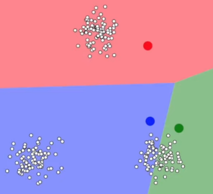
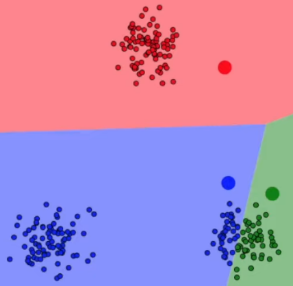
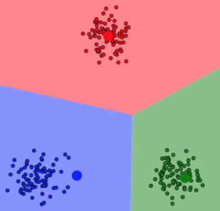
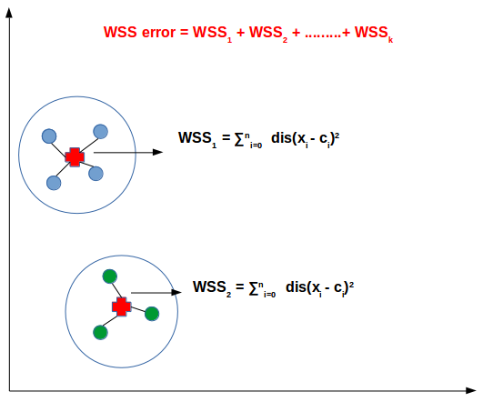
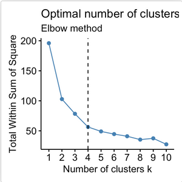

- **[K-Means Clustering Explanation and Visualization — TheDataPost](https://youtu.be/R2e3Ls9H_fc?si=gtABjBC44c1HPyYa)**
- **[StatQuest: K-means clustering — StatQuest with Josh Starmer](https://youtu.be/4b5d3muPQmA?si=OSEZbZZh3OjiQEGq)**

**K-Means Clustering** is a machine learning algorithm used for clustering or grouping similar data points together. K-means partition or divide the dataset into "k" non-overlapping cluster.

### Clustering

The cluster itself is chosen by us, it is chosen by the machine learning practitioner. By choosing cluster, this mean we are choosing where how many cluster should be present. A cluster will have a central point called **centroid**, it is used as a reference point to measure the similarity or dissimilarity of data points within a cluster.

  
Source: https://youtu.be/R2e3Ls9H_fc?si=2dtBtEfRt0XrJ9Vf&t=111

### Assignment

After setting up the centroid, each data point will be assigned to the cluster whose centroid is closest to it. The distance between a data point and a centroid is usually measured using Euclidean distance, although other distance metrics can be used as well.

  
Source: https://youtu.be/R2e3Ls9H_fc?si=iOL-ggvFbJoH32AG&t=146

### Adjustment

The centroids will be adjusted by taking the mean of all the data points values assigned to that cluster. This step moves the centroids closer to the center of their respective clusters. This will keep being repeated until the centroid no longer change or reach a predefined maximum number of iterations.

Once the limit is reached, the algorithm outputs the final clustering result, where each data point is assigned to a specific cluster based on the nearest centroid.

  
Source: https://youtu.be/R2e3Ls9H_fc?si=GQj0qVFf0Z_mRK2T&t=176

### k-Means Variation

In k-means, measuring of how well does a model performs to cluster, the **within-cluster sum of squares (WSS)** is often used. It measures the compactness or dispersion of data points within each cluster in k-means clustering. It quantifies how close the data points are to their respective cluster centroids. Measuring the WSS can be useful to decide how many cluster or "k" should we use.

In K-means clustering, the goal is to minimize the within-cluster sum of squares (to better cluster data). It is calculated by summing up the squared distances between each data point and its assigned centroid within the same cluster, and then summing these values across all clusters.

Mathematically, the within-cluster sum of squares (WSS) can be expressed as: $WSS = \Sigma \Sigma ||x - c||^2$

  
Source: https://datamahadev.com/understanding-k-means-clustering/

#### Elbow Method

In k-means, the growth of WSS against to the number of cluster used or k, if graphed, looks like an elbow. The WSS generally decreases as K increases because adding more clusters allows for a better fit of the data points. However, beyond a certain point, the reduction in WSS diminishes, and adding more clusters may not significantly improve the clustering solution.

That certain point is typically 3 or 4, the "elbow" in the plot refers to the point of inflection, where the rate of decrease in WSS significantly slows down. The elbow point represents a trade-off between a low WSS more interpretable clustering solution.

  
Source: https://www.datanovia.com/en/lessons/determining-the-optimal-number-of-clusters-3-must-know-methods/
