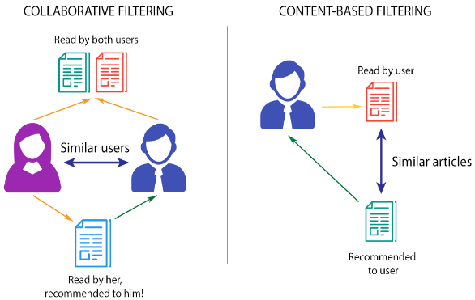
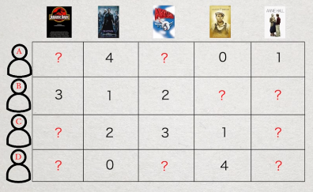
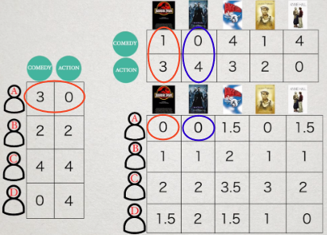
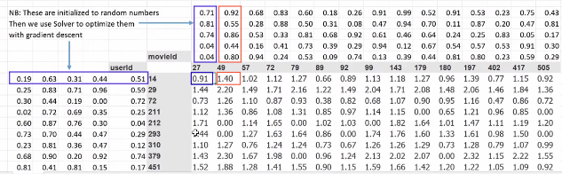
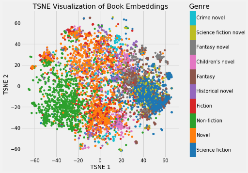

**Main Source :**

- **[Deep learning lesson 7 - fastai](https://youtu.be/p4ZZq0736Po?si=rLLlK6OGFDbP4piw)**
- **[How Recommender Systems Work (Netflix/Amazon) - Art of the Problem](https://youtu.be/n3RKsY2H-NE?si=hwrlSNwSirDgdQUp)**

**Collaborative Filtering** is a technique used for recommendation systems (e.g. youtube video feed) to provide personalized recommendation user based on their preferences. There are two types of collaborative filtering :

- **User-based** : In this approach, recommendations are based on similar user behaviors. For example, if user A watch several same movie as user B, and user A has watched a movie that user B hasn't watch before, the system might recommend that movie to user B.
- **Item-based** : Also known as content-based, this approach focuses to recommend based on similarity between items. For example, if user A played a game with some specific genre before, the system might recommend another game which have similar or the same genre.

    
   Source : https://medium.com/fnplus/neighbourhood-based-collaborative-filtering-4b7caedd2d11

### How it works

The first thing we do is to gather the user's data, suppose the recommendation system is to recommend specific movie. We can summarize all user rating to the corresponding movie with table like below.

  
Source : https://youtu.be/n3RKsY2H-NE?si=13c6_Ug3sDtUDXxb&t=122

Some of the data will obviously be empty, indicating that the user hasn't rated or watched the movie yet. Suppose the system is going to recommend a movie to the user where the rating is empty, remember that the purpose of the recommendation system is to attract the user to watch the movie.

However, how can we know if a user will like a movie they haven't watched before? We will need an approximate measurement to indicate whether the user will like the movie or not. Thus, the problem becomes completing the data table.

#### Item-based recommendation

In item based recommendation, recommendation is based on item similarities, in this case, it might be a movie genre. So, the movie genre can be the variables or the features that determine if a user likes a movie or not.

User rating to specific genre will be gathered, and will be represented in matrix. The numbers will be calculated using dot product. We can also scale it down to suit with the appropriate rating ranges (e.g. minimum 0 and maximum 5).

The idea of using the dot product is that if a user has a low rating for a particular genre, multiplying that rating with another number in another genre will result in an even lower value. Consequently, this lowers the overall rating. In other words, a low rating for a genre will decrease the rating for another movie with the same genre as well.

In the image below, user A likes comedy and dislikes action. Multiplying with the jurassic park movie, even though it has slight comedy, because the user rating toward action genre is 0, this makes the overall rating low.

  
Source : https://youtu.be/n3RKsY2H-NE?si=hxIzf4yWCppQHrc8&t=229 (with modification)

However, this system might not work very well, considering not every user has rating to every genre and some of the user might not be great at describing their preferences.

#### User-based recommendation

Another system is to recommend based on similarities between user's preferences. Instead of using user's rating as feature to generate unavailable rating toward specific movie, we use the available movie rating to generate user's feature.

#### Latent Factors

In user-based recommendation, user features is called **latent factors** or **latent features**, these features are used to determine the pattern or relationship between user and the movie.

The numbers will first be random generated, and will also be represented in matrix. The prediction is same as before, user and movie latent factors will be calculated using dot product. The result is the rating prediction for the movie, higher rating means the user will more likely to like that movie.

  
Source : https://youtu.be/p4ZZq0736Po?si=OpsMAfAoQ0-6Aak8&t=4307

But this won't be an accurate prediction, considering the latent factor used are random generated. This is where machine learning comes, these numbers will be adjusted. We will first calculate the loss function e.g. Mean Squared Error (MSE), where we sum all the difference between predicted rating and actual rating squared and divided it by the number of ratings. We can then use optimizer like [gradient descent](/machine-learning/linear-regression#gradient-descent).

We can also add some bias terms or extra constant value to the user and movie ratings and use [activation function](/deep-learning/deep-learning-foundation#activation-function) like sigmoid, this is used to capture relationship between them that are not captured by latent factors.

We can even visualize this in graph, because latent factors or the features are in form of vector (matrix). Higher dimensional features can be reduced using technique like [PCA](/machine-learning/principal-component-analysis). During the training process, the model will be trained to group similar items together.

  
Source : https://devopedia.org/word-embedding

:::tip
This recommendation system is based on **dot product model**, where the model predict using dot product. Making recommendation system using [deep learning](/deep-learning) technique like [deep neural network](/deep-learning/neural-network) is also possible.
:::

#### Compression

Now, after all the technique used, the latent factors is all we need to predict user rating. We can keep calculating the dot product and fill out the empty rating table. These latent factors are able to capture pattern of user's rating.

The latent factors technique is not only used in collaborative filtering, it can also be used as compression method. If we think the movie's rating as a color of image represented in matrix, taking the dot product between the latent factors will give us original image back.
