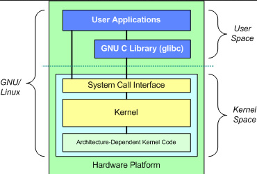
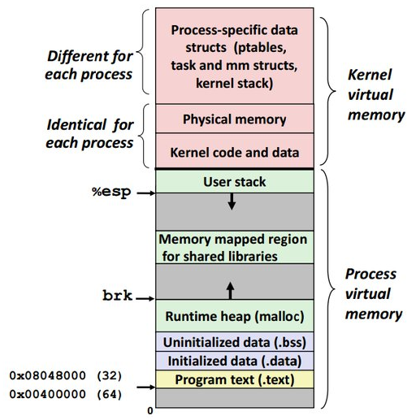
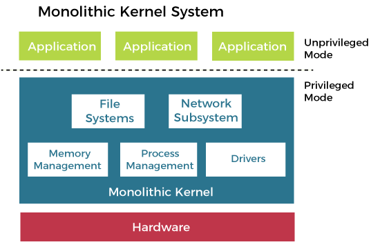
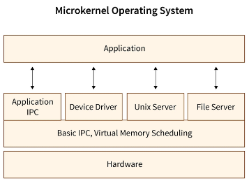
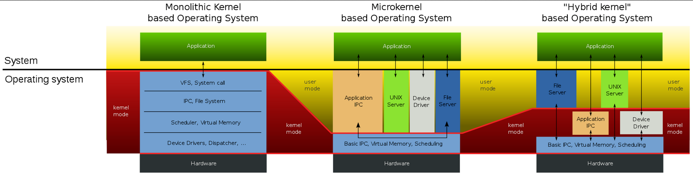

**Main Source :**

- **[Kernel - Wikipedia](<https://en.wikipedia.org/wiki/Kernel_(operating_system)>)**
- **[What is an OS kernel ? How does it differ from an operating system? [closed] - stackoverflow](https://stackoverflow.com/questions/2013937/what-is-an-os-kernel-how-does-it-differ-from-an-operating-system)**

**Kernel** is the core of an operating system (OS), it is the component of OS that manages hardware resources, provide system service, handle communication between processes, etc. It has a complete control over the system and interact directly with the hardware.

The difference between OS and kernel is, a kernel is just the "brain" or the logic of the computer system. While an OS is a broader concept, it is a complete software application with kernel included. OS provides another layer of abstraction for end user, such as window, user interface, API and library for making applications, where all of these are built on top of the kernel.

In conclusion, the kernel is the heart of the operating system, managing the low-level hardware and providing core operating system services. The operating system, including the kernel, provides a complete software platform that enables applications to run and interact with the hardware effectively.

  
Source : https://thecustomizewindows.com/2012/07/kernel-of-operating-system/

### Kernel Functionality

Some function of kernel :

- **Process Management** : Manages the execution of processes, schedules and allocates processor time to different processes, switches between them, handle communication between processes (IPC), and many mechanisms for process creation, termination, and synchronization.
- **Memory Management** : The kernel allocates memory to processes, tracks memory usage, and handles memory deallocation when a process is no longer in use.
- **Device Management** : Kernel enable communication between operating system and hardware devices such as disks, network interfaces, and input/output devices through **device drivers**. The kernel handles device initialization, manages device resources, and provides an interface for user applications to access and control devices.
- **File System Management** : Kernel manages the organization and storage of files on disk by providing file system that handle file creation, deletion, reading, and writing.
- **System Call Interface** : The kernel provides a set of system calls, which are functions that allow user applications to request services from the operating system. By service, those are system functionality which can be file operations, network communication, or etc. These system calls are requested via interface, typically from wrapper functions provided by the operating system to abstract the low-level details of the system call invocation process.
- **Interrupt Handling** : Handles interrupts generated by hardware devices or exceptional events. It receives and prioritizes interrupts, determines the appropriate response, and dispatches interrupt handler to handle the interrupts.

Kernel is a very important program in an OS, it is the first program loaded and will run at all times. At the start, the kernel is responsible for initializing hardware components, including the processor, setting up memory management, initializing devices and communication with peripherals.

Because the kernel interact directly with the hardware, the security of kernel is important. The memory of kernel is typically separated from application memory, this is to ensure that application can't directly access or modify sensitive kernel data or interfere with critical system operations. The protected kernel's memory is often called **kernel space**, and the application's memory is called **user space**. The kernel will also implement memory protection mechanisms to prevent processes from accessing unauthorized memory locations.

  
Source : https://www.quora.com/What-is-meant-by-kernel-memory-is-not-page-able

### Kernel Design

Depending on the goals, the design of a kernel involves making decisions about various aspects of its architecture, organization, and functionality. For example, how will system calls interface looks like, which strategy is used to manage process, what technique is used for memory management, the organization of file system, etc.

#### Monolithic Kernels

**Monolithic kernel** is a kernel architecture, where the entire operating system, including all essential services and functionalities, is implemented as a single, large kernel image.

:::note
A kernel image is a binary file that contains the compiled and linked code of the kernel of an operating system. It represents the executable form of the kernel that can be loaded into memory and executed by the computer's hardware.
:::

In this design, all kernel services, such as process management, memory management, file system support, and device drivers, reside in kernel space. The benefits of monolithic kernels is that they are in a single address space, we can directly access and share data structures and resources, making communication and coordination between kernel components efficient.

However, as the kernel grows, development process can become more complex. A change or update to one component may require modifying and recompiling the entire kernel. One bug in some part of kernel may affect other component of kernel.

  
Source : www.javatpoint.com/monolithic-structure-of-operating-system

#### Microkernels

**Microkernels** architecture aims to keep the kernel minimal by implementing only the most essential services, such as memory management, multitasking, IPC in kernel space. Additional functionality, such as file systems, device drivers, and networking, is moved to user space as separate processes or modules, called **server**.

The communication between each server or between server and microkernel relies on message passing. While it can be easier to maintain compared to monolithic kernels, the exchange of messages to request services or share information can introduce some overhead compared to direct function calls in a monolithic kernel.

  
Source : https://www.scaler.com/topics/microkernel-operating-system/

#### Hybrid Kernels

**Hybrid Kernels** combine both monolithic and microkernel architectures. It attempts to strike a balance between performance and modularity by incorporating features from both approaches. Some essential services and functionalities, such as process management and memory management, are implemented in kernel space, similar to a monolithic kernel. At the same time, other non-essential services, such as file systems, device drivers, and networking protocols, are implemented as separate modules or processes in user space, similar to a microkernel.

  
Source : https://en.wikipedia.org/wiki/Hybrid_kernel#/media/File:OS-structure2.svg
