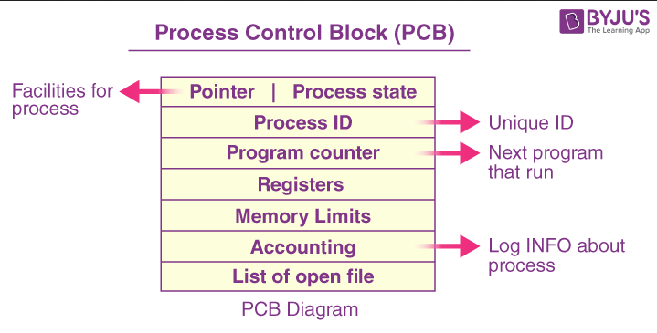
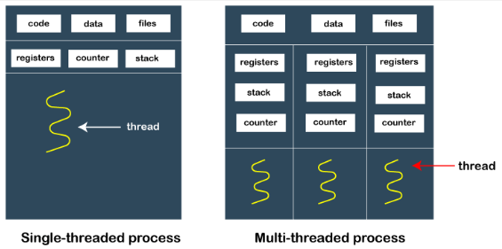
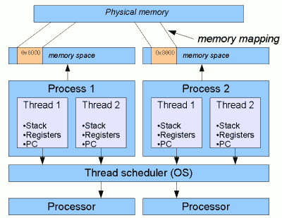
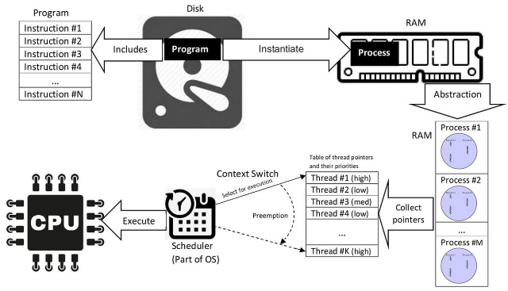
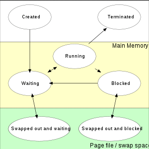
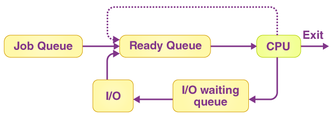
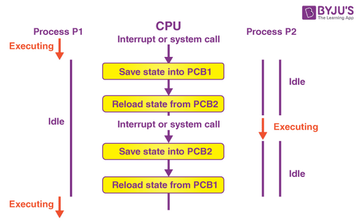
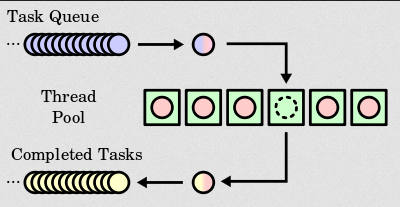
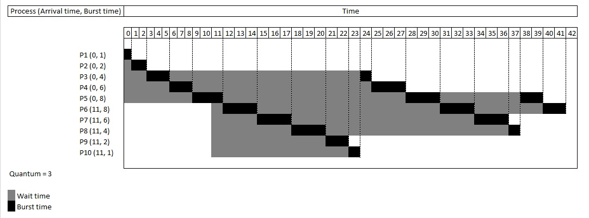

**Main Source :**

- **[Process (computing) - Wikipedia](<https://en.wikipedia.org/wiki/Process_management_(computing)>)**
- **[Process management (computing) - Wikipedia](https://en.wikipedia.org/wiki/Process_management)**
- **[Scheduling (computing) - Wikipedia](<https://en.wikipedia.org/wiki/Scheduling_(computing)>)**
- **[Context switch - Wikipedia](https://en.wikipedia.org/wiki/Context_switch)**

**Process Management** is a fundamental component of an operating system that involves the management and control of processes.

### Process & Thread

**Process** is an instance of a program that is being executed by a computer system. To execute a program, the program's code and data will need to be loaded into the memory. This mean each process will have its own memory space and system resources allocated to it.

Processes are isolated from each other, meaning they cannot directly access each other's memory or resources. However, they can still communicate through an [inter-process communication (IPC)](/operating-system/inter-process-communication) if they need to share data or information.

#### PCB

Process has many information associated with it, individual process is organized in a data structure called **Process Control Block (PCB)**, which contains [process state](#process-state), **process identifier (PID)**, various registers such as [program counter](/computer-organization-and-architecture/registers-and-ram#type-of-registers), etc.

Those individual process are organized together with the [linked list data structure](/data-structures-and-algorithms/linked-list), where each process has a pointer to the next process.

  
Source : https://byjus.com/gate/process-control-block-notes/

#### Thread

A process consists of a sequence of instructions, the unit of processing that executes instruction is called a **thread**. A thread represents a single sequence of instructions that can be scheduled and executed independently by the operating system.

Modern OS supports multiple threads within a single process, sharing the same memory space and system resources. Having multiple thread meaning we can execute a set of instruction much faster.

  
Source : https://www.javatpoint.com/process-vs-thread

In contrast to multiprocess, each process has different memory space

  
Source : https://www.javamex.com/tutorials/threads/how_threads_work.shtml

Threads also have their own unique thread identifier (TID). Because threads are working together, they can communicate and share data with each other within the same process by accessing or modifying the same memory and resources.

  
Source : https://en.wikipedia.org/wiki/Process_(computing)#/media/File:Concepts-_Program_vs._Process_vs._Thread.jpg, The execution of process through various steps

### Multitasking

A single CPU core executes a single process at a time, meaning one program can only be run at a time. Multitasking is a technique where the CPU core switches rapidly between different processes, allocating a small-time slice to each process. This gives the impression that multiple processes are executing concurrently, even though only one process is actually being executed at any given moment.

This is made possible by **scheduling**, the scheduler will allocate CPU time to different processes based on various factors such as priorities, fairness, etc.

There are two types of multitasking :

- **Preemptive Multitasking** : This technique allocates CPU time to multiple processes by forcibly interrupting and suspending the execution of one process to give time to another process.
- **Cooperative Multitasking** : This technique relies on processes voluntarily yielding control to other processes. In this approach, each process is responsible for explicitly relinquishing the CPU when it has completed its task or when it wants to allow other processes to run.

When trying to switch the execution between process, the current state of process being executed will be saved, so it can be restored and resumed later. This process is called **[context switch](#context-switch)**.

### Process State

A process has several states which represents the current condition or status.

1. **New or Created** : The process is in the "new" state when it is being created or initialized by the operating system. It is being loaded from secondary storage such as hard drive into main memory.

2. **Ready or Waiting** : In this state, the process is loaded into main memory, has all required resources allocated, and is awaiting execution. It is eligible to run, but it is waiting for the CPU scheduler to allocate CPU time to it.

3. **Running** : When a process is in the "running" state, it is actively being executed by the CPU. Only one process can be in the running state on a single CPU core at any given time. The CPU scheduler allocates CPU time to the process, and the process executes its instructions. The process transitions back to the "waiting" state when it is not actively executing again.

4. **Blocked** : The process enters the "blocked" state when it cannot proceed further until a certain event or condition occurs. This could be waiting for user input, waiting for a resource to become available (e.g., waiting for I/O completion), or waiting for a signal from another process. In this state, the process is suspended, and it is not eligible for execution until the event or condition it is waiting for is satisfied. Once the condition is met, the process moves back to the "waiting" state.

5. **Terminated** : The "terminated" state represents the end of the process's execution. It occurs when a process completes its execution or is explicitly terminated by the operating system or another process because of exceptions. In this state, the process is no longer running or eligible for execution. The operating system releases the resources held by the terminated process, removes it from the system's process table, and cleans up associated resources in the main memory.

     
   Source : https://en.wikipedia.org/wiki/Process_(computing)#/media/File:Process_states.svg

### Process Scheduling

**Process Scheduling** is the key of multitasking, there are several goals :

- **Maximizing throughput** or the amount of work done in some unit of time.
- **Minimizing wait time** or the amount of time processes spend waiting.
- **Minimizing response time** or the time taken from the initiation of a request or task until the first response or output is produced.
- **Maximizing fairness** or equitable access to system resources for all processes.

#### Process Queue

Processes are stored in queue based on their current state. For example, processes that are in ready state are put in ready queue.

  
Source : https://byjus.com/gate/process-scheduling-in-operating-system-notes/

The job queue consists of all processes awaiting execution. It represents a queue of tasks or jobs that are submitted to the system for processing. Process in I/O queue is waiting for I/O completion.

#### Process Scheduler

The process scheduler is responsible for determining the execution order and allocation of system resources to processes. Based on how often scheduling decision is made, there are 3 time frames :

- **Short-Term Scheduling (CPU Scheduling)** : This scheduling focuses on selecting processes from the ready queue for execution on the CPU. Its primary goal is to allocate CPU time efficiently among competing processes. Short-term scheduling decisions are made frequently, typically on the order of milliseconds or microseconds, to quickly switch between processes and provide the illusion of concurrent execution.

- **Medium-Term Scheduling (Process Swapping)** : Medium-term scheduling swap processes in and out of main memory (RAM). When the system's memory becomes heavily utilized or overloaded, the medium-term scheduler may decide to move some processes from memory to secondary storage (such as a hard disk) to free up memory space. This process is called swapping out. Later, when more memory becomes available, the medium-term scheduler may select processes from the swap area and bring them back into main memory (swapping in) for execution.

- **Long-Term Scheduling (Job Scheduler)** : Long-term scheduling focuses on deciding which processes should be admitted into the ready queue, which occurs when a new process is created. Long-term scheduling determines if the system has enough resources (CPU, memory, I/O) to accommodate the new process. Long-term scheduling helps to control the degree of multitasking, it ensures that the system does not become overwhelmed with too many processes.

#### Context Switch

In context switch, which is done by the **dispatcher**, the current state of the running process, including the contents of CPU registers, program counter, and other relevant information will be saved. This step ensures that the process can be resumed from the same point when it regains CPU execution time.

It is important for context switch to be fast as possible, because it is invoked very frequently and during invocation, the CPU does nothing.

Each process has its own [PCB](#pcb), which holds important information about the process. When context switch occurs, the corresponding PCB of current process is accessed and modified to reflect the current state. After that, the PCB associated with the new process, is retrieved, and its relevant data, including register values, is loaded into the CPU registers.

  
Source : https://byjus.com/gate/context-switching-in-os-notes/

#### Scheduling Algorithm & Strategy

- **First in, first out (FIFO) or First come, first served (FCFS)** : This is the simplest algorithm, the next process to be executed is the order they arrive in the ready queue. While it is simple and easy to implement, it may result in poor average response time, especially if long-running processes are ahead in the queue.

    
   Source : https://en.wikipedia.org/wiki/Scheduling_(computing)#/media/File:Thread_pool.svg

- **Priority Scheduling** : Processes are assigned priorities, and the process with the highest priority is selected for execution. The priority can be anything, for example it could be deadline.
- **Shortest Remaining Time First or Shortest Job First (SJF)** : Strategy where the process with the smallest total execution time is selected for execution next. However, this requires knowledge of the total execution time of each process (or at least estimation), which is often not available or accurate in practice.
- **Round Robin (RR)** : Each process is allocated a fixed time slice, and processes are executed circularly. This strategy provides fair sharing of CPU time among processes, however, shorter processes may still experience longer response times due to the fixed time slice.

    
   Source : https://en.wikipedia.org/wiki/Round-robin_scheduling

### Process Synchronization

#### Deadlock

#### Starvation

#### Livelock

#### Synchronization Primitives

atomic operation

##### Semaphores

##### Mutex

##### Spinlocks

##### Monitors
