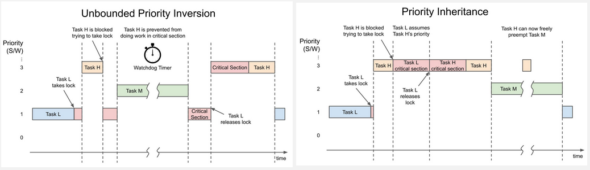
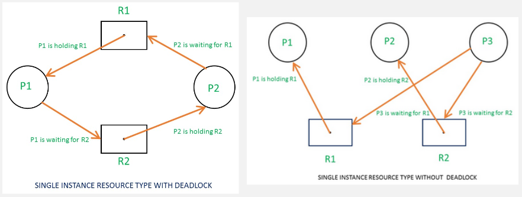
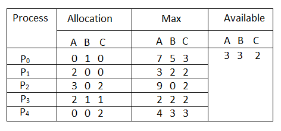
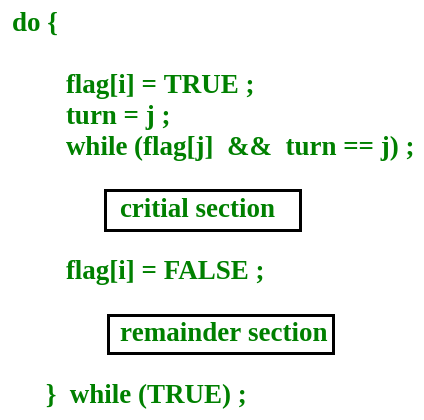

**Main Source :**

- **[Chapter 5 Process Synchronization - Abraham Silberschatz-Operating System Concepts (9th,2012_12)]**
- **[Chapter 7 Deadlocks - Abraham Silberschatz-Operating System Concepts (9th,2012_12)]**

Process synchronization is concerned with the coordination and control of concurrent processes or threads in a system. The goal is to ensure that processes can safely access shared resources, communicate with each other, and avoid other [concurrency-related issues](/operating-system/multithreading#multithreading-problems).

### Synchronization Issues

#### Priority Inversion

**Priority Inversion** is a phenomenon that can occur in systems where different tasks or processes have different priorities. It refers to a situation where a lower-priority task or process holds a resource needed by a higher-priority task, thereby causing a delay in the execution of the higher-priority task.

Example scenario :

1. Three tasks/processes are involved : a **high-priority task (H)**, a **medium-priority task (M)**, and a **low-priority task (L)**.
2. H need to access some resource, but the resource is currently held by L.
3. H couldn't preempt L, because L has much lower priority than H. The reason low-priority tasks can't be preempted is due to the avoidance of starvation, if high-priority task keep preempting, lower-priority task may never get a chance to execute.
4. Suppose that M is ready, M can preempt L because it is not the highest priority. Now, M is currently executing and holds the resource.
5. This phenomenon causes H takes longer to complete, because of waiting for M additionally.

One way to mitigate is the **priority inheritance** technique, which temporarily raise the priority of a lower-priority task to a higher-priority task when the lower-priority task holds a resource needed by the higher-priority task. So, L priority can be changed to H, this way we don't prevent M for preempting, because essentially it has higher priority. After the resource access is complete, the priority is back to original.

  
Source : https://www.digikey.com/en/maker/projects/introduction-to-rtos-solution-to-part-11-priority-inversion/abf4b8f7cd4a4c70bece35678d178321

#### Deadlock

After using synchronization techniques, additional concurrency issues may occur. For example, after using mutexes to restrict resource access to a single process at a time can potentially lead to another issue known as [deadlock](/operating-system/multithreading#multithreading-problem).

Processes need resource, this mean the process has a dependency on a resource to perform certain operations or computations. For example, a process may need access to a printer resource to print a document, or it may need access to a database resource to retrieve or update data. Deadlock occurs when a set of processes is unable to proceed because each process is waiting for a resource that is held by another process in the set.

Deadlock are typically characterized by :

- **Mutex** : It occurs when mutex is used, when at least one resource must be held in a non-sharable mode, meaning that only one process can use it at a time.
- **Hold and Wait** : When accessing resource, the processes will hold resources while waiting to acquire additional resources.
- **No Preemption** : Resources cannot be forcibly taken away from processes that hold them, only the process itself can release it.
- **Circular Wait** : There exists a circular chain of processes, each waiting for a resource held by the next process in the chain.

##### Resource Allocation Graph

We can detect a deadlock by representing the circular chain of processes in a graph called **resource allocation graph (RAG)**. It consists of nodes representing processes and resources, and directed edges representing resource requests and allocations. If the graph contains a cycle, it indicates the possibility of a deadlock.

  
Source : https://www.geeksforgeeks.org/resource-allocation-graph-rag-in-operating-system/ (box R is resource, circle P is process)

A single resource type means only one instance of a resource can be accessed at a time. However, this method is not applicable when dealing with multi-instance resource types, which is the case when single instance of resource can be accessed by some number of processes.

A deadlock happens when processes are stuck waiting for resources that are held by other processes, forming a cycle in the RAG. However, in multi-instance resource systems, processes can sometimes release some instances of a resource and continue running. So, even if there is a cycle in the RAG, it does not always mean there is a deadlock.

##### Banker's Algorithm

The Banker's algorithm can be used to detect deadlock in multi-instance resource systems.

The algorithm operates based on the concept of a **safe state**, which is a state in which a system can allocate resources to processes in a way that avoids deadlock. In multi-instance resource systems, the resource can be accessed by some number of process, safe state occurs when there are enough resources available to satisfy the resource requirements of all processes in the system.

The opposite concept, **unsafe state** occurs when there is not enough available resources to satisfy the resource requirements of all processes, which can potentially lead to a deadlock.

The algorithm works by considering the maximum resource needs of each process, the currently allocated resources, and the available resources in the system.

- **Initialization** : The algorithm starts by gathering information about the maximum resource needs of each process, the currently allocated resources, and the available resources in the system.

  
Source : https://www.geeksforgeeks.org/bankers-algorithm-in-operating-system-2/

The resource allocation can be represented in a table (called **available matrix**), for example, the resource A has a total of 10, where 2, 3, 2 of it is allocated by process 1, 2, 3, respectively. Resource A can only be accessed by max of 7, resulting in availability of 3.

- **Request Handling** : When a process requests additional resources, the algorithm checks if granting the request would result in an unsafe state or potential deadlock. It evaluates whether there are enough available resources to satisfy the request without violating the safety conditions.

- **Resource Allocation** : If the requested resources can be allocated without causing an unsafe state, the algorithm grants the resources to the requesting process. It updates the allocation and available resource matrices accordingly.

- **Safety Check** : After each resource allocation or request, the algorithm performs a safety check to determine if the system is in a safe state. It simulates the allocation of resources to all processes and checks if it can reach an end state where all processes can complete their execution without deadlock.

- **Deadlock Avoidance** : If the safety check determines that the system is in a safe state, the requested resources are allocated to the process, and the system continues its execution. Otherwise, the requested resources are not immediately granted, and the process must wait until sufficient resources become available.

##### Recovery

If a deadlock occurs after detection, there are some method to recover from it :

- **Process Termination** : One approach is to terminate one or more processes involved in the deadlock. By terminating a process, the resources held by that process are released and become available for other processes. The terminated process may need to restart or reattempt its task after the deadlock is resolved.

- **Resource Preemption** : In some cases, it may be possible to preempt or forcibly reclaim resources from one or more processes to break the deadlock. The preemption can be achieved by rolling back the process to a checkpoint or by freeing resources that are less critical to the process. Preempted resources can then be allocated to other processes to allow them to proceed.

### Other Synchronization Techniques

Some concept of synchronization for process is similar to [thread synchronization](/operating-system/multithreading#thread-synchronization).

#### Peterson’s Solution

In a concurrent program, the specific section of code where shared resources are accessed or modified is called **critical section**. We could implement [mutex](/operating-system/multithreading#locks--mutex) to ensure only one process can access or modify the resource. We also need to ensure that progress is made within the critical section. To avoid when no progress is made, we can make a process that are waiting for the critical section to complete to bypass. To ensure the fairness, we can limit on the number of times a process is allowed to be bypassed while waiting to enter its critical section.

**Peterson's solution** is an algorithm for mutual exclusion in concurrent programming. It provides a software-based approach to ensure that only one process or thread can enter its critical section at a time.

Peterson's solution requires the shared variables :

- `turn` : A variable that indicates whose turn it is to enter the critical section.
- `flag` : An array of boolean flags, with each element representing the intention of a process to enter the critical section.

The algorithm works as follows :

1. Each process sets its `flag` to indicate its intention to enter the critical section.
2. The process sets `turn` to indicate that it is the other process's `turn`.
3. The process enters a loop and checks if the other process's `flag` is set and if it is the other process's `turn`. If both conditions are true, the process waits until the other process completes its critical section.
4. If the conditions are false, the process enters its critical section and executes the desired code.
5. After the process completes its critical section, it resets its flag to indicate that it is no longer interested in entering the critical section. Also, exist a remainder section where we can perform any necessary cleanup or non-critical tasks.

  
Source : https://www.geeksforgeeks.org/introduction-of-process-synchronization/

### Message Passing

pipes, sockets, message queues, or channels.
