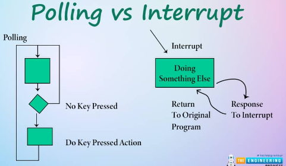
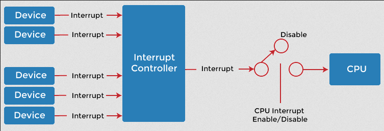
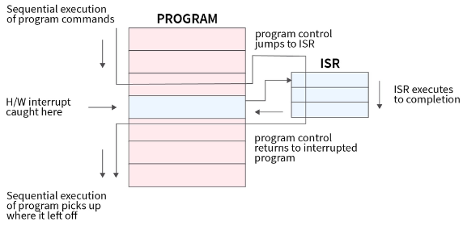

**Main Source :**

- **[Interrupt - Wikipedia](https://en.wikipedia.org/wiki/Interrupt)**
- **[Interrupt handler - Wikipedia](https://en.wikipedia.org/wiki/Interrupt_handler)**

Interrupt is a signal or event that interrupts the normal execution flow of a program or the operation of a computer system. When an interrupt occurs, the processor stops its current task and call the **interrupt handler** to resolve the interrupt event.

Interrupt make it possible for an event that is time-sensitive or critical to be handled as soon as possible. They allow the computer system to respond quickly to external events and perform necessary actions without wasting time polling (the act of actively checking something) or waiting for events to occur.

  
Source : https://www.theengineeringprojects.com/2021/12/esp32-interrupts.html

### Type of Interrupt

Interrupts can be categorized based on their source of origin, which can be either hardware or software.

#### Hardware Interrupt

Hardware interrupt is triggered when a specific event from the hardware occurs, such as a key press from keyboard, mouse movement from mice, network packet arrival from network card, or timer reaching a specific value.

Hardware interrupt signals are associated with **interrupt requests (IRQs)**. Each hardware device is assigned a unique IRQ number for identification. When the device generates an interrupt, the corresponding interrupt handler associated with that IRQ is invoked.

##### Masking

Many interrupts can be generated, there could be scenario where the less urgent or lower-priority interrupts interfere other time-sensitive events. **Masking** is an act to disable or ignore specific interrupts temporarily. This can be done by setting certain bits in the interrupt controller or by modifying interrupt flags in the processor.

##### Missing Interrupts

When issues such as faulty interrupt signals, incorrect interrupt wiring, improper interrupt configuration, or interrupt masking occurs, this can result in the system failing to respond to important events or data from hardware device.

##### Sporious Interrupts

**Spurious Interrupts** are unexpected or false interrupts that occur without any corresponding hardware event or interrupt signal. They are typically caused by electrical noise, voltage fluctuations, or signal reflections.

Spurious interrupts can be challenging to diagnose and resolve since they do not correspond to any real hardware events. To handle spurious interrupts, system designers often implement many techniques for additional checks to validate the occurrence of a genuine interrupt event. Software can also be designed to ignore or suppress spurious interrupts to prevent unnecessary interrupt handling or error conditions.

#### Software Interrupt

Software interrupt originate from software, typically through [system call that request a service](/operating-system/system-call-and-service). System calls are triggered by executing special software instructions or by raising specific flags or conditions. For example, a program may make a system call to request a file operation, network communication, or access to hardware resources.

Other source of software interrupt is from **exception** that occurs during the execution of program. Exceptions are anomalous condition that require special handling from the exception handler, this may be caused by error such as division by zero, invalid memory access, page faults, or illegal instruction execution.

### Interrupt Implementation

In the hardware-level, interrupt exist as electrical signals that are generated by hardware devices. These electrical signals are typically in the form of voltage transitions or maintained voltage levels that are detected and processed by the hardware. The interrupt signal can be handled by the CPU using a programmable **interrupt controller**.

An interrupt controller is a hardware component responsible for managing and prioritizing interrupts. It acts as a central hub for receiving interrupt signals and determining the order in which they are handled.

The interrupt signal is typically connected to a dedicated interrupt line, known as an **Interrupt Request (IRQ) line**. Each hardware device that can generate interrupts is connected to a specific IRQ line. The IRQ lines are part of the system's physical wiring and are connected to the interrupt controller or processor.

  
Source : https://www.javatpoint.com/what-is-interrupt-in-os

The primary functions of an interrupt controller include receiving interrupt signals, assign priority levels to interrupts based on their significance, [masking](#masking), route the interrupt to their corresponding handler.

### Interrupt Handler

Also known as **Interrupt Service Routine (ISR)**, it is a specific block of code that is executed in response to an interrupt. The interrupt handler is typically written in low-level programming languages or assembly language to ensure efficient and precise execution to minimize the impact on the interrupted program.

Before executing the interrupt handler, the hardware typically perform [context switch](/operating-system/process-management#context-switch) to save the current execution context, including the values of registers, program counters, and other relevant processor state information to be resumed on later.

The specific handling depends on hardware architecture and specific devices that triggers the interrupt. For example, an interrupt handler for a network interface card may read incoming network packets, or an interrupt handler for a storage device may write data to disk.

After the interrupt handler completes its execution, control is returned to the interrupted program or task. The hardware restores the saved context and resume the program execution from the point where it was interrupted.

  
Source : https://www.scaler.com/topics/operating-system/interrupt-handling/
