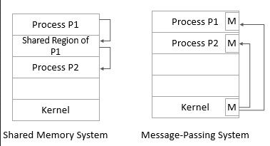

**Main Source :**

- [] 

**Inter-process Communication (IPC)** is...

### IPC Mechanism

IPC is all about communication, there are two main technique to communicate, by utilizing shared memory, or passing messages.

#### Shared Memory

**Shared Memory** is typically used for thread, but can also be used for process communication. The implementation is simple, a portion of memory is allocated and made accessible to multiple processes for read and write. However, this communication mechanism may require [additional synchronization technique](#thread-synchronization) to prevent [concurrency issues](#multithreading-problems).

#### Message Passing

**Message Passing** is an act of communication between processes or thread without using shared memory, it is inherently associated with "message".

Message passing can be synchronous or asynchronous. In the synchronous model, the sender process blocks until the message is received by the recipient process. In the asynchronous model, the sender process continues execution immediately after sending the message, without waiting for a response from the recipient. The recipient process can receive the message at a later time.

Some example of message passing :

- **Pipes** : Pipes are a form of [inter-process communication (IPC)](/operating-system/inter-process-communication) that allows the output of one process to be used as the input of another process. In a pipe, data flows in a unidirectional manner from the writer process to the reader process. Pipes can be either named or unnamed, with unnamed pipes typically used for communication between related processes (e.g., parent-child processes).

- **Sockets** : Sockets are a communication endpoint that enables bidirectional communication between processes over a network. They can be used for IPC within the same machine (domain sockets) or across different machines (network sockets).

- **[Message Queues](/backend-development/message-broker#message-broker)** : Message queues is where processes exchange messages through a shared [queue](/data-structures-and-algorithms/queue) in the operating system. Each message has a specific format and is placed into the queue by the sending process. The receiving process can then retrieve messages from the queue in a first-in-first-out (FIFO) order.

- **Channels** : Channels is a higher-level concept for message passing. Channels typically provide a set of operations, such as sending and receiving messages, and may incorporate synchronization mechanisms like blocking or non-blocking operations. Channels can be implemented using various underlying mechanisms, including shared memory, pipes, or sockets.

  
Source : https://beingintelligent.com/difference-between-shared-memory-and-message-passing-process-communication.html

:::tip
In relation to concurrency, see also [concurrency and parallelism](/computer-and-programming-fundamentals/concurrency-and-parallelism).
:::

### RPC

**Remote Procedure Call (RPC)** listed in [RPC](/backend-development/rpc)

### IPC Synchronization

IPC still uses synchronization method listed in the [thread synchronization](/operating-system/multithreading#thread-synchronization), such as mutex, semaphore, condition variables, but IPC cover a larger scope, that is within processes.

Classic problem such as [readers-writers](/operating-system/process-synchronization#readers-writers), and [dining philosophers](/operating-system/process-synchronization#dining-philosophers).

Solution such as mutex
