**Main Source :**

- **[Chapter 8 Main Memory - Abraham Silberschatz-Operating System Concepts (9th,2012_12)]**
- **[Memory management - Wikipedia](https://en.wikipedia.org/wiki/Memory_management)**
- **[Stack-based memory allocation - Wikipedia](https://en.wikipedia.org/wiki/Stack-based_memory_allocation)**
- **[Contiguous Memory Allocation in OS - SCALER Topics](https://www.scaler.com/topics/contiguous-memory-allocation-in-os/)**
- **[Slab allocation - Wikipedia](https://en.wikipedia.org/wiki/Slab_allocation)**
- **[Buddy memory allocation - Wikipedia](https://en.wikipedia.org/wiki/Buddy_memory_allocation)**
- **[Virtual memory - Wikipedia](https://en.wikipedia.org/wiki/Virtual_memory)**
- **[Memory paging - Wikipedia](https://en.wikipedia.org/wiki/Memory_paging)**
- **Various Google searches**

Memory is used to store program's data and instruction. The CPU will fetch the instructions from memory and execute them. The data required by the instructions is also fetched from memory and manipulated by the CPU. After execution is done, the data is stored back on the memory.

OS manages the memory used by programs, this involves allocating and deallocating a portion of memory space to different programs and processes. Each process' memory is isolated with each other, this is to prevent unauthorized access. It is the responsibility of the OS to enforce memory protection, ensuring that a process cannot access memory outside its allocated boundaries.

### Memory Management

When we create a program and store data, say assigning a number on a variable, the memory management is handled automatically by the language runtime or the underlying system libraries.

In the case of automatic memory management, here's what might happen :

1. When we assign data to a variable, the compiler or interpreter reads the statement and determines the memory size required to store the variable based on its data type and other specific programming language rules. It then requests memory from the operating system to allocate space for the variable.
2. The operating system, through the compiler or interpreter, assigns a memory address to the variable. The memory address is a unique identifier that specifies the location in memory where the variable's value will be stored. The assigned value is stored at the memory address allocated to the variable.
3. Once the value is assigned, we can access the variable's value in our code by referring to its name. The compiler or interpreter translates the variable name into the corresponding memory address, allowing you to read or modify the value stored at that location.
4. The variable remains in memory until its scope ends. When the variable goes out of scope or is no longer needed, the memory allocated to it can be reclaimed for future use.

### Memory Allocation

**Memory Allocation** is the process of assigning a portion of a computer's memory to store data or instructions during the execution of a program. It involves reserving memory space to hold variables, data structures, objects, or program code.

Here is the overview of memory allocation :

1. **Memory Request** : When a program or process requests memory, it communicates with the operating system to obtain the required memory space.
2. **Allocating Memory** : The operating system will allocate the requested memory and maps the requested memory space to a specific location in the physical memory. By mapping, it means that it sets aside a specific portion of the computer's physical memory for a program or process to use. The allocated memory becomes reserved and dedicated to the program or process that requested it.
3. **Memory Access** : The program or process can now access the allocated memory space. It can read from and write to the memory within the allocated boundaries. The OS won't allow when the program try to access region outside the boundary. When the program tries to access a part of the computer's memory that it shouldn't be accessing, an error called **segmentation fault** may occur.
4. **Deallocation** : When a program no longer needs the allocated memory, it should inform the operating system to deallocate the memory space. The operating system marks the previously allocated memory as available for reuse.

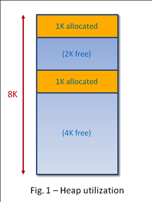  
Source : https://www.embedded.com/dynamic-memory-and-heap-contiguity/

#### Memory Segmentation

Depending on the strategy and purpose of allocation, the memory allocated can take place in various location. Memory is divided into variable-sized segments, where each segment is associated with a particular process or program.

Overall, there are four segments, code segment, data segment, stack segment, and heap segment. The code segment contains the executable code of a program, the data segment holds the static and global variables used by a program, the stack segment is used for storing local variables and function call information, and the heap segment for dynamic allocation.

- **Stack** : The stack is a region of memory used for the execution of programs. It is a data structure that follows the [LIFO principle](/data-structures-and-algorithms/stack). The stack is used for storing function call information, local variables, and other data associated with function execution. Each time a function is called, a stack frame is created, which contains the function's parameters, return address, and local variables. When the function completes, its stack frame is removed, and control returns to the calling function.
- **Heap** : Heap is a region of memory that is a larger and more flexible area of memory compared to the stack. The heap is used for allocating memory dynamically at runtime when the size or lifetime of data is unknown or needs to be managed explicitly. In [manual memory management](#dynamic-allocation), memory allocated on the heap must be explicitly requested and released by the program.
- **Static** : Static memory is a region of memory that stores global variables, static variables, and constants. It is allocated and initialized before the program execution begins and remains throughout the entire lifespan of the program. Variables declared outside any function (global variables) and variables declared with the static keyword have static storage duration and are stored in the static memory.

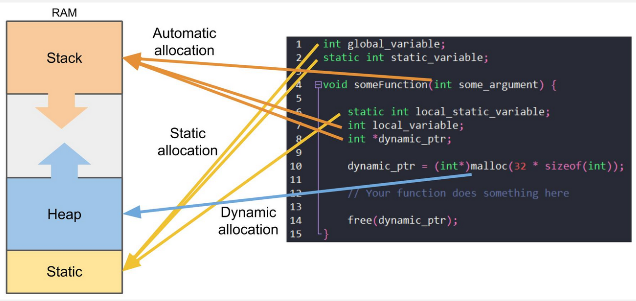  
Source : https://www.digikey.com/en/maker/projects/introduction-to-rtos-solution-to-part-4-memory-management/6d4dfcaa1ff84f57a2098da8e6401d9c

The other two regions :

- **Literals** : Literals are fixed values that appear directly in the source code of a program. They represent specific data types and are used to provide explicit values for variables or expressions. For example, if you have the code snippet `int x = 5;`, the literal value 5 is stored as part of the initialization of the variable `x`.
- **Instruction** : They represent individual operations that the CPU can execute (executable). In memory, instructions are stored as part of the program's **code segment**. The code segment contains the machine code instructions that make up the program's executable code.

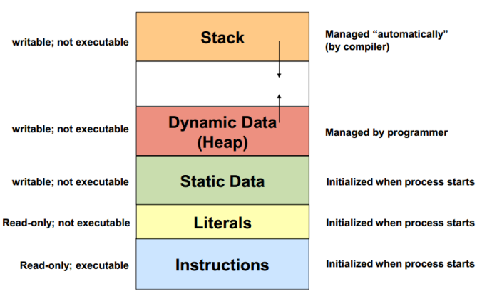  
Source : https://stackoverflow.com/questions/32418750/stack-and-heap-locations-in-ram

:::note
For correction on the image, the stack is not managed automatically by the compiler; rather, it is managed by the generated machine code based on the instructions provided by the compiler.

The compiler generates machine code that includes instructions for manipulating the stack, such as pushing or popping values onto or off the stack. These instructions are responsible for managing the stack frame during function calls and local variable allocation.
:::

#### Stack Allocation

**Stack allocation** is the allocation and deallocation of memory on the stack during the execution of a program. The stack is a region of memory used for managing function call information and local variables.

Stack allocation is simple and efficient because it operates on LIFO principle. This mean that the most recently allocated memory block is the first one to be deallocated. The stack data structure is managed with a **stack pointer**. The stack pointer is a [pointer](/computer-and-programming-fundamentals/memory#pointer--reference) that points to the memory address where the next value will be pushed or popped from the stack.

Stack allocation is commonly used for storing temporary variables and function call information. It is suitable for variables with a limited lifetime within a specific scope, as they are automatically deallocated when the scope is exited.

When a function is called, the stack pointer is adjusted to create a new stack frame, which contains the function's parameters, return address, and local variables. When a function exits, the memory allocated for its local variables is immediately available for reuse by subsequent function calls.

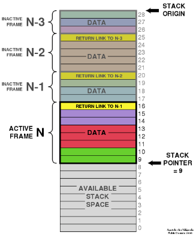  
Source : https://en.wikipedia.org/wiki/Stack-based_memory_allocation

However, the stack has a finite size, and exceeding its capacity can lead to an error called **stack overflow**, which is when the available space in the stack is exceeded due to excessive [recursion](/data-structures-and-algorithms/recursion) or the allocation of a large amount of local variables.

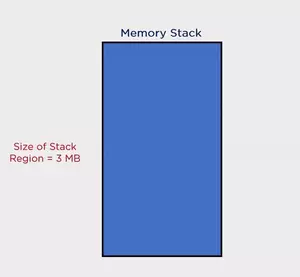  
Source : https://www.simplilearn.com/tutorials/data-structure-tutorial/stacks-vs-heap

#### Dynamic Allocation

Also known as **heap allocation**, which is done manual by the programmer. It is the process of allocating memory at runtime (when the program is running) on the heap region, rather than the stack. Dynamic allocation is typically used when the size or lifetime of the data structure or object cannot be determined at compile-time or when it needs to be allocated and deallocated dynamically during program execution.

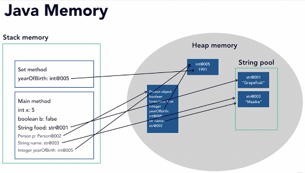  
Source : https://cdinuwan.medium.com/java-memory-management-garbage-collection-f2075f07e43a

##### Manual Memory Management

In manual memory management, programmers take control of memory allocation by requesting memory directly instead of relying on the compiler to do so on their behalf. When programmers allocate memory manually, they explicitly request memory from the operating system through the compiler or interpreter. Similarly, deallocation is also done explicitly by the programmer, releasing memory when it is no longer needed. In this process, the compiler acts as an intermediary, making requests to the operating system based on the programmer's instructions.

In languages that require manual memory management, such as C and C++, the programmer has direct control over the allocation and deallocation of memory. For example, we can use the `malloc()` and `free()` function to dynamically allocate and free the memory, respectively.

Dynamic allocation is flexible when resizing memory. We can use the `realloc()` function to resize it, increasing or decreasing its size as needed. Resizing dynamic memory involves allocating a new memory with the desired size, copying the existing data to the new block if necessary, and deallocating the old block.

##### Automatic Memory Management

The direct control of memory in manual management can either be an up or down.

One of the major advantages of manual memory management is the potential for improved performance. Since the programmer has direct control over memory, they can optimize memory usage based on the specific needs of the program. However, manual memory management also introduces challenges and potential risks. It requires careful attention to detail to avoid issues such as **memory leaks**, where we do not release an unused memory, and invalid memory accesses.

There are many techniques to automatically manage memory, two examples are :

- **Garbage Collection (GC)** : Garbage collection automatically detect if objects or data are still in use and which are not. It identifies objects that are no longer reachable through any references from the program's root objects or variables, and marks them as eligible for garbage collection. After identifying the garbage objects, the GC reclaims the memory occupied by these objects, making it available for future allocations. While GC is very useful, it can introduce some overhead. When doing the operation, GC typically pauses the execution of program, this is to ensure consistent state of object, avoiding concurrent modifications.
- **Reference Counting** : Reference counting is a strategy to determine if an object is no longer used and should be freed from the memory. Reference counting may be used in GC. In reference counting, every object has a reference count associated with it. When an object is created or a reference to an object is assigned, its reference count is incremented. When a reference to an object is removed or goes out of scope, the reference count is decremented. When the reference count of an object reaches zero, it means there are no more references to the object, and it is considered garbage. At this point, the memory occupied by the object can be freed.

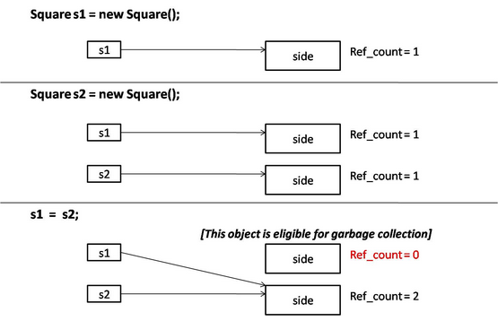  
_Garbage collection in Java language_  
Source : https://www.startertutorials.com/corejava/garbage-collection.html

#### Contiguous Memory Allocation

**Contiguous memory allocation** is a memory management technique where memory is divided into continuous blocks or regions. In this scheme, each process is allocated a block of memory that is contiguous next to each other, meaning it occupies a single continuous range of memory addresses.

The block partition can be fixed or variable.

- **Fixed (Static Partitioning)** : Total memory is divided into fixed-sized partitions or blocks in advance. Each partition is assigned to a process at the time of process creation based on its size. Once a partition is allocated to a process, it remains fixed for the lifetime of the process, even if the process doesn't fully utilize the entire partition. This partitioning suffer from **internal fragmentation**.
- **Variable (Dynamic Partitioning)** : Memory is dynamically divided into variable-sized partitions based on the size requirements of processes. The OS keep track of free and occupied memory in a table. When a process requests memory, it will search for a suitable contiguous block of memory that is large enough to accommodate the process. This partitioning is efficiently utilized memory, but it suffers from **external fragmentation**.

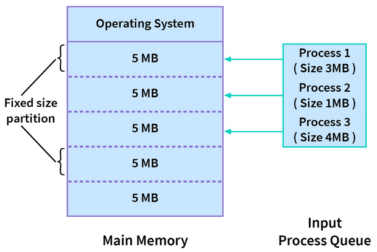  
_fixed size partition_  
Source : https://www.scaler.com/topics/contiguous-memory-allocation-in-os/

Contiguous memory allocation requires proper memory protection mechanisms to prevent processes from accessing the memory of other processes. These mechanisms include using base and limit registers or utilizing virtual memory techniques.

#### Slab Allocation

**Slab allocation** is a memory allocation mechanism that involves allocating a fixed-size block of memory called **slab**, whose size is supposed to fit an object, thereby minimizing memory waste due to [fragmentation](#fragmentation).

Collection of slabs is stored in **cache**, it is used to track slab status. The cache maintains a list of free slabs, partially used slabs, and full slabs.

The slab allocator sets up a pool of memory, which is then divided into slabs of a fixed size. When an allocation request is made for an object of a specific size, the slab allocator looks for a cache dedicated to that size. If a cache is found, the allocator checks if there are free objects within the cache's slabs. If there are, it assigns one of the free objects to the requester. If not, it allocates a new slab and assigns an object from that slab.

When an object is deallocated, it is returned to the cache's list of free objects. If the slab becomes empty (all objects are deallocated), it is moved to the list of free slabs.

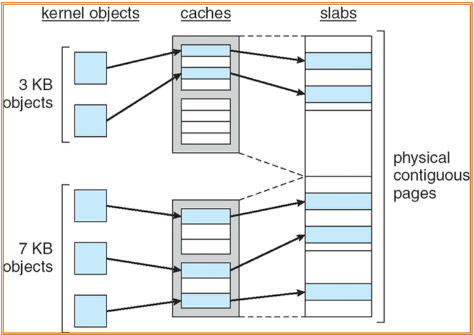  
Source : https://cs.stackexchange.com/questions/45159/can-someone-explain-this-diagram-about-slab-allocation

#### Buddy Allocation

**Buddy allocation** is a memory allocation algorithm that manages memory in power-of-two block sizes, which can be divided or merged.

When a memory request is made, the buddy allocator allocates memory from a buddy of a size that is a power of 2, such as 4 KB, 8 KB, or 16 KB. If the request asks for smaller memory than is available, then the block can be divided. If the request asks for larger memory, then the block can be merged.

The properties of divide and merge of buddy allocation make it reduces external fragmentation. However, it still suffers from internal fragmentation when the requested size is larger than available. For example, if requested memory is 66 KB, then we would have to allocate for 128 KB, because of the fixed power-of-two nature.

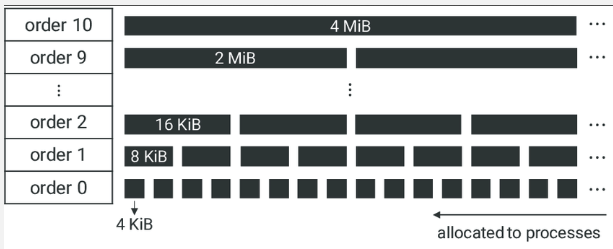  
Source : https://www.researchgate.net/figure/Memory-management-in-Linux-via-the-buddy-allocator-algorithm-Memory-spaces-are-divided_fig1_360496423

#### Allocation Strategy

During allocation, there are few strategies to determine the best location to allocate a block of memory from a free memory pool :

- **First-Fit** :
  - Allocator searches for the first available memory block that is large enough to accommodate the requested size.
  - It starts at the beginning of the free memory pool and selects the first block that meets the size requirement.
  - This strategy is simple and efficient in terms of time complexity, but it may lead to [fragmentation](#fragmentation) as it tends to allocate memory from the beginning of the pool, leaving smaller free blocks scattered throughout the memory.
- **Best-Fit** :
  - The best-fit strategy aims to find the smallest available memory block that can satisfy the requested size.
  - It searches through the entire free memory pool to find the block that minimizes wastage, leaving the smallest unused space after allocation.
  - This strategy can lead to better memory utilization, but it may require more time for searching the entire free memory pool to find the best-fit block.
- **Worst-Fit** :
  - The worst-fit strategy allocates the largest available memory block to the requested size.
  - It searches through the entire free memory pool to find the largest block and allocates from it, which results in larger unused space or external fragmentation.
  - It can be useful because sometimes leaving larger memory hole is better than a small memory hole.

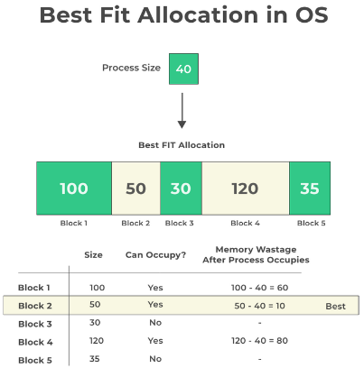  
Source : https://prepinsta.com/operating-systems/page-replacement-algorithms/best-fit/

#### Fragmentation

**Fragmentation** is a phenomenon where memory or storage space that is divided into blocks keep dividing until it becomes very small, non-contiguous blocks that are not efficiently utilized. It can occur in both RAM and disk storage.

- **Internal** : Internal fragmentation occurs when allocated memory or storage space is larger than what is required by a process or file. The unused portion within an allocated block, which cannot be utilized by other processes or files, is wasted.
- **External** : External fragmentation occurs when free memory or storage space is divided into small, non-contiguous blocks, making it challenging to allocate large contiguous blocks to processes or files, even if the total free space is sufficient. They occur in variable partitioning, when there are memory or storage gaps between allocated blocks.

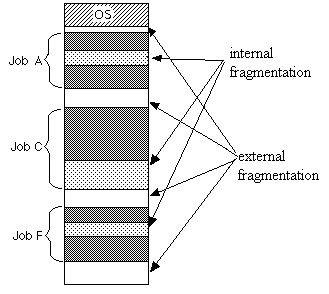  
Source : https://stackoverflow.com/questions/1200694/internal-and-external-fragmentation

To eliminate fragmentation, a process called **defragmentation** is done. It involves reorganizing files and data on a disk is reorganized. This process rearranges fragmented file segments into contiguous blocks.

#### Compaction

**Compaction** is a technique to rearrange memory contents, such as processes or data, to create larger contiguous blocks of free memory. It involves moving processes or files and updating memory references accordingly. Compaction can be time-consuming and may require additional memory or storage to facilitate the movement of data.

The difference between compaction and defragmentation is, compaction moves any data so that hole is minimized. On the other hand, defragmentation involves rearranging common data, such as data of the same file, so that the file is stored continuously.

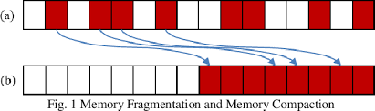  
Source : https://www.semanticscholar.org/paper/Memory-Compaction-Performance-Improvement-by-a-Page-Jang-Kwon/579ddc1c3fb50a554ac93a9d6d7095aa1f506a66

### Virtual Memory

#### Virtual Addressing

The operating system assigns a portion of memory to a process by providing it with a range of memory addresses. When the process needs to read from or write to memory, it uses any of these addresses. However, the address given to the process are not directly associated with physical memory. In other words, the locations the process refers to are not actual physical locations. This concept is known as **virtual addressing**, where the process accesses a "virtual" location.

We call memory that use virtual addressing a **virtual memory**. Virtual memory make it possible to use secondary storage such as hard disk to store process data. Main memory or RAM, while they are fast, they are limited in space. Secondary storage is typically slow, but it has much larger space.

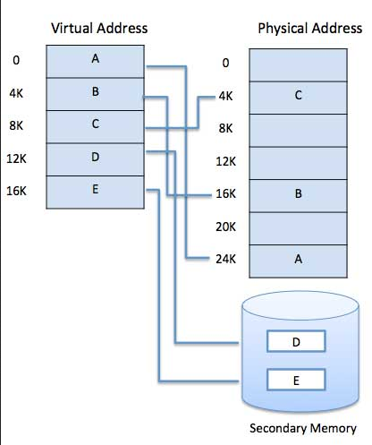  
Source : https://www.tutorialspoint.com/operating_system/os_virtual_memory.htm

Process is given a range of address that it can access to. It is the OS responsibility to handle the mapping between the virtual address and the physical address. If the process want to access, say the address "0x200", the OS must translate that virtual address into a real address, it needs to locate a physical location from a virtual address.

In summary, virtual memory is a technique to use secondary disk as an extension of memory. Each process uses a virtual address instead of a physical address. The memory management system decides whether to place the data on the main memory, or place it in the secondary disk. The location where it is placed doesn't matter, as the OS will the mapping between virtual and physical address.

#### Paging

**Paging** is one of the mechanism to implement virtual memory. Paging divides the virtual address space of a process into contiguous fixed-size blocks called **pages**. Likewise, the physical memory is divided into frames of the same size. The pages of a process are mapped to the frames in physical memory through a page table.

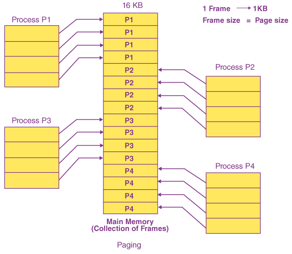  
Source : https://byjus.com/gate/paging-in-operating-system-notes/

#### Translation

When a program references a memory address through virtual address, it will need to go through an address translation. Memory management unit (MMU), which is the hardware that handles memory related operations, will intercept the memory access and performs the necessary translation.

The MMU uses a **page table**, which is a data structure maintained by the OS that contains various mapping information between virtual pages and physical frames, such as an indicator that indicates whether the corresponding address that the process is accessing is present in the main memory.

A virtual address contains consists of multiple components or fields :

- **Page Number** : Page or segment within the virtual address space that the address belongs to.
- **Page Offset** : Represents the offset or displacement within the page or segment. It specifies the specific location or byte within the page or segment that the address refers to.

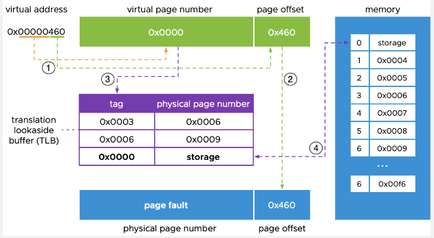  
Source : https://blogs.vmware.com/vsphere/2020/03/how-is-virtual-memory-translated-to-physical-memory.html

When a program references a memory page that is not currently present in main memory, an exception called **page fault** occurs. When a requested page is not available in main memory, it needs to be fetched from secondary storage. The program generates a memory access request for the page, this will trigger a page fault [interrupt](/operating-system/interrupt-handling), causing the control to transfer to the operating system.

This entire process is called **demand paging**, which is a technique to load data into memory only when it is needed, rather than loading the entire program or data set into memory at once. Virtual memory make it possible to implement demand paging, it allows the system to allocate and manage memory resources dynamically, as needed, by utilizing secondary storage as an extension of the physical memory.

#### Page Replacement

When page fault occurs, data need to be fetched from secondary storage to the main memory. This will involve evicting or replacing an existing page on the main memory, the process is called **page replacement** or **page swapping**. There are many algorithm and strategy to decide which page to replace, some examples are :

- **Least Recently Used (LRU)** : This algorithm selects the page that has not been accessed for the longest period of time. It assumes that pages that have not been accessed recently are less likely to be accessed in the near future.
- **First-In, First-Out (FIFO)** : This algorithm evicts the page that has been in physical memory the longest. It maintains a queue of pages and removes the page that entered the memory first.
- **Least Frequently Used (LFU)** : This algorithm selects the page that has been accessed the least number of times. It assumes that pages with lower access frequencies are less likely to be used in the future.

#### Advantages & Disadvantages

Paging make it possible to swap memory, pages that are not currently needed can be temporarily swapped out to disk storage. By swapping out unnecessary pages to disk, the system can free up valuable space in the main memory for other processes or programs.

Each page in virtual memory can be assigned access permissions, such as read-only or read-write, this increase memory protection between processes.

However, the division of memory into pages lead to potential [internal fragmentation](#fragmentation), when the process does not utilize all memory within a page. Unused portion of the page is wasted and cannot be allocated to other processes.

:::tip
In the mapping between virtual and physical memory, file can also be mapped into the virtual memory address space of a process. This technique is called **memory-mapped files**, it enables process to access the contents of a file as if it were a block of memory, providing an efficient way to read from and write to files.
:::
