**Main Source :**

- **[Chapter 10 Mass-Storage Structure - Abraham Silberschatz-Operating System Concepts (9th,2012_12)]**
- **[Chapter 12 File-System Implementation - Abraham Silberschatz-Operating System Concepts (9th,2012_12)]**
- **[Free Space Management in OS - SCALER Topics](https://www.scaler.com/topics/free-space-management-in-os/)**

Operating system provides necessary abstractions and services for disk management. By disk, it means they are secondary or tertiary storage, which are non-volatile storage device that retains data even when the power is turned off.

### Mass-Storage Structure

Mass-storage structure is the organization and management of storage devices, which encompasses the physical and logical components that enable the disk to store, access, and retrieve large amounts of data.

There are 3 common secondary storage :

- **Magnetic Disk (Hard Disk Drive [HDD])** :

  - **Structure** : Magnetic disk consist of platter disks stacked on top of each other on a spindle. Each plate has a special coating that can hold a magnetic field. The plates are enclosed within an assembly arm, where each plate has a read/write head above it.
  - **Working Principle** : HDDs use magnetism to store and retrieve data. The head can rotate to move across the surface of the platter. The rotation speed of the head is measured in revolutions per minute (RPM). A higher RPM indicates faster rotation speed, which imply a faster data access times. The heads can read and write data by changing the magnetic orientation of tiny regions on the platter's surface, representing the 0s and 1s of digital data.
  - **Data Access** : When data is written, the read/write heads apply a magnetic field to a specific location on the platter, aligning the magnetic particles in the desired orientation. When reading data, the heads detect the magnetic field on the platter and convert it into electrical signals that represent the stored data. The heads move across the platter surfaces to access different tracks and sectors, allowing random access to data.

    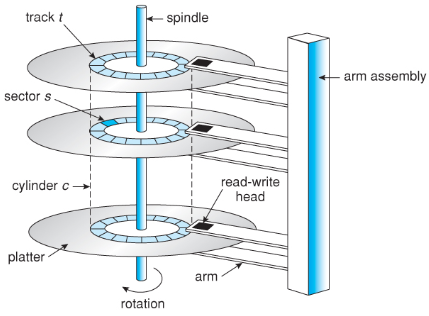  
    Source : https://www.cs.uic.edu/~jbell/CourseNotes/OperatingSystems/10_MassStorage.html

- **Solid-State Drive (SSD)** :

  - **Structure** : An SSD consists of multiple [flash memory](/computer-organization-and-architecture/coa-fundamentals#flash-memory) chips organized into memory blocks. Each memory block contains multiple memory cells, which are further organized into pages. The SSD also contains a controller that manages the data flow between the flash memory chips and the computer system.
  - **Working Principle** : SSDs use [flash memory](/computer-organization-and-architecture/coa-fundamentals#flash-memory), a type of non-volatile memory, to store and retrieve data. Flash memory is made up of floating-gate transistors that can hold an electric charge, representing the 0s and 1s of digital data.
  - **Data Access** : To write data, the controller sends electrical signals that charge the floating-gate transistors, altering their electrical state and storing the data. To read data, the controller measures the electrical charge in the transistors to determine the stored data. Unlike HDDs, SSDs have no moving parts, allowing for faster data access and improved reliability.

- **Magnetic Tape** :

  - **Structure** : Magnetic tape is wound on reels or cartridges. The tape is passed over a read/write head, which magnetically writes data onto the tape or reads data from it.
  - **Working Principle** : Magnetic tape is a sequential storage medium that uses magnetism to record and retrieve data. It consists of a long, narrow strip of plastic coated with a magnetic material.
  - **Data Access** : Magnetic tape is designed for sequential access, which means that data is read or written linearly from one end of the tape to the other. To access a specific piece of data, the tape must be fast-forwarded or rewound until the desired location is reached. Magnetic tape is commonly used for backup and archival purposes due to its relatively low cost and high storage capacity, although it tends to have slower access times compared to disk-based storage.

    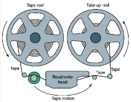  
    Source : https://cs.hofstra.edu/~cscvjc/Fall06/Slides/Sess09/img25.html

### Disk Structure

Disk is divided into several logical components :

- **Track** : A track is a concentric circular path on a disk's platter. It is defined as a complete circle around the disk's surface at a specific radius.
- **Sector** : A sector is the smallest addressable unit of storage on a disk. It represents a fixed-size section of a track. Sectors are typically formatted to hold a specific amount of data, such as 512 bytes or 4 kilobytes. Data is written to and read from sectors using the disk's read/write heads. These sectors are grouped together into larger units called blocks. The block size can vary depending on the [file system](/operating-system/file-system) and disk configuration.
- **Cluster** : A cluster, also known as an allocation unit, is a group of blocks that are treated as a single unit by the file system. It is the smallest addressable unit of disk space for file allocation.

  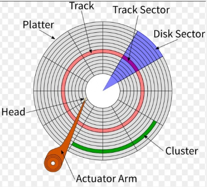  
   Source : https://www.kompasiana.com/image/stevenmlf/5e8ae37ed541df08e35c66b2/bagaimana-harddisk-membaca-data-dan-arsitektur-sektor?page=1

### Disk Scheduling

To read/write data to disk, we will issue [system call](/operating-system/system-call) provided by the operating system. The I/O request require :

- **Input or Output** : Specify whether it's an input (read) or output (write) operation.
- **Disk Address** : Specify the location on the disk including information about the track, sector, and cylinder.
- **Memory Address** : The address or the location in memory where the data to be read from or written to the disk is stored. It represents a buffer or a specific region of memory allocated for the I/O operation.
- **Number of Sectors** : Indicates the size or quantity of data to be transferred between the disk and memory.

**Disk Scheduling** is a technique used by operating systems to determine the order in which disk I/O requests are serviced. It is crucial to optimize disk access and minimize the **seek time**, which is the time taken for the disk's read/write heads to move to the desired location on the disk.

Some example of disk scheduling algorithms :

- **First-Come, First-Served (FCFS)** : This is a simple disk scheduling algorithm that services requests in the order they arrive. However, it does not consider the location of the requests on the disk, which can lead to poor performance if requests are scattered across the disk.

  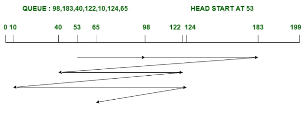  
   Source : https://www.geeksforgeeks.org/difference-between-fcfs-and-sstf-disk-scheduling-algorithm/

- **Shortest Seek Time First (SSTF)** : This algorithm selects the request that requires the least movement of the read/write heads from the current position. It aims to minimize the seek time by prioritizing the closest request.

  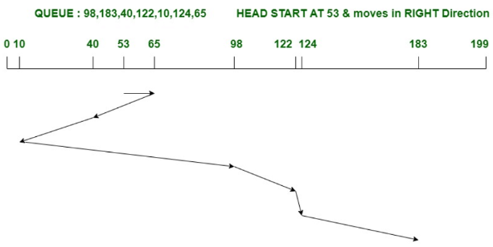  
   Source : https://www.geeksforgeeks.org/difference-between-sstf-and-look-disk-scheduling-algorithm/

- **SCAN (elevator algorithm)** : The SCAN algorithm moves the read/write heads in one direction (e.g., from the outermost track to the innermost track) and services all the requests in that direction. When it reaches the end, it reverses direction and services the remaining requests. There is also a variant of SCAN, C-SCAN (Circular SCAN), which jump immediately to the other end instead of reversing the direction.

  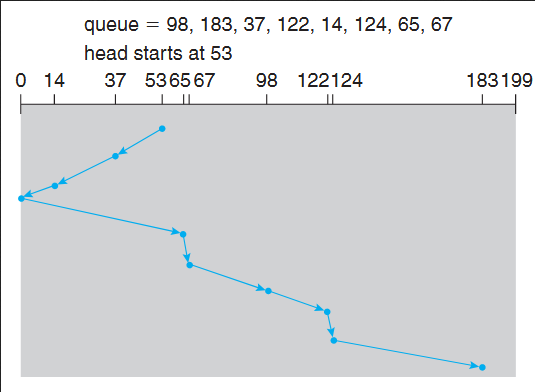  
   Source : https://stackoverflow.com/questions/58289534/scan-and-cscan-algorithm-in-operating-system

### Disk Management

#### Disk Formatting

Disk formatting is the process of preparing a storage device to be used by an operating system. Disk formatting involves three process :

- **Physical Formatting** : Initialize the physical tracks and sectors on the disk, as well as configuring parameters such as sector size. Physical formatting is typically performed by the manufacturer during the production of the disk and is not normally necessary or accessible to end-users.
- **Partition** : Disk is typically divided into logical regions that can be managed separately, called **partition**.
- **Logical Formatting** : Involves creating the file system structures such as creating an empty file or directory and the necessary metadata.

#### Boot Sector

When the computer goes through the [boot process](/operating-system/booting), it needs an initial program to run. A portion of the program data is stored in a read-only memory (ROM), while another portion resides in the **boot sector**, which is a fixed position on the disk dedicated to storing the initial program.

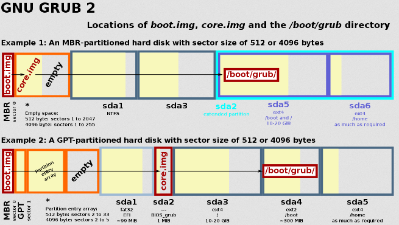  
Source : https://en.wikipedia.org/wiki/Boot_sector#/media/File:GNU_GRUB_components.svg

#### Bad Sector

Bad sector refers to a portion of a storage device that is physically damaged or unable to reliably store data. A bad sector can occur due to various reasons, including manufacturing defects, physical damage, aging, or other issues with the disk.

There are two types of bad sectors :

- **Hard Bad Sector** : It is a permanent physical defect on the disk's surface. It cannot be repaired or recovered because it represents a physical flaw, such as a scratch, magnetic degradation, or a faulty read/write head.
- **Soft Bad Sector** : It is a logical or temporary issue that arises due to problems with data storage or retrieval. Soft bad sectors can occur due to data corruption, software errors, or issues with the disk's internal mechanisms. In some cases, soft bad sectors can be repaired by performing disk maintenance operations.

When bad sector is found, it is flagged to be unusable. If it is possible to recover the bad sector, we can remap the bad sector to a reserved spare sector. This process involves updating the disk's internal mapping table to redirect any read or write operations from the original bad sector to the spare sector.

#### Free-space management

When we delete a file, it is not immediately removed from the disk. File is simply marked as free space instead of being deleted. When we want to create a new file, we will overwrite the disk which is marked as free. This effectively delay the physical deletion of files, which will reduce the performance overhead when deleting file.

The OS can choose various data structure to keep track the free space, the data structure is called **free-space list**.

- **Bit Vector** : A block in the disk has a bit, each bit will either be 0 or 1, where 0 represent allocated and 1 represent free space. This data structure is simple, but when it needs a free space, it needs to check the bit one by one, potentially going through all the block.

  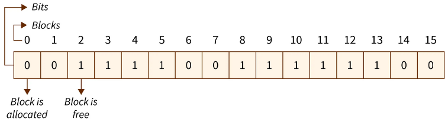  
  Source : https://www.scaler.com/topics/free-space-management-in-os/

- **[Linked List](/data-structures-and-algorithms/linked-list)** : The system maintains a linked list of free blocks. This approach allow us to get free space efficiently, because all the node in the linked list is already a free space. However, because the pointer to the next block is located inside the block, traversing the list would be inefficient, because it requires I/O operation to read the block.

  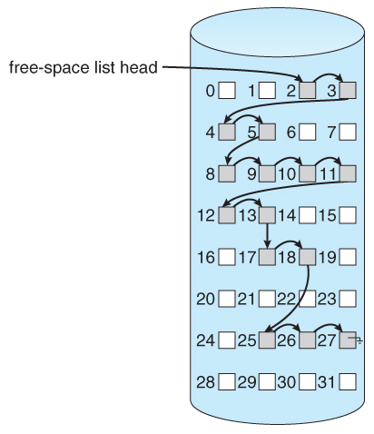  
  Source : https://www.cs.uic.edu/~jbell/CourseNotes/OperatingSystems/12_FileSystemImplementation.html

- **Counting** : This approach involves keeping track of the count of contiguous free blocks. This approach takes advantage of the fact that data is often stored in contiguous blocks, so when a block is freed, it is likely that the adjacent blocks are also free. We only need to store the address of the first free block and the number of free contiguous block next to it.

#### Storage Allocation

**Storage allocation** is the process of assigning and managing storage space for data or resources on a storage device, determining where and how they are stored, organizing them systematically, and tracking their locations for efficient retrieval.

There are three common method to allocate :

- **Contiguous Allocation** : In this method, files are stored as continuous blocks of data on the storage device. Each file occupies a contiguous section of the storage space. We will then store the location of the block with its length. Contiguous allocation provides fast access to data, but it can suffer from [fragmentation](/operating-system/memory-management#fragmentation) as files are created, modified, and deleted.

  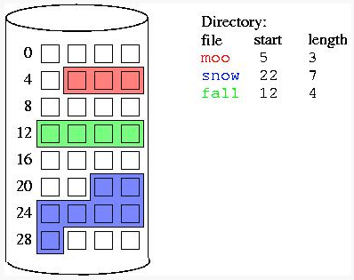  
  Source : https://mocki.co/contiguous-allocation/

- **Linked Allocation** : Linked allocation uses linked data structures, such as [linked lists](/data-structures-and-algorithms/linked-list), to manage storage space. Each file is divided into blocks, and each block contains a pointer to the next block. The file system maintains a table or index to keep track of the blocks' locations scattered around. Linked allocation allows for dynamic storage allocation and flexibility, solving fragmentation issue, but can introduce overhead due to the need to traverse the linked structure.

  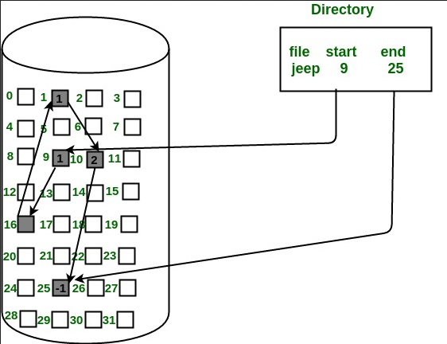  
  Source : https://www.geeksforgeeks.org/file-allocation-methods/

- **Indexed Allocation** : Indexed allocation uses a table to store the location of a file's block. The file's block will contain pointers or addresses that directly reference the data blocks on the storage device. Indexed allocation allows efficient access to files by random access, but it requires additional storage space for the index structure.

  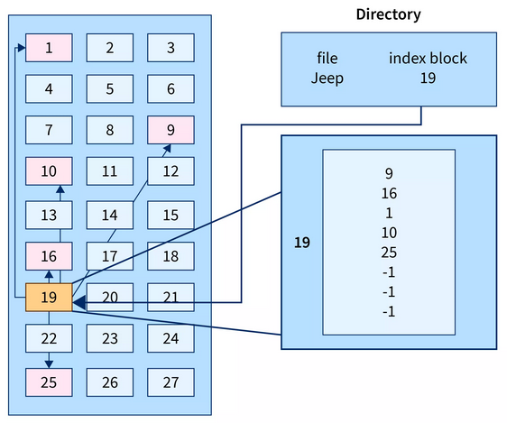  
  Source : https://www.scaler.com/topics/file-allocation-methods-in-os/

### RAID

**Redundant Array of Independent Disks (RAID)** is a technology that combines multiple physical disk drives into a single logical unit. RAID provides parallel data transfer across all the disks by distributing data across multiple disks, it utilizes all the disk transfer rate.

Another benefits of RAID are data redundancy. A technique called **mirroring** allow us to have a backup of data. The technique involves writing a copy of a data written into a specific disk into every disk. While it is expensive, it ensures that data is still accessible even if one or more disk drives fail.

RAID can be configured in many levels :

- **RAID 0** : Also known as **striping**, RAID 0 improves performance by splitting data across multiple disks without redundancy, offering no data protection.
- **RAID 1** : RAID 1, or mirroring, duplicates data across two or more disks to provide redundancy, providing a backup data.
- **RAID 0 + 1 and 1 + 0** : RAID 0 + 1 combines mirroring and striping. It provides both high performance and data redundancy, but it requires a larger number of drives compared to other RAID levels.

And many other levels…

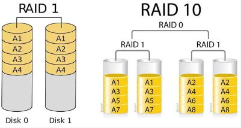  
Source : https://ttrdatarecovery.com/raid-1-vs-raid-10-comparison/
