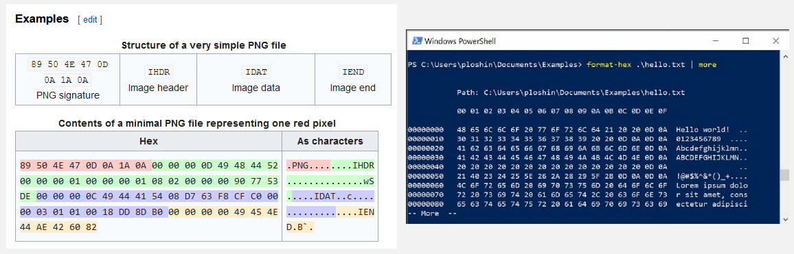
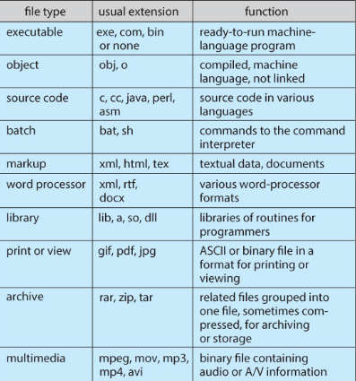
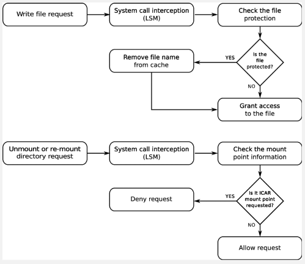
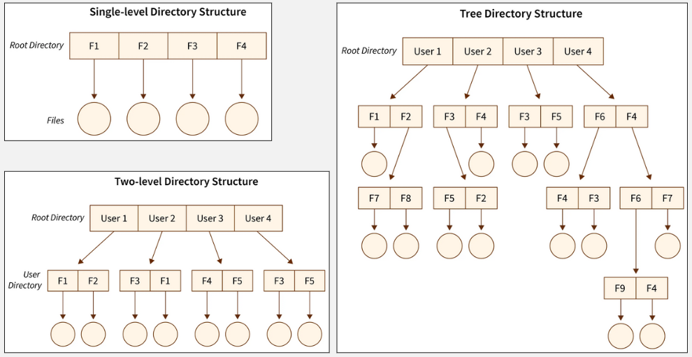
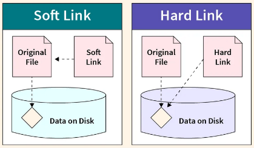
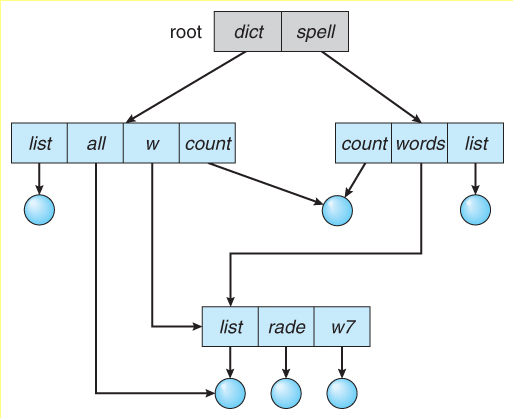
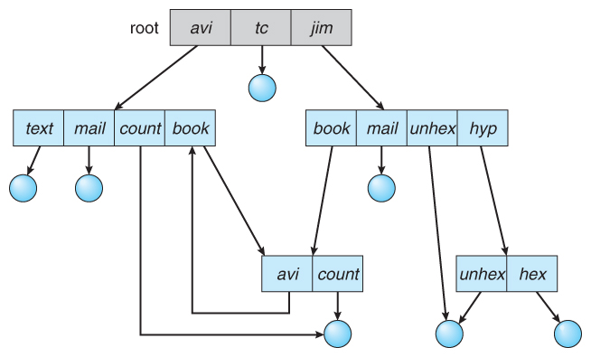

**Main Source :**

- **[Chapter 11 File-System Interface - Abraham Silberschatz-Operating System Concepts (9th,2012_12)]**
- **[Chapter 12 File-System Implementation - Abraham Silberschatz-Operating System Concepts (9th,2012_12)]**
- **[File system - Wikipedia](https://en.wikipedia.org/wiki/File_system)**
- **[Directory structure in OS - SCALER Topics](https://www.scaler.com/topics/directory-structure-in-os/)**

**File System** is a logical construct, a method, or structure used by an operating system to organize and store data on the storage.

At the lowest level, disk stores data in binary 0s and 1s, grouped together into sectors and blocks. Having file system provide a more convenient way to access data, it serves as an abstraction layer between the physical storage medium and the operating system when doing file operation.

### File

File is a named collection of related data that is stored on a storage medium. File contains information, depending on the file format, it can either be binary data (machine-readable) or plain text data (human-readable), which is encoded in specific encoding format such as [ASCII](/computer-and-programming-fundamentals/data-representation#ascii) or [UTF-8](/computer-and-programming-fundamentals/data-representation#utf).

Internally, a file is typically represented as a sequence of bytes or characters. File have specific format that explain how the file is structured. For example, image file format such as [PNG](/digital-media-processing/png) structure it's contents such that, computer know how to interpret it meaningfully. It may contain information about the file or the actual file information; in the case of images, it is the pixel data.

  
Source : [PNG file](https://twitter.com/likev/status/1395285523460083714), [TXT file](https://www.techtarget.com/whatis/definition/ASCII-American-Standard-Code-for-Information-Interchange)

The specific format or type of files is typically associated within the name as its extension. They are letters or symbols that appear after the dot in a file name (e.g., .txt for a text file, .jpg for an image file).

  
Source : https://www.cs.uic.edu/~jbell/CourseNotes/OperatingSystems/11_FileSystemInterface.html

:::tip
More about the [structure of specific file format](/digital-media-processing)
:::

#### File Attributes

The file system keep track of the data information, file has many attributes :

- **Name** : Every file has a unique name, which is human-readable, that identifies it within the file system. The name is used to reference and locate the file.
- **Size** : The size of a file refers to the amount of storage space it occupies on the storage medium, usually measured in bytes, kilobytes, megabytes, or larger units.
- **Type/Format** : Examples include text files (e.g., .txt), image files (e.g., .jpg, .png), audio files (e.g., .mp3), video files (e.g., .mp4), and many more.
- **Location** : The location of a file refers to its physical position or address on the storage medium.
- **Metadata** : Other information about the file, such as creation and modification timestamps, file permissions, file owner, file attributes, and other relevant details.
- **Protection** : Security related information, such as, who is allowed to read or write, is it visible, is it read-only, etc.

#### File Operation

- **Create** : Create a new file entry along with information associated with the file, this requires allocating space for the file, and a directory to store the file.
- **Write** : The write operation is used to modify the contents of a file or append new data to it. Through [system call](/operating-system/system-call), we will specify the target file, starting position, and the data to be written. The OS translates the logical file address to a physical disk location and writes the data to the appropriate sectors or blocks on the storage medium.
- **Read** : The read operation retrieves data from a file and transfers it into memory. It involves specifying the file to read, the starting position, and the number of bytes to read. The OS translates the logical file address to a physical disk location, retrieves the requested data, and transfers it to the requesting process or buffer.
- **Reposition / Seek** : The seek operation is used to reposition the current read/write position within a file. It involves specifying an offset from a reference point (e.g., the beginning, current position, or end of the file) and a direction (forward or backward). The OS updates the file's read/write pointer accordingly, allowing subsequent read or write operations to occur at the desired location.
- **Delete** : The delete operation removes a file from the file system. It involves locating the file's metadata, freeing the associated disk space, and updating directory entries or file system structures to reflect the deletion.
- **Truncate** : Truncating a file adjusts its size by removing or discarding a portion of its contents, based on the specified target size. The OS updates file metadata and frees disk space as needed. Truncation can both shrink and expand a file, making discarded data inaccessible.
- **Open** : Establishes a connection or handle to a file, enabling subsequent operations on it. It involves specifying the file's name or identifier, access mode (e.g., read-only, write-only, or read-write), and other optional parameters. The OS verifies access permissions, allocates necessary resources (e.g., file descriptors), and prepares the file for subsequent operations.
- **Close** : The close operation terminates the connection or handle to an open file. It involves releasing any resources associated with the file, such as file descriptors or locks.

:::tip
Terminology :

- **File pointer** is reference or indicator that points to a specific location within a file, in which next read or write operation will occur. File pointer for read operation is called **read-pointer** and for write operation, it is called **write-pointer**.
- **File descriptors** are unique identifiers or numerical representations that represent access to a file, socket, or other I/O resources.
- **File locks** are mechanism to restrict access to a file or a portion of a file to a single process or thread, to prevent concurrent access. There are two types of locks, **shared lock**, which allows multiple processes to read concurrently, or **exclusive lock**, which grants exclusive access to a process for writing to the file.
- **File-open count** is a number of times a file has been opened by different processes or within the same process. It helps keeping track of how many processes currently have the file open.
  :::

#### File Security

To ensure only authorized processes have access to files, the OS provide a mechanism called **access control**. The OS maintains metadata about each file, including ownership and permissions. These permissions specify which processes are allowed to perform certain operations on the file, such as read, write, execute, append, delete, or list. Read, write, execute, and list are descriptive, append means writing new information at the end of the file, and list, list the name and attributes of the file.

In a multi-user environment where multiple users operate the same computer, meaning they may share access to files, this is where file security becomes even more critical. The operating system provides features to handle file sharing and control how files may be accessed by different users, not just processes.

In [Unix OS](/operating-system/unix), each file is assigned a 9-bit binary protection code, which consists of three 3-bit fields representing the **owner**, the **owner's group**, and everyone else (also called **universe**). These fields determine the level of access granted to different users or groups for a particular file.

The three permission bits for each field are :

- **Read (r)** : View the contents of the file.
- **Write (w)** : Modify or delete the file.
- **Execute (x)** : Grants the user or group the ability to execute the file, in the case of executable files or scripts, or to access the contents of a directory.

For example, a file with the permission code "rwxr-x--x" means that the owner has read, write, and execute permissions, the owner's group has read and execute permissions, and others have only execute permission.

  
Source : https://www.researchgate.net/figure/File-system-protection-algorithm_fig3_260525066

### File Organization

#### Directory

Within the file system on a disk, files are organized in **directories** or **folders**. A directory is a way of grouping files together, it is a container that holds related files and provides a hierarchical structure for organizing and managing these files. A directory itself does not represent a physical entity on the disk but rather serves as a logical container or organizational unit for files and subdirectories.

Directories create a hierarchy within the file system, forming a tree-like structure. At the top of the hierarchy is the **root directory**, which serves as the starting point for navigating the file system. **Subdirectories** can be created within the root directory, and further subdirectories can be created within those, forming a nested structure.

  
Source : https://informationtechnologyja.wordpress.com/2020/10/19/information-technology-grade-9-lesson-2-tree-directory-structure/

#### Directory Levels

Directory can be categorized based on their organizational structure and the depth of their hierarchy :

- **Single-Level Directory** : All files are stored in a single directory without any subdirectories. While it's simple, it can be confusing to manage and locate specific files as the number of files increases.
- **Two-Level Directory** : Files are organized into multiple directories, with each directory having a unique name. Each file is associated with the name of the directory it belongs to, along with its own individual name.
- **Tree-Structured Directory** : This is the most commonly used directory. This directory structure its file in hierarchical tree-like structure. The top-level directory is the root directory, and from there, subdirectories can be created, each containing files or additional subdirectories.

  
Source : https://www.scaler.com/topics/directory-structure-in-os/

#### Pathnames

Files within the file system are identified by their **pathnames**, which specify their location within the directory hierarchy. A pathname typically includes the names of directories traversed from the root directory to the specific file, separated by slashes ("/") in Unix-like systems or backslashes ("\") in Windows systems.

For example, in Unix, a document file could be inside the Documents directory : `/home/user/Documents/file.txt`, where the root directory is just `/`. In Windows system, `C:\Users\user\Documents\file.txt`, where the root directory is `C:\`, the `C` is a drive letter which identify different disk partition in the storage.

There are three types of pathnames :

- **Absolute** : An absolute pathnames from the root to the file or directory. For example, in Unix-like systems, an absolute pathname could be `/home/user/Documents/file.txt`, where `/home/user/` represents the path to the `Documents` directory, and `file.txt` is the file name.
- **Relative** : Location of a file or directory relative to the current working directory. For example, if the current working directory is `/home/user/`, a relative pathname could be `Documents/file.txt` to refer to the file within the "Documents" directory.

  In the context of file system, the single dot "." and double dot ".." has a special meaning. The single dot represents the current directory, it is used to refer to the current working directory in relative pathnames. For example, if the current working directory is `/home/user/`, the pathname `./file.txt` refers to the file `file.txt` in the current directory.

  The double dot represents the parent directory, it is used to refer to the directory one level up in the directory hierarchy. For example, if the current working directory is `/home/user/Documents/`, the pathname `../file.txt` refers to the file `file.txt` in the parent directory of `Documents`, which is `/home/user/`.

- **Canonical** : Absolute pathname that has been simplified or normalized to its simplest form. It eliminates any unnecessary or redundant elements such as "." (current directory) and ".." (parent directory) references. For example, `/home/user/Documents/../file.txt` accesses the `file.txt` in the parent of `Documents` directory, this can be simplified to `/home/user/file.txt`.

#### Representation

Other than tree, there are other data structure can be used to represent directories. One of them is graph, using graph allows directories to have multiple parents, whereas trees enforce a strict hierarchical structure with a single parent for each directory. This can be useful when a directory needs to be logically linked or shared between multiple locations within the file system.

Multiple parents allow directory to have links, which are references or pointers to other files or directories.

- **Hard / Physical Links** : A hard link is a direct reference to a file or directory. When a hard link is created, it points to the same underlying data as the original file or directory. Changes made to the file through any of its hard links are reflected in all other hard links. Hard links can only be created for files within the same file system since they reference the underlying data blocks directly. While hard links can be used to create multiple references to a file, they cannot create cyclic dependencies or loops within a graph structure.
- **Soft / Symbolic Links** : On the other hand, soft link acts as a pointer or reference to another file or directory. Unlike hard links, soft links are separate files that contain a path to the target file or directory. When accessing a soft link, the file system resolves the link and redirects the request to the target file or directory. Changes made to the target file or directory are reflected in the soft link, but modifying the soft link itself does not affect the target. Soft links make it possible to create loops or cycles within a graph-like structure.

    
   Source : https://www.scaler.com/topics/hard-link-and-soft-link-in-linux/

The two types of graph for directory representation :

- **[Acyclic Graph](/data-structures-and-algorithms/graph#acyclic)** : This directory structure uses a **directed acyclic graphs (DAGs)** to represent directories and their relationships. Directories can have multiple parents, and symbolic links can be used to create additional directory references. However, it is important to maintain acyclicity, meaning there should be no cyclic dependencies or loops in the graph.

    
  Source : https://www.cs.uic.edu/~jbell/CourseNotes/OperatingSystems/11_FileSystemInterface.html

- **[General Graph](/data-structures-and-algorithms/graph)** : In a general graph directory structure, directories are represented using a general graph data structure, which may have cycles and arbitrary relationships. Managing and navigating a general graph directory structure may require additional algorithms or mechanisms to handle cycles and resolve conflicts.

    
  Source : https://www.cs.uic.edu/~jbell/CourseNotes/OperatingSystems/11_FileSystemInterface.html

:::note
[Tree](/data-structures-and-algorithms/tree) is a special case of graph where the properties are undirected and acyclic. It contains no cycles or loops and connected, meaning there is a path between any two vertices.
:::

### File System Implementation

#### File System Structure

#### File Control Block

#### Partition & Mounting

#### Directory Implementation

- **Linear List** :
- **Hash Table** :

#### Allocation Methods

**Allocation Methods** are the methods of allocating space on a storage device to store files in a file system. It involves managing the storage resources and organizing the physical locations where files are stored on the storage medium.

See [storage allocation](/operating-system/disk-management#storage-allocation).

#### Inode

It's an example in Unix OS. FCB

#### Free-Space Management

**Free-space Management** is the process of tracking and managing available space on a storage device. It involves keeping a record of which areas or blocks of the storage medium are free or allocated to files.

- **Allocation** : When a new file needs to be created, the system identifies and allocates a suitable portion of the storage medium to store the file. The system finds contiguous or non-contiguous set of free blocks that can accommodate the file's size.
- **Deallocation** : When a file is deleted or no longer needed, the system marks the previously allocated blocks as free, making them available for future allocations.

See [free-space management](/operating-system/disk-management#free-space-management).

### File System Example

#### FAT

- dd
- dd

#### NTFS

- dd
- dd

#### EXT4

- dd
- dd
