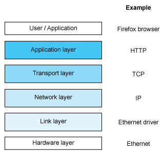
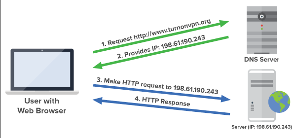
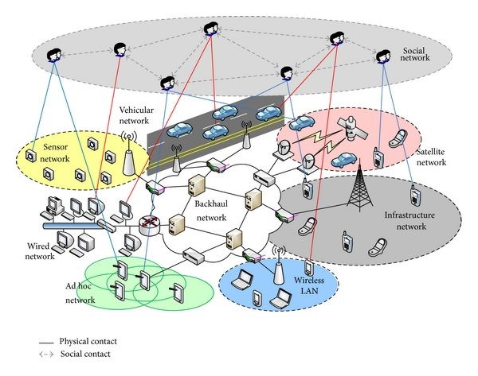
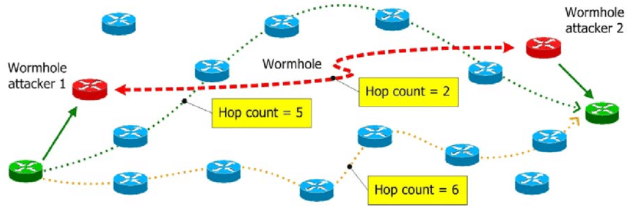
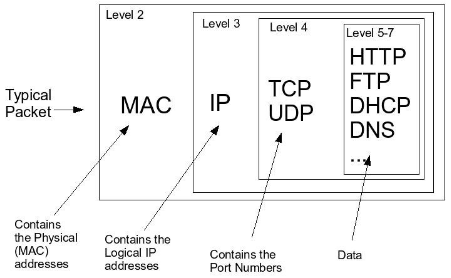

**Main Source:**

- **[Computer Networking](/computer-networking)**
- **[Chapter 17 Distributed Systems - Abraham Silberschatz-Operating System Concepts (9th,2012_12)]**

OS bridges hardware and software applications by providing APIs, including networking APIs. When software application want to make a network request, the OS will handle the low-level networking capabilities. This includes tasks such as establishing network connections, managing network sockets, packet transmission, and handling network protocols.

To communicate in network, each system must follow a set of rules. These rules are called network protocol, it consists of standard that one must follow in order to communicate. Network protocol has several levels, where each level describes the level of abstraction. It spans from the lowest physical level, up to the application level.

A networking stack is a layered implementation of network protocols that handles various tasks involved in network communication. It encompasses tasks like physical data transmission (physical layer), managing transmission above the physical layer (data link layer), [IP addressing](/computer-networking/ip-address), [routing](/computer-networking/routing), and forwarding (network layer), end-to-end communication (transport layer), and direct interaction with applications (application layer).

The OS manages these tasks on behalf of the application, abstracting away the complexities of the underlying network infrastructure.

  
Source: https://www.cyberciti.biz/tips/linux-network-stack-tutorial.html

The OS interacts with network drivers and hardware devices to send and receive network packets. It manages the network interfaces, such as [Ethernet](/computer-networking/ethernet) adapters or wireless cards.

:::info
See also [device management](/operating-system/device-management) and [networking stack](/computer-networking/osi-model).
:::

### Communication Structure

There are four steps which the OS need to handle in order to communicate.

#### Naming & Name Resolution

To communicate in a network, two system must locate each other. A participant in a network communication that sends or receives data is called a **host**. Each of the two hosts must have a unique identifier, which helps in locating them within the network.

For simple processing, computer uses number as an identifier instead of human-readable names. The identifier is called [IP address](/computer-networking/ip-address), an example of IP address is `128.29.12.13`. When we browse on the internet, we typically enter some URL such as `www.google.com`, this URL is actually the host name. However, as said earlier, computer uses number. It doesn't understand how to connect to `www.google.com`, it requires the IP address of `www.google.com`. However, it wouldn't make sense for human user to use raw IP address to browse the internet.

To address this, a solution is to implement a service that can translate a human-readable host name into its corresponding raw IP address. The service that provide this is called [domain name system (DNS)](/computer-networking/dns). When we intend to connect to some host, such as browsing with specific URL in browser, the browser application delegate the task and ask the OS to resolve the IP for corresponding URL.

  
Source: https://devopedia.org/domain-name-system

#### Routing Strategies

Given that we know the location of the receiver, how should we transmit our data? Network are connected in various ways, it can be wired connection of computer (e.g., [LAN and WAN](/computer-networking/lan-wan)), or it could be wireless (e.g., [Wi-Fi](/computer-networking/wi-fi), [cellular connection](/computer-networking/cellular-networking)), the connection can be complex when the network become larger. [Routing](/computer-networking/routing) is the act of deciding on the paths or routes that messages should follow to reach their intended destinations efficiently.

  
Source: https://www.researchgate.net/figure/Contemporary-wireless-complex-communication-network-architecture-presenting-cumulatively_fig1_258401293

Routing process will be handled by a [router](/computer-networking/router). The router will determine the route using routing algorithms and protocol. One of the simple protocol is the [Routing Information Protocol (RIP)](/computer-networking/routing#routing-information-protocol-rip). This algorithm minimizes the distance of routing by having a _hop count_, which is a metric that represent the number of routers or network segments that a packet must traverse to reach its destination.

  
Source: https://www.researchgate.net/figure/Distinguishing-safe-routes-from-hop-count-values_fig4_221979955

#### Packet Strategies

When transmitting data, the messages are divided into smaller, fixed-size unit called **packets**. A packet consists of several components that enable it to be successfully transmitted and delivered to its destination:

- **Header**: Header section contains control information necessary for routing and handling the packet, such as the source and destination addresses.
- **Payload**: The payload is the actual data being transmitted. It can include any type of information, such as text, images, audio, or video.
- **Trailer**: The packet concludes with a trailer section, which contains additional information for error detection and correction. This may include [checksums](/computer-security/hash-function#checksums) or cyclic redundancy checks (CRC) to ensure data integrity during transmission.

  
Source: https://tournasdimitrios1.wordpress.com/2011/01/19/the-basics-of-network-packets/

#### Connection Strategies

Two processes can establish a sequence of communication. Connections can be either **connection-oriented** or **connectionless**.

In a connection-oriented approach, a dedicated communication channel is established between the sender and receiver before data transmission. Protocols like [TCP](/computer-networking/tcp-protocol) follow a connection-oriented approach. In short, TCP guarantee that packet will not lost in transmission, this is participant of TCP must ensure they are connected reliably. Upon sending message, the sender must send an **ACK (acknowledgment)** message, which can be thought as an indicator of whether data transmission should continue.

On the other hand, connectionless communication does not establish a dedicated connection and each message is sent independently. Protocols like [UDP](/computer-networking/udp) follow a connectionless approach. UDP doesn't require sender to send the ACK message, it doesn't have built-in mechanisms for error recovery, retransmission, making UDP generally faster.
