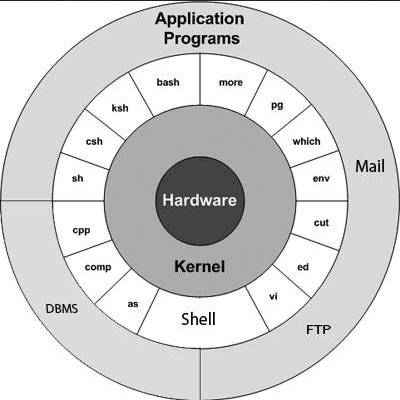
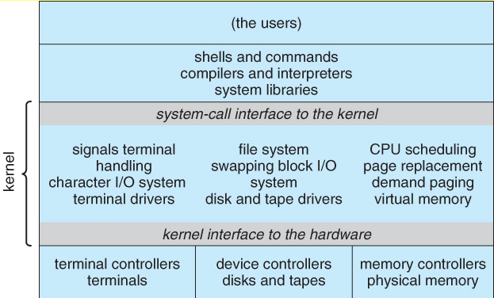

**Main Source :**

- **[Unix - Wikipedia](https://en.wikipedia.org/wiki/Unix)**

**Unix** is a multitasking, and multi-user operating system initially developed in the 1970s at Bell Labs by a group of programmers including Ken Thompson and Dennis Ritchie.

Unix was designed to be flexible, modular, and portable. Each component of the OS has its own well-defined interface, it can interact with other modules in a standardized manner. By portable, it means the OS can run on different hardware platforms without requiring significant modifications or recompilation.

The design principles and features of Unix make it popular. As a result, many other OS starts to adopt similar design principles and features with Unix, leading to the emergence of so called "Unix-like systems". Unix-like system, such as [Linux](/operating-system/linux-kernel) and [BSD](/operating-system/bsd), shares many fundamental concepts and system calls with Unix. The portability aspect of Unix also make it compatible with Unix-like systems.

### Architecture & Structure

Below is the layered architecture of Unix OS, with the hardware being the innermost layer and applications in the outermost layer.

  
Source : https://www.tutorialspoint.com/unix/unix-getting-started.htm

- The kernel layer wraps hardware layer, it handles low-level tasks such as [process management](/operating-system/process-management), [memory management](/operating-system/memory-management), [file system management](/operating-system/file-system), [device driver interfaces](/operating-system/device-management), and scheduling of system resources.
- Beyond the kernel, there exist the interface layer. This layer contains command ([shell](/operating-system/user-interface#cli)) and set of [system call interface](/operating-system/system-call#system-call-interface) that allows program to request services from the kernel, such as creating processes, accessing files, and managing memory.
- The last level contains application programs, which uses system APIs by requesting it through system call interface to the kernel.

The structure of Unix is as follows :

  
Source : https://www.cs.uic.edu/~jbell/CourseNotes/OperatingSystems/2_Structures.html

### Features

- **Portability** : Unix follows the **Portable Operating System Interface (POSIX)** standard. POSIX defines how should an OS provide both system and application APIs so that it can be portable between other platforms.
- **Shell** : Unix provides shell that serves as a [command-line interface (CLI)](/operating-system/user-interface#cli) for interacting with the system. The shell interprets user commands and executes them, allowing users to perform various operations, run programs, and manage files and processes.

  - `ls` : Lists files and directories in the current directory.
  - `cd` : Changes the current directory.
  - `mkdir` : Creates a new directory.
  - `rm` : Removes files and directories.

- **Hierarchical File System** : UNIX uses a hierarchical file system, where files and directories are organized in a tree-like structure, with one root directory (the "/"), and [inode](/operating-system/file-system#ext2) as the data structure of a file system object.

  - `usr` : Stands for user, which contains user-related files and programs that are not essential for basic system functionality.
  - `home` : The home directory is typically the default directory for each user. It stores personal files and user-specific configurations. Each user has their own home directory, typically represented as `/home/username` or `~`.
  - `bin` : The bin directory, short for binary, contains executable binary files (i.e., compiled programs or scripts) that are essential for basic system functionality. Common system utilities and commands are stored in this directory.

- [**Inter-process Communication**](/operating-system/inter-process-communication) : Uses of [pipes](/operating-system/inter-process-communication#message-passing) as its IPC mechanism. For example, the command `command1 | command2` creates a pipe between `command1` and `command2`, where the output of `command1` is piped directly as input to `command2`.
- **System Calls** : See [type of system calls & example](/operating-system/system-call#type-of-system-calls--example).
