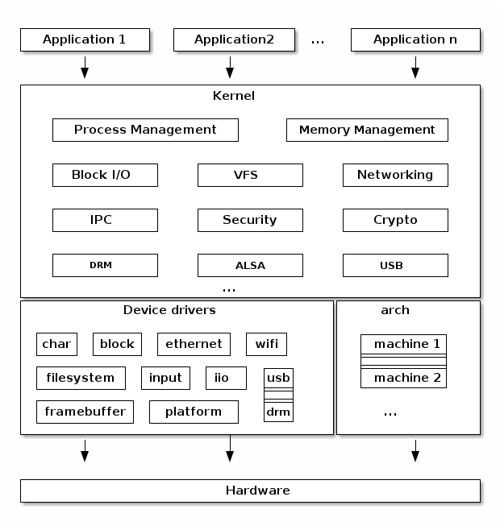

**Main Source :**

- **[Chapter 18 The Linux System - Abraham Silberschatz-Operating System Concepts (9th,2012_12)]**
- **[Linux kernel - Wikipedia](https://en.wikipedia.org/wiki/Linux_kernel)**

**Linux** is a free and open-source, multitasking, Unix-like [operating system kernel](/operating-system/kernel). It was created by Linus Torvalds in 1991, Linux was developed as a free and open alternative to proprietary operating systems.

Linux is a kernel rather than a complete operating system. The complete operating system, commonly referred as Linux's distributions or distros, combine the Linux kernel with additional software components, such as user interfaces, system utilities, libraries, and application software. Some popular Linux distributions include Ubuntu, Fedora, Debian, CentOS, and Arch Linux.

### Architecture & Structure

Linux is a modular [monolithic kernel](/operating-system/kernel#monolithic-kernels), each kernel component is called **kernel modules**. Linux supports loadable kernel modules, which are dynamically loaded and unloaded at runtime. Modules allow for the addition or removal of kernel functionalities without the need to rebuild or reboot the entire kernel.

  
Source : https://linux-kernel-labs.github.io/refs/heads/master/lectures/intro.html

Linux is built upon the GNU project, which is a compilation of freely available and open-source software. Linux kernel is developed using the C programming language, along with its standard library known as the libc or GNU C library. The C programming language is compiled using one of the compilers provided by the GNU Compiler Collection (GCC), which encompasses a collection of compilers offered by the GNU project.

### Features

The Linux kernel is based on [Unix](/operating-system/unix), they have similar features. For system calls, take a look at [type of system calls & example](/operating-system/system-call#type-of-system-calls--example).

#### Process Management

- Creation of new processes through a system call called `fork()` and `exec()`. The `exit()` system call is used to terminate the execution of a process, while the `wait()` system call is used by a parent process to wait for its child process before terminate.
- Process has some information associated with it, such as process ID (PID), file descriptors, which is information about the files opened by the process, and virtual memory info, which contains the information about process' memory layout, including the code segment, data segment, heap, and stack.
- Linux supports preemptive multitasking, the scheduling of process is done using the **Completely Fair Scheduler (CFS)** algorithm. In short, it is a priority-based scheduling that uses a [red-black tree](/data-structures-and-algorithms/tree#red-black-tree) data structures to order tasks based on the amount of time they spend running on the CPU, known as **vruntime**, to ensure fairness.

#### Memory Management

- Linux manages physical memory by classifying memory into several zones, where their boundaries depend on the system architecture.

  - **Normal Zone** : This zone is the largest regions that contains regular application memory, which is typically used for user-space processes.
  - **DMA Zone** : This zone is dedicated to [direct memory access (DMA)](/computer-organization-and-architecture/input-output#dma) operations, where devices can access memory directly without CPU intervention.
  - **High Memory Zone** : This is a memory zone that contains pages with high-memory addresses. This zone is used to allocate and manage physical memory that is not permanently mapped into the kernel address space. The purpose of this zone is to address the limitations of older hardware that cannot fully map all physical memory into the kernel's virtual address space.

- Linux kernel manages physical memory in the form of pages. When a process requests memory, the kernel allocates pages from the available pool.
- Linux implements a [virtual memory](/operating-system/memory-management#virtual-memory) system that allows processes to have their own virtual address spaces. It provides memory protection, demand paging, and memory sharing mechanisms.

#### File Systems

- Linux supports various file systems, including [ext4](/operating-system/file-system#ext4), XFS, Btrfs, [FAT](/operating-system/file-system#fat), [NTFS](/operating-system/file-system#ntfs), and more.
- ext file systems utilize journaling mechanism, which is a mechanism to logs changes to the file system before committing them to the main file system structures. This ensures file system can be recovered after system crashes or power failures.

#### Device Management

- Devices are categorized into three classes, depending on their access method : **block devices**, **character devices**, and **network devices**.

  - Block devices include devices that allow random access to independent, fixed-sized blocks of data, such as hard disks, floppy disks, CD-ROMs, Blu-ray discs, and flash memory.
  - Character devices include devices like mice and keyboards that are accessed serially, meaning data is read or written sequentially, one character at a time.
  - Network devices represent devices used for networking purposes. Although technically considered character devices, they are handled differently from other character devices due to their unique nature.

- In addition to Linux that supports dynamically loadable kernel modules, this also allows device drivers to be loaded and unloaded at runtime without rebooting the system.

#### Inter-process Communication

- Linux primarily uses **wait queues** to coordinate processes and communicate about incoming asynchronous events, rather than signals. When a process wants to wait for a particular event to complete, it places itself on a wait queue associated with that event. Multiple processes will wait for a single event and they will be awakened once the event has completed.
- For alternative of wait queues in asynchronous events communication, Linux also implement [semaphore](/operating-system/multithreading#semaphores).
- For passing message among processes, Linux provide [shared memory](/operating-system/inter-process-communication#shared-memory) and [pipe message passing](/operating-system/inter-process-communication#message-passing) mechanism.

#### Networking

- Networking is implemented through three layers of software : the **socket interface**, **protocol drivers**, and **network-device drivers**.

  - The socket interface is the entry point for user applications to perform networking requests. It is designed to resemble the 4.3 BSD socket layer, this make it compatible with programs that utilize Berkeley sockets.
  - The protocol drivers process packet, such as modifying, splitting, or reassembling. When data arrives at this layer, either from an application's socket or a network-device driver, it is expected to be tagged with an identifier specifying the network protocol it contains.
  - Network-device drivers are responsible for interacting with the physical network devices. These drivers manage the communication between the kernel and the network hardware, handling tasks such as sending and receiving data packets.

- Linux kernel supports a wide range of network protocols, including [TCP/IP](/computer-networking/tcp-protocol), [UDP](/computer-networking/udp), ICMP, [IPv4](/computer-networking/ip-address#ipv4), and [IPv6](/computer-networking/ip-address#ipv6). It also provides support for network services like [DNS](/computer-networking/dns), [DHCP](/computer-networking/dhcp), and [NAT](/computer-networking/nat).

#### Security

- To ensure security of user accounts, Linux implements authentication mechanism. The authentication process in Linux is primarily based on the use of login names and passwords. When a user attempts to log in, the login program prompts for a login name and a password. The password is then encrypted and compared against the encrypted password stored in the password file, usually located at `/etc/passwd`. If the encrypted passwords match, the login is allowed; otherwise, it is rejected.
- Linux implements a file and directory access permissions. The kernel supports [Access Control Lists (ACLs)](/operating-system/protection-and-security#access-control) and Security-Enhanced Linux (SELinux), which provide additional layers of access control and security policies.
