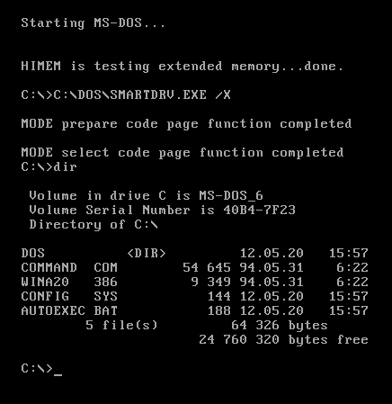
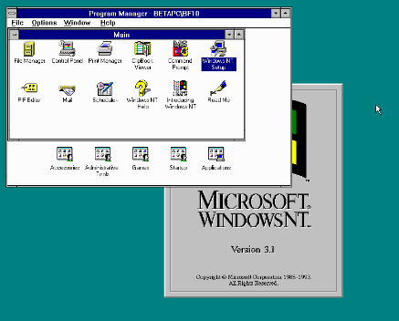
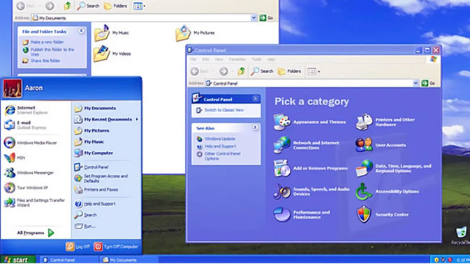
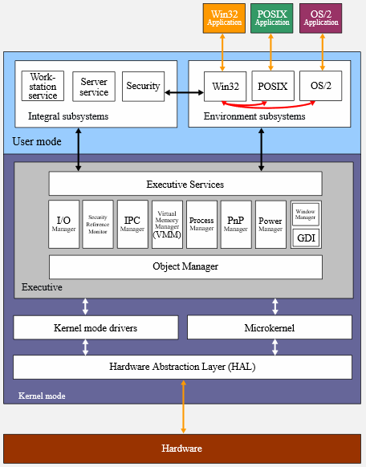
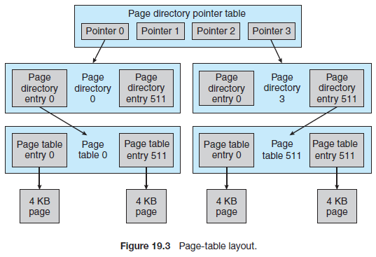
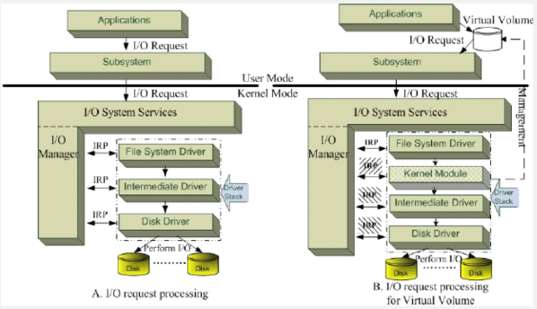

**Main Source:**

- **[Chapter 19 Windows 7 - Abraham Silberschatz-Operating System Concepts (9th,2012_12)]**
- **[Microsoft Windows — Wikipedia](https://en.wikipedia.org/wiki/Microsoft_Windows)**
- **[MS-DOS — Wikipedia](https://en.wikipedia.org/wiki/MS-DOS)**
- **[Windows NT — Wikipedia](https://en.wikipedia.org/wiki/Windows_NT)**

Windows is a group of operating system developed by Microsoft. The history of Windows can be divided into several eras, each with its own kernel. The earliest version of Windows, known as Windows 1.0, was released in 1985, and it ran on top of MS-DOS.

### History

DOS (Disk Operating System) is an OS that runs from a disk drive, they are operating system with simple command-line interface used to manage computer's hard drive and hardware components. MS-DOS is a specific DOS developed by Microsoft, initially released in 1981.

  
Source: https://en.wikipedia.org/wiki/MS-DOS

MS-DOS was very simple, it was more of a graphical environment rather than a complete operating system. Microsoft introduces many versions of Windows that was based on MS-DOS, including Windows 1.x, 2.x, 3.x, 9x (e.g., Windows 95, Windows 98), and Windows Me (Millennium Edition). The MS-DOS kernel is a monolithic kernel that was specifically developed for the [x86](/computer-organization-and-architecture/isa#x86) architecture. Most versions of MS-DOS are 16-bit, but there are some versions that are hybrid, combining elements of both 16-bit and 32-bit functionality.

Upon several MS-DOS based OS, Microsoft developed the Windows NT operating system. Windows NT (New Technology) was a complete rewrite from scratch and was a full 32-bit system. It was targeted to be a general-purpose operating system for personal computers.

The NT-based Windows line started with Windows NT 3.1 in 1993. The kernel used in Windows NT was called the NTOS kernel, which is a more advanced kernel that supports more feature such as multiuser, POSIX compatibility, portable kernel with preemptive multitasking, and support for more architecture.

  
Source: https://betawiki.net/wiki/Windows_NT_3.1

Microsoft continued to develop the NT-based Windows line with versions such as Windows NT 3.1, 3.5, 3.51, 4.0, and Windows 2000.

The next major version, Windows XP, released in 2001, had a significant run and replaced previous versions of Windows. It was the successor to Windows 2000 and was designed to provide a more intuitive graphical interface, enhanced security, and many new or upgraded user programs.

More version keep being developed with more features, Windows Vista, Windows 7, Windows 8, Windows 8.1, Windows 10, and the latest up to now, Windows 11. Along these versions, Microsoft also developed for various platforms beyond the desktop. This includes Windows Server, Windows Phone, Windows Embedded, and many more.

  
_Windows XP_  
Source: https://www.liputan6.com/tekno/read/2019112/tak-mau-imove-oni-dari-windows-xp-ini-risikonya

### Windows 7

Windows 7, based on the Windows NT family of operating systems was released to manufacturing on July 22, 2009, and became generally available on October 22, 2009. Windows 7 succeeded Windows Vista and was succeeded by Windows 8.

The design principles of Windows 7 were aimed at achieving various goals, including security, reliability, compatibility, performance, extensibility, portability, international support, energy efficiency, and dynamic device support [1][2].

For security, Windows 7 implement discretionary access controls, using [access-control lists (ACLs)](/operating-system/protection-and-security#access-control) to protect system objects such as files, registry settings, and kernel objects.

Extensive code review, testing, and automatic analysis tools were utilized to identify potential defects that could lead to security vulnerabilities and prevent errors in drivers and applications.

Compatibility with existing applications was also a key consideration in the design of Windows 7. The operating system aimed to ensure compatibility with both Windows and POSIX applications.

#### Architecture

The architecture of Windows is a layered system of modules. Windows operate on **client-server model**, meaning there is a role of client and server. In this model, clients are the end-user devices or applications that make requests for services or resources, while servers are responsible for providing those services or resources.

The client-server model is typically used in networking, but it is also appliable in the context of operating system. To facilitate communication and interaction between clients and servers, Windows employs various mechanisms, including [Remote Procedure Calls (RPCs)](/operating-system/inter-process-communication#rpc). RPCs allow clients to send requests to servers, and the servers respond with the required information or perform the requested actions.

  
Source: https://en.wikipedia.org/wiki/Architecture_of_Windows_NT

- **Hardware Abstraction Layer (HAL)**: The HAL is a layer that abstracts the hardware-specific details and provides a uniform interface for the rest of the operating system. It allows Windows to run on different hardware platforms with minimal modification.
- **Kernel**: The kernel does four main things, thread scheduling,
  low-level processor synchronization, interrupt and exception handling, and
  switching between user mode and kernel mode.
- **Executive**: The Executive is a layer above the kernel and provides a set of essential services and components that support the operation of the operating system. It includes components such as the memory manager, process manager, I/O manager, security reference monitor, and the object manager.

  In the Windows kernel, objects are fundamental data structures that are allocated and utilized by the kernel itself. They represent various system resources, such as processes, threads, files, semaphores, I/O devices, and more. Objects in the Windows kernel are not used in the same sense as in [object-oriented programming](/computer-and-programming-fundamentals/object-oriented-programming), but rather as data structures managed by the kernel, specifically by the object manager.

- **User Mode**: User mode includes various user-facing components and services. This includes the Windows shell, which provides the graphical user interface and manages the desktop, taskbar, and start menu. Other user mode components include system services, runtime libraries, security, and application frameworks that enable the execution of user applications.
- **Subsystems**: Windows supports multiple subsystems, a subsystem refers to a component that provides a specific environment for running applications and executing their code. There are three subsystems, Win32, POSIX, and OS/2 subsystem. The Win32 subsystem provides compatibility for 32-bit Windows applications, while the POSIX subsystem allows running applications compatible with the POSIX standard, and OS/2 subsystem allows OS/2 application to be run on Windows NT.

#### Features

- **Thread & Scheduling**: Thread is scheduled based on their priority. For example, thread waiting for keyboard I/O would get a large priority increase, whereas a thread waiting for a disk operation would get a moderate one. The Windows scheduler employs preemptive scheduling, which means that a running thread can be interrupted and replaced by another thread of higher priority.
- **Synchronization**: Windows provides various synchronization mechanisms through dispatcher objects, such as [mutex locks](/operating-system/multithreading#locks--mutex), [semaphores](/operating-system/multithreading#semaphores), events, and timers.
- **Interrupts**: Interrupts, represented by interrupt object, are handled by interrupt dispatcher in the kernel which calls the appropriate handler [(ISR)](/operating-system/interrupt-handling#interrupt-handler) from an interrupt-dispatch table.
- **Memory Management**: Virtual memory system is managed by **virtual memory manager (VMM)**. The virtual memory manager uses a page-based management scheme, with a fixed 4KB page size. Virtual address space for each process is divided into 32-bit segments, allowing for a maximum of 4 GB of virtual address space. For [x86](/computer-organization-and-architecture/isa#x86) machines, this space is split between the user and kernel, with each receiving 2 GB. For [x64](/computer-organization-and-architecture/isa#x86) machines, both the user and kernel receive more virtual addresses than they can practically use. The virtual address space is **demand-paged**, meaning that only the necessary pages are loaded into physical memory when needed.

  Access of virtual address is handled in multilevel page table. This table divides the virtual address space into multiple levels, each with its own page table entries. Process has a **page directory**, which is the main mapping of the page tables. It contains pointer to a **Page Directory Entry (PDE)**. Each entry points to another table, **Page Table Entry (PTE)**. Page directory has 512 PDE, and each PDE has 512 PTEs, each of which points to a 4-KB page frame in physical memory.

    
   Source: OS Concepts book page 848

- **Process Management**: When a process is created, the **process manager** is responsible for handling the necessary steps. For example, when a Win32 application calls the `CreateProcess()` function, a message is sent to the Win32 subsystem to notify it of the process creation.
- **I/O Manager**: I/O manager keep track of loaded device drivers, filter drivers, and file systems, it maintains a record of which drivers and file systems are currently loaded in the system. Device drivers follow the Windows Driver Model (WDM) specification, they are represented as **driver object**. Application will make I/O request through the I/O subsystem and the I/O services will generate a request in a form called **I/O request packet (IRP)**, which is then passed down to the driver object.

    
   Source: https://www.researchgate.net/figure/Windows-NT-I-O-driver-stack-model-The-I-O-Manager-of-the-Windows-NT-operating-system_fig1_220718462

- **File System**: Windows initially uses the [FAT](/operating-system/file-system#fat) file system, but it has been replaced with the [NTFS](/operating-system/file-system#ntfs). NTFS provide [access control lists](/operating-system/protection-and-security#access-control), encryption, data recovery, fault tolerance, compression, support for very large files and file systems, multiple data streams, [Unicode](/computer-and-programming-fundamentals/data-representation#unicode) names, and sparse files.
- **Networking**: Windows supports both peer-to-peer and client-server networking. It provides various networking components that facilitate data transport, [inter-process communication](/operating-system/inter-process-communication), file sharing, and the ability to send print jobs to remote printers. Networking is standardized in two interfaces: **Network Device Interface Specification (NDIS)** and the **Transport Driver Interface (TDI)**. NDIS operates between data link (layer 2) and network layer (layer 3), it separates network adapters from transport protocols, allowing either component to be changed independently without affecting the other. TDI, on the other hand, operates between transport (layer 4) and session layer (layer 5).

  Windows provides several networking features. For example, Windows supports [DNS](/computer-networking/dns), [DHCP](/computer-networking/dhcp), and Windows Internet Name Service (WINS), which help in managing IP addresses and name resolution on networks. For protocol, Windows implement [TCP/IP](/computer-networking/tcp-protocol) and [HTTP](/computer-networking/http-https). Windows also support the [RPC](/operating-system/inter-process-communication#rpc) mechanism for making procedure call on other machine across the network. All networking in Windows is provided via the **Winsock API (Windows Sockets)**.
